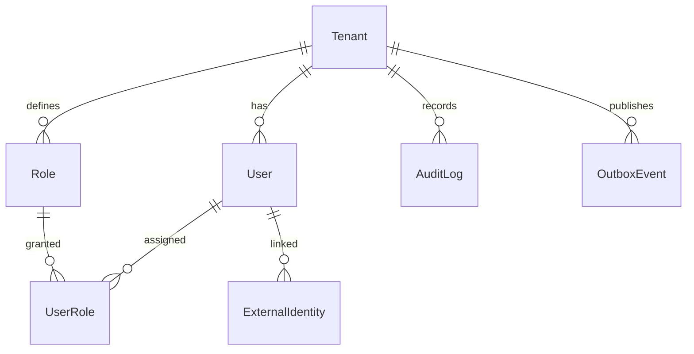

# Template: Data Model

## Proposito

Documenta el modelo de datos de un sistema de software: analisis de entidades con campos, relaciones, decisiones de diseno, y diagrama ERD en Mermaid.

- **Cuando se crea**: Fase 2 (Discovery) como parte de la documentacion de arquitectura
- **Quien lo llena**: TL / R&D Lead con input de Dev
- **Quien lo valida**: TL + QA Lead
- **Gate asociado**: Gate 1 (PRD Aprobado)
- **Instancias por proyecto**: 1 por producto/sistema (integrado en architecture-doc)

---

## Required Entity Categories

Always derive and include entities from these categories:

| Category                  | Generic Name        | Description                                    |
| ------------------------- | ------------------- | ---------------------------------------------- |
| Tenant / Organisation     | `Tenant`            | Top-level isolation boundary per customer      |
| Staff User                | `User`              | Internal actors (staff, admins)                |
| RBAC Role Definition      | `Role`              | Named permission set                           |
| Role Assignment Junction  | `UserRole`          | User-to-role within a tenant                   |
| Core Domain Resource      | _(domain-specific)_ | Primary entity the system manages              |
| Sub-resource              | _(domain-specific)_ | Derived or published version of core resource  |
| External Party / Subject  | _(domain-specific)_ | Person or entity acted upon                    |
| External Identity Mapping | `ExternalIdentity`  | IdP user ID mapped to platform user            |
| Entitlement / Config      | _(domain-specific)_ | What a tenant is licensed to use               |
| Assignment / Membership   | _(domain-specific)_ | Links subject to resource                      |
| Stage / Status History    | _(domain-specific)_ | Pipeline stage tracking                        |
| Structured Feedback       | _(domain-specific)_ | Reviewer or assessor input                     |
| Decision Record           | _(domain-specific)_ | Final outcome of the workflow                  |
| Audit Log                 | `AuditLog`          | Append-only, with before/after jsonb snapshots |
| Transactional Outbox      | `OutboxEvent`       | Reliable event publishing via outbox pattern   |

## Estructura del Documento

````markdown
---
id: {project-name}-data-model
version: "1.0.0"
last_updated: "YYYY-MM-DD"
updated_by: "TL: {Name}"
status: active
type: project
review_cycle: 60
next_review: "YYYY-MM-DD"
owner_role: "TL"
---

# {System Name} -- Data Model

## 1. Entity Analysis

### {EntityName}

**Purpose**: [One-sentence purpose of this entity]

**Fields**:

| Field      | Type        | Description           |
| ---------- | ----------- | --------------------- |
| id         | uuid PK     | Primary key           |
| tenant_id  | uuid FK     | Reference to Tenant   |
| created_at | timestamptz | Creation timestamp    |
| updated_at | timestamptz | Last update timestamp |
| ...        | ...         | ...                   |

**Relationships**:

- [A Tenant has many Users. A User belongs to exactly one Tenant.]
- [Cardinality and direction for each relationship]

**Design Decision**:

- [Non-obvious choice explanation: why two tables, nullable FK semantics, anonymisation scope, unique constraints, append-only enforcement]

[Repeat for each entity]

## 2. Entity Relationship Diagram


````

[Rules:]

- [Every entity has uuid id PK, created/updated timestamps, FK fields marked FK]
- [Use UK for unique keys]
- [Every relationship line has a verb label]
- [Correct crow's-foot notation:]
  - [||--o{ one-to-many]
  - [||--|| one-to-one]
  - [||--o| one-to-zero-or-one]
  - [Many-to-many resolved via junction entity]

## Changelog

| Version | Date       | Author     | Changes         |
| ------- | ---------- | ---------- | --------------- |
| 1.0.0   | YYYY-MM-DD | TL: {Name} | Initial version |

```

```
