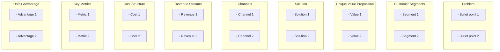

# Template: Business Model

## Proposito

Documenta el modelo de negocio de un sistema de software: descripcion del sistema, ventajas competitivas, inventario de features, y Lean Canvas visual.

- **Cuando se crea**: Fase 1 (Originacion) junto con el Business Case
- **Quien lo llena**: PO con input de R&D y stakeholders
- **Quien lo valida**: Sponsor + CTO
- **Gate asociado**: Gate 0 (Intake)
- **Instancias por proyecto**: 1 por producto/sistema

---

## Estructura del Documento

````markdown
---
id: {project-name}-business-model
version: "1.0.0"
last_updated: "YYYY-MM-DD"
updated_by: "PO: {Name}"
status: active
type: project
review_cycle: 60
next_review: "YYYY-MM-DD"
owner_role: "PO"
---

# {System Name} -- Business Model

## 1. System Description

[Two to three paragraphs covering:]

- What the system is and what problem it solves
- Target market: buyer persona and end-user persona
- Deployment model: B2B SaaS, API-first, multitenant, on-premise, hybrid

## 2. Added Value and Competitive Advantages

[Bullet list of at least 5 distinct, specific advantages]

- [Concrete differentiator 1 -- not generic claims]
- [Concrete differentiator 2]
- [Concrete differentiator 3]
- [Concrete differentiator 4]
- [Concrete differentiator 5]

## 3. Main Features

| Feature     | Description                       |
| ----------- | --------------------------------- |
| [Feature 1] | [What it does and why it matters] |
| [Feature 2] | [What it does and why it matters] |
| [Feature 3] | [What it does and why it matters] |
| ...         | ...                               |

[Minimum coverage: core workflow stages, RBAC, SSO/federation, event streaming, multitenancy, audit/compliance]

## 4. Lean Canvas

[Mermaid graph TB diagram with 9 labeled subgraphs]


````

[Rules: every cell 2-4 bullet points, no placeholders, no em-dashes, plain hyphens only]

## Changelog

| Version | Date       | Author     | Changes         |
| ------- | ---------- | ---------- | --------------- |
| 1.0.0   | YYYY-MM-DD | PO: {Name} | Initial version |

```

```
