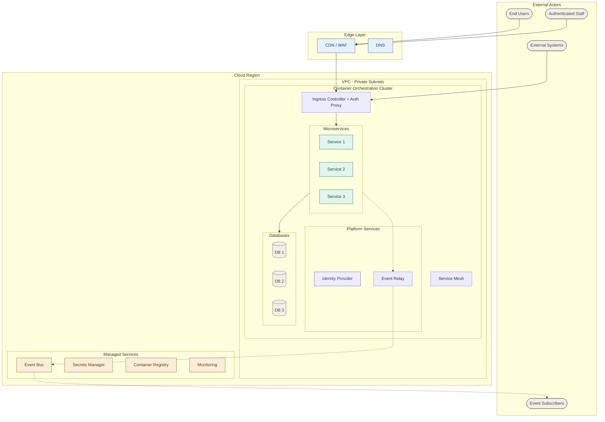

# Template: System Design

## Proposito

Documenta el diseno de sistema de un software: overview de arquitectura, inventario de microservicios, y diagrama de arquitectura de alto nivel en Mermaid.

- **Cuando se crea**: Fase 2 (Discovery) como parte del PRD Tecnico
- **Quien lo llena**: TL / R&D Lead
- **Quien lo valida**: TL + CTO
- **Gate asociado**: Gate 1 (PRD Aprobado)
- **Instancias por proyecto**: 1 por producto/sistema (integrado en prd-tecnico)

---

## Estructura del Documento

````markdown
---
id: {project-name}-system-design
version: "1.0.0"
last_updated: "YYYY-MM-DD"
updated_by: "TL: {Name}"
status: active
type: project
review_cycle: 60
next_review: "YYYY-MM-DD"
owner_role: "TL"
---

# {System Name} -- System Design

## 1. Architecture Overview

[Two paragraphs covering:]

**Paragraph 1 - Decomposition and Data Ownership:**

- Microservices decomposition rationale: how domain boundaries map to services
- Database-per-service pattern: why each service owns its data
- Event-driven integration: transactional outbox pattern, event publishing

**Paragraph 2 - Integration and Identity:**

- Integration model: event schema standard, downstream subscriber pattern
- Identity layer: IdP selection, SSO protocols (OIDC/SAML), multitenancy approach
- Cross-cutting concerns: observability, rate limiting, circuit breakers

## 2. Service Inventory

| Service              | Responsibility                               | Database      | Publishes Events                   |
| -------------------- | -------------------------------------------- | ------------- | ---------------------------------- |
| [service-1]          | [Core workflow domain 1]                     | PostgreSQL    | [event.created, event.updated]     |
| [service-2]          | [Core workflow domain 2]                     | PostgreSQL    | [event.submitted, event.completed] |
| [service-3]          | [Supporting domain]                          | PostgreSQL    | [event.processed]                  |
| event-relay          | Transactional outbox reader, event publisher | Shared outbox | N/A (reads outbox)                 |
| notification-service | Email, SMS, push notifications               | PostgreSQL    | [notification.sent]                |

[Derive one service per major domain boundary. Always include event-relay and notification-service.]

## 3. High-Level Architecture Diagram


````

[Diagram rules:]

- [No em-dashes or en-dashes -- use plain hyphens]
- [No Unicode box-drawing characters]
- [No trailing whitespace on class or classDef lines]
- [All class assignments on one line]
- [Use -.-> for side-channel/dependency arrows, --> for primary data flow]

## Changelog

| Version | Date       | Author     | Changes         |
| ------- | ---------- | ---------- | --------------- |
| 1.0.0   | YYYY-MM-DD | TL: {Name} | Initial version |

```

## Styling Reference

Standard classDef values for system design diagrams:

| Class | Fill | Stroke | Color | Use |
|-------|------|--------|-------|-----|
| edge | #E6F1FB | #185FA5 | #0C447C | Edge/CDN/WAF components |
| svc | #E1F5EE | #0F6E56 | #085041 | Microservice nodes |
| idp | #EEEDFE | #534AB7 | #3C3489 | Identity provider |
| managed | #FAEEDA | #854F0B | #633806 | Cloud managed services |
| db | #F1EFE8 | #5F5E5A | #444441 | Database nodes |
| neutral | #F1EFE8 | #5F5E5A | #444441 | External actors, info nodes |
```
