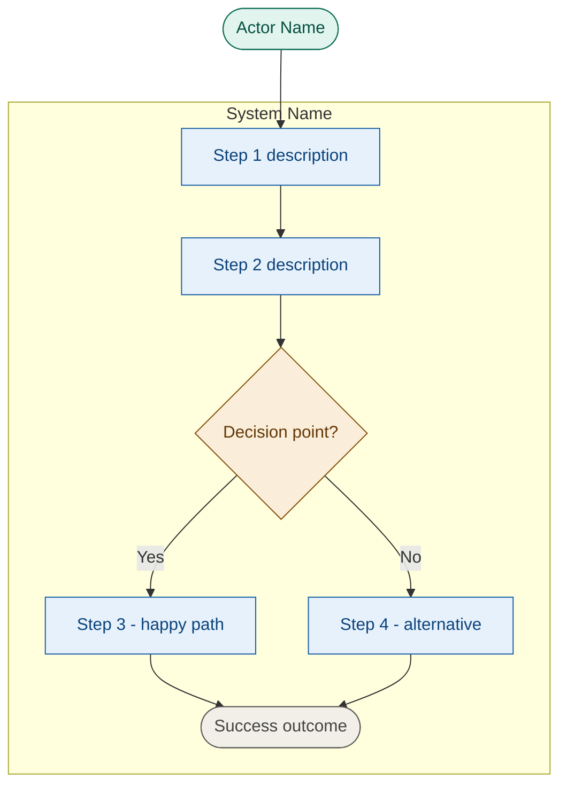

# Template: Use Cases

## Proposito

Documenta los 3 casos de uso principales de un sistema de software, cada uno con descripcion y diagrama Mermaid flowchart.

- **Cuando se crea**: Fase 2 (Discovery) despues del PRD
- **Quien lo llena**: PO + TL con input de stakeholders
- **Quien lo valida**: PO + QA Lead
- **Gate asociado**: Gate 1 (PRD Aprobado)
- **Instancias por proyecto**: 1 por producto/sistema

---

## Estructura del Documento

````markdown
---
id: {project-name}-use-cases
version: "1.0.0"
last_updated: "YYYY-MM-DD"
updated_by: "PO: {Name}"
status: active
type: project
review_cycle: 60
next_review: "YYYY-MM-DD"
owner_role: "PO"
---

# {System Name} -- Use Cases

## 1. [Use Case Title: Primary Happy Path]

**Description**

[One paragraph covering: actors involved, trigger, main flow steps, outcome, constraints]

**Diagram**


````

---

## 2. [Use Case Title: Complex Multi-Actor Interaction]

**Description**

[One paragraph covering: multiple actors, trigger, multi-step flow with decisions, outcome]

**Diagram**

[Mermaid flowchart TD with multiple actors, system boundary, decision points]

---

## 3. [Use Case Title: Compliance/Security Critical]

**Description**

[One paragraph covering: actors, compliance trigger, security steps, audit outcome]

**Diagram**

[Mermaid flowchart TD with security-focused flow, compliance checks, audit trail]

---

## Selection Criteria

| Use Case | Criteria Covered                                          |
| -------- | --------------------------------------------------------- |
| UC-1     | Primary happy path through core workflow                  |
| UC-2     | Most complex multi-actor interaction with decision points |
| UC-3     | Most critical for compliance, security, or data integrity |

## Traceability

| Use Case | Maps to PRD Section | Generates RFs    |
| -------- | ------------------- | ---------------- |
| UC-1     | [PRD-F section ref] | RF-XXX to RF-XXX |
| UC-2     | [PRD-F section ref] | RF-XXX to RF-XXX |
| UC-3     | [PRD-F section ref] | RF-XXX to RF-XXX |

## Changelog

| Version | Date       | Author     | Changes         |
| ------- | ---------- | ---------- | --------------- |
| 1.0.0   | YYYY-MM-DD | PO: {Name} | Initial version |

```

## Styling Reference

Standard classDef values for all use case diagrams:

| Class | Fill | Stroke | Color | Use |
|-------|------|--------|-------|-----|
| actor | #E1F5EE | #0F6E56 | #085041 | External actors |
| system | #E6F1FB | #185FA5 | #0C447C | System steps |
| decision | #FAEEDA | #854F0B | #633806 | Decision nodes |
| terminal | #F1EFE8 | #5F5E5A | #444441 | Outcome nodes |
```
