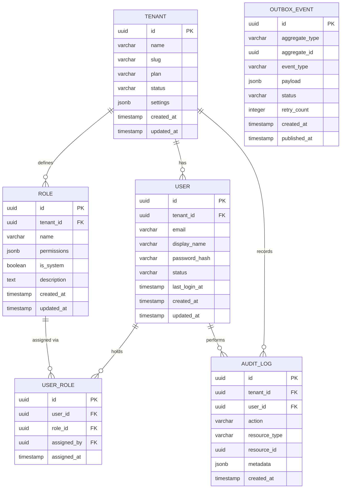

# Data Model - Multi-Tenant SaaS Platform

This document describes the core data model for a multi-tenant SaaS platform. It covers 6 foundational entities that support tenant isolation, user management, role-based access control, audit logging, and reliable event publishing via the transactional outbox pattern.

---

## Entity Analysis

### 1. Tenant

**Purpose:** Represents an organization or company that subscribes to the SaaS platform. All business data is scoped to a tenant, ensuring strict data isolation between customers.

| Field      | Type         | Constraints                 | Description                                                |
| ---------- | ------------ | --------------------------- | ---------------------------------------------------------- |
| id         | UUID         | PK, NOT NULL                | Unique tenant identifier                                   |
| name       | VARCHAR(255) | NOT NULL                    | Organization display name                                  |
| slug       | VARCHAR(100) | UNIQUE, NOT NULL            | URL-safe identifier for routing                            |
| plan       | VARCHAR(50)  | NOT NULL, DEFAULT 'starter' | Subscription plan: starter, business, enterprise           |
| status     | VARCHAR(20)  | NOT NULL, DEFAULT 'active'  | Tenant status: active, suspended, cancelled                |
| settings   | JSONB        | DEFAULT '{}'                | Tenant-specific configuration (branding, features, limits) |
| created_at | TIMESTAMP    | NOT NULL, DEFAULT NOW()     | Tenant creation timestamp                                  |
| updated_at | TIMESTAMP    | NOT NULL, DEFAULT NOW()     | Last modification timestamp                                |

**Relationships:**

- One Tenant has many Users (1:N)
- One Tenant has many Roles (1:N)
- One Tenant has many AuditLogs (1:N)

**Design Decisions:**

- JSONB `settings` field allows flexible per-tenant configuration without schema migrations
- `slug` enables tenant-aware URL routing (e.g., `app.example.com/acme/dashboard`)
- `plan` is stored as a string rather than a FK to a plans table to simplify billing integrations and allow plan definitions to evolve independently

---

### 2. User

**Purpose:** Represents an individual person who can authenticate and interact with the platform within the context of a specific tenant. A user belongs to exactly one tenant.

| Field         | Type         | Constraints                | Description                             |
| ------------- | ------------ | -------------------------- | --------------------------------------- |
| id            | UUID         | PK, NOT NULL               | Unique user identifier                  |
| tenant_id     | UUID         | FK(Tenant.id), NOT NULL    | Owning tenant reference                 |
| email         | VARCHAR(255) | NOT NULL                   | User email (unique within tenant)       |
| display_name  | VARCHAR(200) | NOT NULL                   | Full name for display purposes          |
| password_hash | VARCHAR(255) | NOT NULL                   | Bcrypt-hashed password                  |
| status        | VARCHAR(20)  | NOT NULL, DEFAULT 'active' | User status: active, invited, disabled  |
| last_login_at | TIMESTAMP    | NULLABLE                   | Timestamp of most recent authentication |
| created_at    | TIMESTAMP    | NOT NULL, DEFAULT NOW()    | Account creation timestamp              |
| updated_at    | TIMESTAMP    | NOT NULL, DEFAULT NOW()    | Last modification timestamp             |

**Relationships:**

- One User belongs to one Tenant (N:1)
- One User has many UserRoles (1:N)
- One User has many AuditLogs (1:N)

**Design Decisions:**

- Email uniqueness is enforced per tenant (composite unique constraint on `tenant_id` + `email`), allowing the same person to exist in multiple organizations
- `password_hash` uses bcrypt with a cost factor of 12; the application layer handles hashing and never stores plaintext
- `last_login_at` supports session analytics and inactive account detection without a separate login history table

---

### 3. Role

**Purpose:** Defines a named set of permissions within a tenant. Roles are tenant-scoped, allowing each organization to customize its access control model beyond platform defaults.

| Field       | Type         | Constraints             | Description                                            |
| ----------- | ------------ | ----------------------- | ------------------------------------------------------ |
| id          | UUID         | PK, NOT NULL            | Unique role identifier                                 |
| tenant_id   | UUID         | FK(Tenant.id), NOT NULL | Owning tenant reference                                |
| name        | VARCHAR(100) | NOT NULL                | Role display name (unique within tenant)               |
| permissions | JSONB        | NOT NULL, DEFAULT '[]'  | Array of permission strings                            |
| is_system   | BOOLEAN      | NOT NULL, DEFAULT false | True for platform-managed roles that cannot be deleted |
| description | TEXT         | NULLABLE                | Human-readable role description                        |
| created_at  | TIMESTAMP    | NOT NULL, DEFAULT NOW() | Role creation timestamp                                |
| updated_at  | TIMESTAMP    | NOT NULL, DEFAULT NOW() | Last modification timestamp                            |

**Relationships:**

- One Role belongs to one Tenant (N:1)
- One Role has many UserRoles (1:N)

**Design Decisions:**

- Permissions are stored as a JSONB array of strings (e.g., `["users:read", "users:write", "reports:read"]`) rather than a separate permissions table, reducing join complexity for authorization checks
- `is_system` flag protects default roles (Admin, Member, Viewer) from tenant deletion while allowing custom roles alongside them
- Role name uniqueness is enforced per tenant via a composite unique constraint on `tenant_id` + `name`

---

### 4. UserRole

**Purpose:** Join table implementing the many-to-many relationship between Users and Roles. Enables a user to hold multiple roles within their tenant.

| Field       | Type      | Constraints             | Description                                    |
| ----------- | --------- | ----------------------- | ---------------------------------------------- |
| id          | UUID      | PK, NOT NULL            | Unique assignment identifier                   |
| user_id     | UUID      | FK(User.id), NOT NULL   | User being assigned the role                   |
| role_id     | UUID      | FK(Role.id), NOT NULL   | Role being assigned to the user                |
| assigned_by | UUID      | FK(User.id), NULLABLE   | User who made the assignment (null for system) |
| assigned_at | TIMESTAMP | NOT NULL, DEFAULT NOW() | When the role was assigned                     |

**Relationships:**

- One UserRole belongs to one User (N:1)
- One UserRole belongs to one Role (N:1)
- One UserRole optionally references a User as assigner (N:1)

**Design Decisions:**

- Composite unique constraint on `user_id` + `role_id` prevents duplicate role assignments
- `assigned_by` provides attribution for role changes, supporting compliance audit requirements
- No `tenant_id` column since tenant scoping is inherited through the User and Role foreign keys, avoiding redundant data

---

### 5. AuditLog

**Purpose:** Immutable append-only log capturing all significant actions performed within the platform. Supports regulatory compliance, forensic investigation, and operational monitoring.

| Field         | Type         | Constraints             | Description                                                |
| ------------- | ------------ | ----------------------- | ---------------------------------------------------------- |
| id            | UUID         | PK, NOT NULL            | Unique log entry identifier                                |
| tenant_id     | UUID         | FK(Tenant.id), NOT NULL | Tenant context for data isolation                          |
| user_id       | UUID         | FK(User.id), NULLABLE   | Acting user (null for system-initiated actions)            |
| action        | VARCHAR(100) | NOT NULL                | Action identifier (e.g., 'user.created', 'role.updated')   |
| resource_type | VARCHAR(100) | NOT NULL                | Type of entity affected (e.g., 'User', 'Role', 'Tenant')   |
| resource_id   | UUID         | NOT NULL                | ID of the affected entity                                  |
| metadata      | JSONB        | DEFAULT '{}'            | Additional context: IP address, user agent, changed fields |
| created_at    | TIMESTAMP    | NOT NULL, DEFAULT NOW() | When the action occurred                                   |

**Relationships:**

- One AuditLog belongs to one Tenant (N:1)
- One AuditLog optionally belongs to one User (N:1)

**Design Decisions:**

- The table is append-only with no UPDATE or DELETE operations permitted at the application layer, ensuring tamper-proof audit trails
- `metadata` as JSONB allows flexible contextual data (IP, user agent, diff of changed fields) without schema changes for each new audit scenario
- Partitioned by `created_at` (monthly) for query performance and cost-effective archival of older records
- No foreign key constraint on `resource_id` since the referenced entity may be soft-deleted while the audit record must persist

---

### 6. OutboxEvent

**Purpose:** Implements the transactional outbox pattern to guarantee reliable event publishing. Events are written to this table within the same database transaction as the business operation, then asynchronously relayed to the message broker by a separate publisher process.

| Field          | Type         | Constraints                 | Description                                                       |
| -------------- | ------------ | --------------------------- | ----------------------------------------------------------------- |
| id             | UUID         | PK, NOT NULL                | Unique event identifier                                           |
| aggregate_type | VARCHAR(100) | NOT NULL                    | Type of aggregate that emitted the event (e.g., 'User', 'Tenant') |
| aggregate_id   | UUID         | NOT NULL                    | ID of the aggregate instance                                      |
| event_type     | VARCHAR(100) | NOT NULL                    | Event name (e.g., 'UserCreated', 'RoleAssigned')                  |
| payload        | JSONB        | NOT NULL                    | Serialized event payload                                          |
| status         | VARCHAR(20)  | NOT NULL, DEFAULT 'pending' | Processing status: pending, published, failed                     |
| retry_count    | INTEGER      | NOT NULL, DEFAULT 0         | Number of publish attempts                                        |
| created_at     | TIMESTAMP    | NOT NULL, DEFAULT NOW()     | When the event was created                                        |
| published_at   | TIMESTAMP    | NULLABLE                    | When the event was successfully published                         |

**Relationships:**

- OutboxEvent is a standalone table with no foreign key relationships to maintain decoupling from domain entities

**Design Decisions:**

- Events are written atomically with business operations in the same transaction, eliminating the dual-write problem (database + message broker inconsistency)
- The publisher process polls for `status = 'pending'` records, publishes them to the broker, and updates `status` to `'published'`
- `retry_count` with a configurable maximum (default: 5) prevents infinite retry loops; failed events are flagged for manual investigation
- No FK on `aggregate_id` to avoid coupling the outbox to specific domain tables and to support events from any aggregate type

---

## Entity-Relationship Diagram

---

## Indexing Strategy

| Table       | Index                     | Columns                      | Purpose                                                   |
| ----------- | ------------------------- | ---------------------------- | --------------------------------------------------------- |
| User        | idx_user_tenant_email     | (tenant_id, email) UNIQUE    | Enforce email uniqueness per tenant and fast login lookup |
| User        | idx_user_tenant_status    | (tenant_id, status)          | Filter active users within a tenant                       |
| Role        | idx_role_tenant_name      | (tenant_id, name) UNIQUE     | Enforce role name uniqueness per tenant                   |
| UserRole    | idx_userrole_user_role    | (user_id, role_id) UNIQUE    | Prevent duplicate role assignments                        |
| AuditLog    | idx_audit_tenant_created  | (tenant_id, created_at DESC) | Efficient audit log queries by tenant                     |
| AuditLog    | idx_audit_resource        | (resource_type, resource_id) | Look up audit history for specific entities               |
| OutboxEvent | idx_outbox_status_created | (status, created_at)         | Publisher polling for pending events                      |

## Changelog

| Version | Date       | Author            | Changes                                                 |
| ------- | ---------- | ----------------- | ------------------------------------------------------- |
| 1.0.0   | 2026-03-26 | TL: Lead Engineer | Initial example - Multi-tenant SaaS platform data model |
