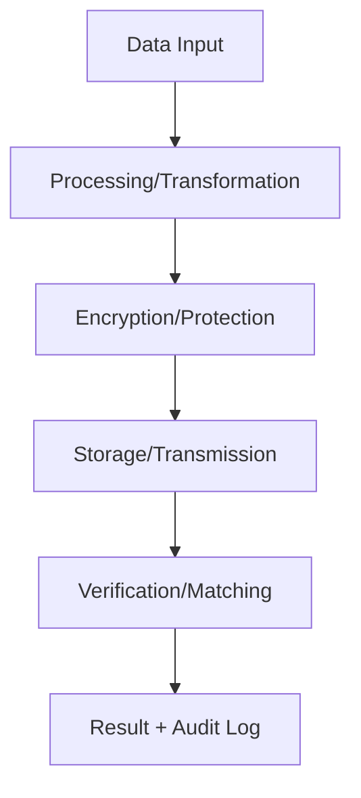

# Structured Innovation & Problem-Solving — LIDR SDLC Methodology

Cross-cutting | Gate: Pre-development (before any implementation) | Language: Spanish + Inglés técnico

> **HARD GATE**: MUST be used before ANY creative work, implementation, or design decisions. This skill is MANDATORY for all innovation activities.

## Propósito

Facilitar innovación estructurada y resolución de problemas usando LIDR SDLC Methodology, adaptada para cualquier dominio de software y entornos regulados. Genera soluciones innovadoras mientras garantiza compliance con las regulaciones aplicables al proyecto (GDPR, eIDAS, PSD2, etc.).

## Cuándo Usar

### Triggers Obligatorios

- **Antes de implementar cualquier funcionalidad nueva** — feature, componente, algoritmo
- **Decisiones arquitectónicas** — cambios de stack, patrones, integraciones
- **Solución a problemas complejos** — bugs difíciles, performance, security
- **Diseño de flujos de usuario** — onboarding, verificación, autenticación
- **Definición de productos** — nuevos SDKs, APIs, capabilities

### Frases que Activan

- "Necesitamos una solución para..."
- "¿Cómo podríamos mejorar...?"
- "Qué alternativas hay para..."
- "Diseñar un sistema que..."
- "Crear una funcionalidad..."
- "Resolver el problema de..."
- "Innovar en el área de..."

### Anti-Patrón: "Esto es muy simple para un brainstorm"

❌ **Cualquier proyecto, sin importar su simplicidad aparente, pasa por este proceso**:

- Un componente UI "simple"
- Un endpoint básico
- Una configuración
- Un fix aparentemente obvio

Los proyectos "simples" son donde las suposiciones no examinadas causan más retrabajos.

## Metodología LIDR SDLC — 6 Fases Estructuradas

### 1. Explorar Contexto del Proyecto

```
Checklist de Exploración:
□ Revisar archivos relevantes, commits recientes
□ Entender el dominio específico del proyecto (tipos de datos, flujos, actores)
□ Identificar regulaciones aplicables (GDPR, eIDAS, PSD2, AML, HIPAA, etc.)
□ Mapear stakeholders (business, usuarios finales, reguladores, auditores)
□ Revisar arquitectura actual y decisiones previas (ADRs)
□ Identificar restricciones técnicas y de compliance
```

### 2. Definir el Problema (Design Thinking)

```markdown
## Problem Statement Canvas

### Situación Actual

- **¿Qué está pasando ahora?**
- **¿Quién está afectado?**
- **¿Cuál es el dolor específico?**

### Contexto del Dominio

- **Tipo de datos**: Datos personales, datos sensibles, datos de negocio (según dominio del proyecto)
- **Regulación**: Regulaciones aplicables al proyecto (GDPR, HIPAA, PSD2, etc.), consentimiento requerido, DPIA si aplica
- **Criticidad**: Métricas de calidad del sistema, nivel de seguridad requerido
- **Compliance**: Estándares aplicables (ISO 27001, certificaciones de industria)

### Root Cause Analysis (5 Whys)

1. ¿Por qué ocurre este problema?
2. ¿Por qué [respuesta 1]?
3. ¿Por qué [respuesta 2]?
4. ¿Por qué [respuesta 3]?
5. ¿Por qué [respuesta 4]?

### Criterios de Éxito

- **Funcional**: ¿Qué debe hacer la solución?
- **No Funcional**: Performance, seguridad, usabilidad
- **Compliance**: Regulaciones que debe cumplir
- **Business**: ROI, time-to-market, reducción de costos
```

### 3. Ideación Divergente — Generar Alternativas

#### Técnicas de Ideación

| Técnica                 | Cuándo Usar                          | Proceso                                                                   |
| ----------------------- | ------------------------------------ | ------------------------------------------------------------------------- |
| **Crazy 8s**            | Generar volumen de ideas rápidamente | 8 ideas en 8 minutos, una por minuto                                      |
| **Worst Possible Idea** | Desbloquear creatividad              | Generar las peores soluciones para inspirar mejores                       |
| **How Might We**        | Reframear problemas                  | Convertir problemas en oportunidades                                      |
| **SCAMPER**             | Mejorar soluciones existentes        | Substitute, Combine, Adapt, Modify, Put to other uses, Eliminate, Reverse |
| **Domain Patterns**     | Dominio específico                   | Soluciones existentes, patrones probados, compliance patterns del dominio |

#### Template: Matriz de Ideación

```markdown
## Matriz de Soluciones

| Idea         | Complejidad     | Time-to-Market | Compliance Risk | Innovation Level    |
| ------------ | --------------- | -------------- | --------------- | ------------------- |
| [Solución 1] | Alto/Medio/Bajo | Semanas/Meses  | Alto/Medio/Bajo | Incremental/Radical |
| [Solución 2] | ...             | ...            | ...             | ...                 |
| [Solución 3] | ...             | ...            | ...             | ...                 |

### Criterios de Evaluación del Dominio

- **Accuracy**: Impacto en métricas de calidad del sistema
- **Authenticity Detection**: Resistencia a ataques o manipulaciones (según dominio)
- **Privacy**: Minimización de datos, anonimización
- **Interoperability**: Estándares del sector aplicables
- **Performance**: Tiempo de procesamiento, throughput
- **Compliance**: Regulaciones aplicables al proyecto
```

### 4. Convergencia — Seleccionar Mejores Ideas

#### Framework de Evaluación: RICE + Compliance

```
R = Reach (usuarios afectados)
I = Impact (mejora en métricas clave)
C = Confidence (certeza de éxito)
E = Effort (esfuerzo requerido)

RICE Score = (R × I × C) / E

+ Compliance Multiplier:
× 0.5 si viola regulaciones
× 1.0 si cumple mínimo
× 1.5 si mejora compliance posture
```

#### Matriz de Decisión

| Solución | RICE Score | Compliance | Risk Level | Recommendation  |
| -------- | ---------- | ---------- | ---------- | --------------- |
| A        | [score]    | High       | Low        | **Recomendada** |
| B        | [score]    | Medium     | Medium     | Considerar      |
| C        | [score]    | Low        | High       | Descartar       |

### 5. Prototipado y Validación

```markdown
## Plan de Validación

### MVP Definition

**Funcionalidad mínima que permite validar hipótesis clave**

### Prototyping Strategy

- **Paper/Digital Mockups**: Para flujos de usuario
- **Technical Spike**: Para feasibility técnica
- **Regulatory Review**: Para compliance validation
- **Security Assessment**: Para sensitive data handling

### Validation Metrics

- **User Acceptance**: Usability testing con usuarios reales
- **Technical Performance**: Accuracy, latency, throughput
- **Security Validation**: Penetration testing, vulnerability assessment
- **Compliance Check**: Legal review, DPIA si aplica

### Success Criteria

□ Functional requirements met
□ Performance targets achieved
□ Security standards passed
□ Regulatory approval obtained
□ User feedback positive (>80% satisfaction)
```

### 6. Documentación y Transición

#### Design Document Template

````markdown
# Design Document: [PROJECT NAME]

## Executive Summary

**What**: Qué se va a construir
**Why**: Por qué es necesario
**How**: Enfoque técnico de alto nivel
**When**: Timeline y milestones

## Problem Definition

[Del Problem Statement Canvas]

## Solution Architecture

### High-Level Design

[Diagramas C4: Context, Container, Component]

### Domain Data Flow


````

### Technology Stack

- **Frontend**: [tecnologías]
- **Backend**: [tecnologías]
- **Domain Processing**: [algoritmos/SDKs/servicios específicos del dominio]
- **Security**: [encryption, key management]
- **Compliance**: [frameworks implementados]

### Data Security & Privacy

- **Encryption**: AES-256 at rest, TLS 1.3 in transit
- **Access Control**: RBAC with admin roles
- **Audit Trail**: Immutable log de todas las operaciones
- **Data Retention**: Automatic deletion per applicable regulations
- **Consent Management**: Explicit consent tracking

## Implementation Plan

[Fases, dependencias, riesgos]

## Testing Strategy

- **Unit Tests**: [coverage targets]
- **Integration Tests**: [API contracts, system accuracy/quality metrics]
- **Security Tests**: [SAST, DAST, penetration testing]
- **Compliance Tests**: [GDPR audit, eIDAS certification]

## Monitoring & Observability

- **Performance**: Latency, throughput, accuracy rates
- **Security**: Failed attempts, anomaly detection
- **Compliance**: Data access logs, consent status
- **Business**: Conversion rates, user satisfaction

```

## Proceso Paso a Paso

### Checklist de Ejecución
```

FASE 1: EXPLORACIÓN
□ Analizar contexto del proyecto
□ Revisar ADRs y decisiones arquitectónicas previas
□ Identificar regulaciones aplicables
□ Mapear stakeholders y constraints

FASE 2: DEFINICIÓN DEL PROBLEMA
□ Completar Problem Statement Canvas
□ Ejecutar Root Cause Analysis (5 Whys)
□ Definir criterios de éxito específicos
□ Validar problem statement con stakeholders

FASE 3: IDEACIÓN
□ Seleccionar técnicas de ideación apropiadas
□ Generar mínimo 8-10 ideas divergentes
□ Aplicar patterns conocidos del dominio del proyecto
□ Documentar en Matriz de Soluciones

FASE 4: CONVERGENCIA
□ Aplicar framework RICE + Compliance
□ Crear Matriz de Decisión
□ Seleccionar top 2-3 soluciones
□ Presentar recomendación con trade-offs

FASE 5: PROTOTIPADO
□ Definir MVP y strategy de validación
□ Crear prototipos apropiados
□ Ejecutar tests de validación
□ Documentar resultados y learning

FASE 6: DOCUMENTACIÓN
□ Completar Design Document
□ Commit a docs/plans/[YYYY-MM-DD]-[topic]-design.md
□ Obtener approval de stakeholders clave
□ Transicionar a implementation (invocar skill planning)

````

## Plantillas y Frameworks

### Innovation Canvas
```markdown
## Innovation Canvas: [PROJECT NAME]

| Key Partners | Key Activities | Value Propositions | Customer Relationships | Customer Segments |
|-------------|----------------|-------------------|----------------------|------------------|
| - Technology vendors<br>- Compliance auditors<br>- Integration partners | - Core data processing<br>- Authenticity/quality validation<br>- Security compliance | - Higher efficiency<br>- Better security<br>- Regulatory compliance | - API integration<br>- Technical support<br>- Compliance consulting | - [Target customers per project domain] |

| Key Resources | Channels |
|---------------|----------|
| - Core algorithms/services<br>- Security infrastructure<br>- Compliance expertise | - Direct API<br>- Partner integrations<br>- SDK/service distribution |

| Cost Structure | Revenue Streams |
|-----------------|----------------|
| - R&D algorithms<br>- Security infrastructure<br>- Compliance certification | - License fees<br>- Transaction fees<br>- Support services |
````

### Risk Assessment Matrix

| Risk Category                         | Probability | Impact   | Mitigation Strategy                              | Owner                |
| ------------------------------------- | ----------- | -------- | ------------------------------------------------ | -------------------- |
| **Technical**                         |             |          |                                                  |                      |
| Algorithm accuracy below requirements | Medium      | High     | Extensive training data, multiple algorithms     | R&D Lead             |
| Performance degradation at scale      | Low         | High     | Load testing, horizontal scaling                 | DevOps               |
| **Security**                          |             |          |                                                  |                      |
| Sensitive data breach                 | Low         | Critical | End-to-end encryption, access controls           | CISO                 |
| Authenticity attack success           | Medium      | High     | Multi-layer verification, authenticity detection | Security Lead        |
| **Compliance**                        |             |          |                                                  |                      |
| GDPR violation                        | Low         | Critical | Legal review, DPIA, consent management           | Compliance Officer   |
| Audit failure                         | Medium      | High     | Continuous monitoring, documentation             | QA Lead              |
| **Business**                          |             |          |                                                  |                      |
| Market rejection                      | Medium      | Medium   | User research, MVP validation                    | Product Owner        |
| Competitive response                  | High        | Medium   | IP protection, differentiation                   | Business Development |

## Integración con SDLC

### Input Documents

- Business Case (si viene de Fase 1)
- PRD Funcional y Técnico (si viene de Fase 2)
- Arquitectura actual (docs/templates/architecture.md)
- Risk Log (risk-log skill output)

### Output Documents

- Design Document (docs/plans/YYYY-MM-DD-[topic]-design.md)
- Innovation Canvas (brainstorming/examples/innovation-canvas-[topic].md)
- Risk Assessment (brainstorming/examples/risk-assessment-[topic].md)

### Handoff a Siguiente Fase

```
DESPUÉS del brainstorming exitoso:
1. ✅ Design Document aprobado por stakeholders
2. ✅ Risk assessment completado
3. ✅ MVP definition clara
4. → Invocar planning skill para implementation plan
5. → NO invocar directamente skills de implementation
```

## Anti-Patrones (lo que la IA NUNCA debe hacer)

❌ **Saltarse la definición del problema** → ir directo a soluciones
❌ **Una sola idea/solución** → siempre proponer 2-3 alternativas mínimo
❌ **Ignorar compliance** → toda solución DEBE considerar las regulaciones aplicables al dominio del proyecto
❌ **Asumir requirements** → siempre preguntar y validar
❌ **No documentar trade-offs** → cada decisión tiene pros/cons
❌ **Implementar directamente** → SIEMPRE pasar por planning skill primero

## Métricas y Success Criteria

### KPIs del Proceso

- **Time to First Idea**: < 30 minutos desde problem statement
- **Solution Quality**: ≥ 3 alternativas evaluadas con RICE
- **Stakeholder Approval**: ≥ 80% approval rate en design review
- **Implementation Success**: ≥ 90% de features implementadas según design
- **Post-Implementation Satisfaction**: ≥ 4.0/5.0 rating del equipo

### Validation Framework

| Criterio              | Peso | Método de Evaluación                     |
| --------------------- | ---- | ---------------------------------------- |
| Problem clarity       | 20%  | Stakeholder review del problem statement |
| Solution innovation   | 25%  | Novelty assessment vs existing patterns  |
| Technical feasibility | 20%  | Architecture review, spike results       |
| Compliance adherence  | 20%  | Legal/compliance review                  |
| User value            | 15%  | User research, MVP validation            |

## Ejemplos de Uso

### Caso 1: Nuevo Algoritmo de Liveness Detection

```
Problem: Ataques con deepfakes superan nuestro liveness actual
Ideación: 8 técnicas evaluadas (3D sensing, behavioral, multi-modal)
Selección: Combinación behavioral + challenge-response (RICE: 85)
Prototipo: 2-week spike con 95% attack detection
Resultado: Nueva feature con 40% mejora en security metrics
```

### Caso 2: API de Verificación Multi-Biométrica

```
Problem: Clientes requieren verificación facial + voz en un endpoint
Ideación: 5 arquitecturas (secuencial, paralelo, híbrido, federated)
Selección: Procesamiento paralelo + score fusion (RICE: 92)
Prototipo: OpenAPI spec + performance testing
Resultado: API con 60% reducción en tiempo de verificación
```

## Dependencies

### Skills que Precarga

- `@rules/project.md` → contexto del dominio del proyecto
- `@rules/org.md` → estándares y regulaciones organizacionales
- `templates/architecture.md` → arquitectura actual
- `@../security-checklist/checklists/security-compliance.md` → requirements de compliance

### Skills que Invoca al Finalizar

- `implementation-phases` → crear plan de implementación incremental
- `adr` → documentar decisiones arquitectónicas significativas
- `risk-log` → registrar riesgos identificados

### Output Files Generated

```
docs/plans/YYYY-MM-DD-[topic]-design.md
.claude/skills/brainstorming/examples/innovation-canvas-[topic].md
.claude/skills/brainstorming/examples/risk-assessment-[topic].md
```

## Quality Assurance

### Validation Script

This skill includes automated validation via `scripts/validate-examples.ts`:

```bash
# Validate skill examples and structure
npx tsx scripts/validate-examples.ts
```

**Validation includes:**

- Example completeness and correctness
- LIDR SDLC Methodology compliance patterns
- Progressive disclosure adherence
- Resource organization standards

**When to use:**

- Before skill release/packaging
- In CI/CD pipeline (quality gates)
- After major example updates
- During skill maintenance cycles

**Integration with ecosystem:**

- Used by `/multi-agent-audit` for ecosystem validation
- Supports quality gates in SDLC workflow
- Provides consistent validation across all skills

## Changelog

| Versión | Fecha      | Autor           | Cambios                                                        |
| ------- | ---------- | --------------- | -------------------------------------------------------------- |
| 1.0.0   | 2026-03-15 | System: Task #7 | Versión inicial con LIDR SDLC Methodology y enfoque biométrico |
