# Business Model - SaaS Collaboration Platform

## 1. System Description

The SaaS Collaboration Platform is a cloud-native workspace designed for distributed teams that need unified communication, document management, and project tracking in a single application. It targets mid-market and enterprise organizations with 50 to 5,000 employees that currently rely on fragmented tool stacks for daily collaboration.

The platform consolidates real-time messaging, video conferencing, shared document editing, task boards, and file storage into one integrated experience. By reducing context switching between tools, teams achieve faster decision cycles, fewer miscommunications, and measurable improvements in project delivery timelines.

Built on a multi-tenant architecture with tenant-level data isolation, the platform supports regulatory requirements across industries including SOC 2 Type II compliance, GDPR data residency controls, and enterprise SSO integration. The pricing model follows a per-seat SaaS subscription with three tiers (Starter, Business, Enterprise), enabling predictable revenue growth aligned with customer expansion.

## 2. Added Value

The platform delivers the following competitive advantages over existing point solutions:

- **Unified workspace**: Eliminates the need for 4-6 separate collaboration tools by consolidating messaging, video, docs, and tasks into a single application with shared context
- **AI-powered meeting summaries**: Automatically generates action items and decisions from video calls and chat threads, reducing manual note-taking overhead by an estimated 40%
- **Real-time co-authoring with version history**: Enables simultaneous document editing with granular version tracking and rollback, supporting compliance audit trails
- **Cross-tool search**: A single search interface spans messages, documents, tasks, and files, reducing the average time to locate information from 8 minutes to under 30 seconds
- **Workflow automation engine**: No-code automation builder allows teams to connect events across modules (e.g., task completion triggers a Slack notification and updates a document status)
- **Enterprise-grade security posture**: SOC 2 Type II certified, with tenant-level encryption keys, SSO/SAML integration, and configurable data residency for EU, US, and APAC regions

## 3. Main Features

| #   | Feature              | Description                                                               | Module         | Priority |
| --- | -------------------- | ------------------------------------------------------------------------- | -------------- | -------- |
| 1   | Real-time messaging  | Channels, threads, and direct messages with rich media support            | Communication  | P0       |
| 2   | Video conferencing   | HD video calls with screen sharing, recording, and AI transcription       | Communication  | P0       |
| 3   | Document editor      | Collaborative rich-text editor with templates and version history         | Documents      | P0       |
| 4   | Task management      | Kanban boards, list views, Gantt charts, and sprint planning              | Projects       | P0       |
| 5   | File storage         | Cloud file storage with preview, tagging, and access controls             | Storage        | P1       |
| 6   | Workflow automation  | No-code trigger/action builder for cross-module automations               | Automation     | P1       |
| 7   | Analytics dashboard  | Team activity metrics, project progress, and usage insights               | Analytics      | P1       |
| 8   | Admin console        | User provisioning, SSO configuration, audit logs, and compliance settings | Administration | P0       |
| 9   | API and integrations | REST API, webhooks, and pre-built connectors for 50+ third-party tools    | Platform       | P1       |
| 10  | Mobile applications  | Native iOS and Android apps with offline support and push notifications   | Mobile         | P1       |

## 4. Lean Canvas

```mermaid
graph TB
    subgraph Problem["1. Problem"]
        P1["- Teams use 4-6 disconnected tools daily"]
        P2["- Context switching wastes 20%+ of productive time"]
        P3["- Information silos cause misalignment and rework"]
    end

    subgraph CustomerSegments["2. Customer Segments"]
        CS1["- Mid-market companies with 50-500 employees"]
        CS2["- Enterprise organizations with 500-5000 employees"]
        CS3["- Remote-first and hybrid teams across industries"]
    end

    subgraph UniqueValue["3. Unique Value Proposition"]
        UV1["- One workspace replacing 4-6 fragmented tools"]
        UV2["- AI-powered meeting summaries and action tracking"]
        UV3["- Enterprise security with startup-level simplicity"]
    end

    subgraph Solution["4. Solution"]
        S1["- Unified messaging, video, docs, and task management"]
        S2["- AI assistant for summaries, search, and automation"]
        S3["- No-code workflow builder for cross-module automation"]
    end

    subgraph Channels["5. Channels"]
        CH1["- Product-led growth with freemium tier"]
        CH2["- Direct enterprise sales with dedicated CSMs"]
        CH3["- Partner channel with system integrators"]
    end

    subgraph RevenueStreams["6. Revenue Streams"]
        RS1["- Per-seat monthly subscription (3 tiers)"]
        RS2["- Enterprise add-ons: SSO, compliance, SLA"]
        RS3["- API usage fees for high-volume integrations"]
    end

    subgraph CostStructure["7. Cost Structure"]
        CO1["- Cloud infrastructure (AWS/GCP multi-region)"]
        CO2["- Engineering team (60% of operating costs)"]
        CO3["- Sales and customer success operations"]
    end

    subgraph KeyMetrics["8. Key Metrics"]
        KM1["- DAU/MAU ratio above 60%"]
        KM2["- Net Revenue Retention above 120%"]
        KM3["- Time-to-value under 48 hours from signup"]
    end

    subgraph UnfairAdvantage["9. Unfair Advantage"]
        UA1["- Proprietary AI models trained on collaboration patterns"]
        UA2["- Network effects from cross-team adoption"]
        UA3["- Deep integration architecture that increases switching costs"]
    end
```

## Changelog

| Version | Date       | Author            | Changes                                                      |
| ------- | ---------- | ----------------- | ------------------------------------------------------------ |
| 1.0.0   | 2026-03-26 | TL: Lead Engineer | Initial example - SaaS Collaboration Platform business model |
