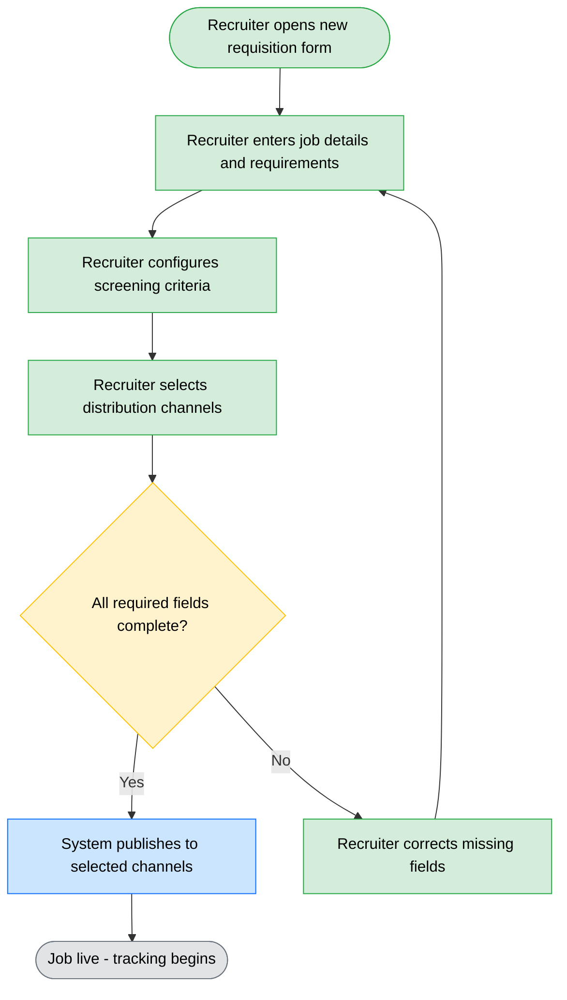
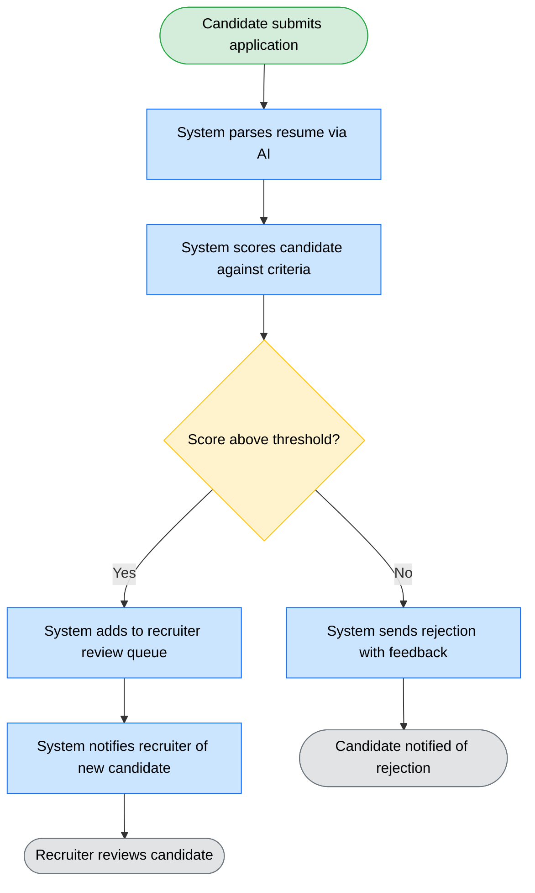
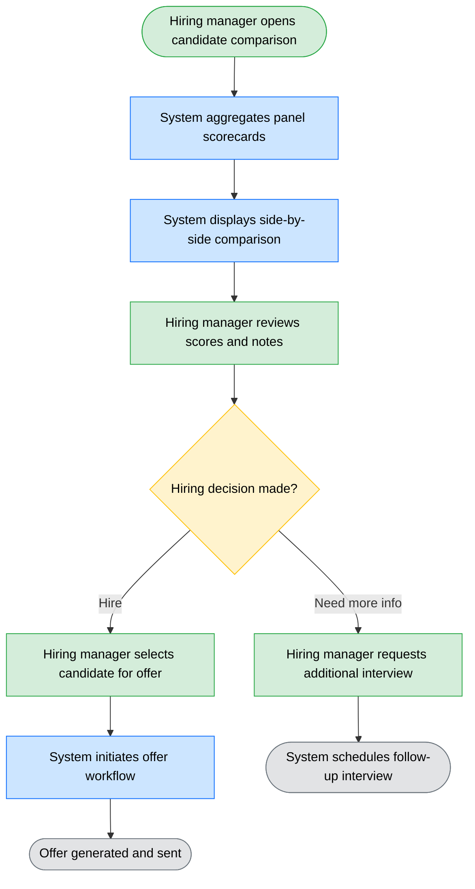
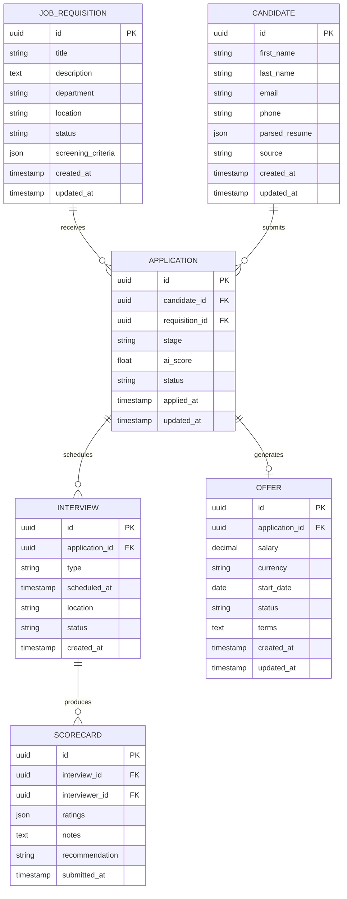
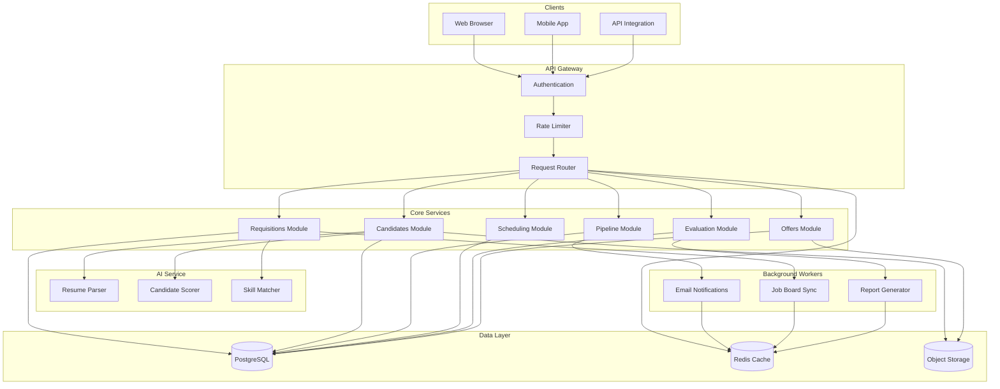

# Software Design Document - Applicant Tracking System (ATS)

> This is a **summary example** demonstrating the structure of a complete Software Design Document. Each section is abbreviated to illustrate the expected format and content types.

---

## 1. Business Model

### 1.1 System Description

The Applicant Tracking System (ATS) is a cloud-based recruitment management platform that automates the end-to-end hiring process for mid-market and enterprise organizations. It enables HR teams to create job postings, receive and filter applications, schedule interviews, collect feedback from hiring panels, and extend offers - all within a single unified workspace.

The platform targets companies with 100 to 10,000 employees that process between 50 and 5,000 applications per month across multiple departments and geographies.

### 1.2 Added Value

- **Automated resume screening**: AI-powered resume parsing and candidate scoring reduces initial screening time by 70%, allowing recruiters to focus on qualified candidates
- **Unified hiring pipeline**: Consolidates job boards, career pages, referral programs, and agency submissions into a single applicant funnel with real-time status tracking
- **Collaborative evaluation**: Structured interview scorecards and panel feedback collection eliminate bias and ensure consistent candidate assessment across teams
- **Compliance automation**: Built-in EEO, GDPR, and local labor law compliance tracking with automated data retention and candidate consent management
- **Analytics and reporting**: Real-time dashboards for time-to-hire, cost-per-hire, source effectiveness, and pipeline conversion rates

### 1.3 Main Features

| #   | Feature                | Description                                                              | Module       | Priority |
| --- | ---------------------- | ------------------------------------------------------------------------ | ------------ | -------- |
| 1   | Job posting management | Create, publish, and distribute job listings across multiple channels    | Requisitions | P0       |
| 2   | Resume parsing         | AI-powered extraction of candidate data from resumes in multiple formats | Candidates   | P0       |
| 3   | Pipeline management    | Kanban-style visual pipeline with customizable stages per job            | Pipeline     | P0       |
| 4   | Interview scheduling   | Calendar integration with automated scheduling and reminders             | Scheduling   | P0       |
| 5   | Scorecard evaluation   | Structured interview feedback with configurable rating criteria          | Evaluation   | P1       |
| 6   | Offer management       | Generate, track, and manage offer letters with e-signature integration   | Offers       | P1       |
| 7   | Reporting dashboard    | Real-time hiring metrics with exportable reports                         | Analytics    | P1       |
| 8   | Candidate portal       | Self-service portal for candidates to track application status           | Portal       | P2       |

### 1.4 Lean Canvas

```mermaid
graph TB
    subgraph Problem["1. Problem"]
        P1["- Manual resume screening wastes 60% of recruiter time"]
        P2["- Fragmented tools create data silos across HR"]
        P3["- Compliance tracking is manual and error-prone"]
    end

    subgraph CustomerSegments["2. Customer Segments"]
        CS1["- Mid-market companies (100-1000 employees)"]
        CS2["- Enterprise HR departments (1000-10000 employees)"]
        CS3["- Staffing agencies managing multiple clients"]
    end

    subgraph UniqueValue["3. Unique Value Proposition"]
        UV1["- AI screening reduces time-to-shortlist by 70%"]
        UV2["- Compliance automation eliminates manual tracking"]
        UV3["- Single platform for entire hiring lifecycle"]
    end

    subgraph Solution["4. Solution"]
        S1["- AI resume parser with skill matching"]
        S2["- Visual pipeline with automated stage transitions"]
        S3["- Built-in compliance engine for EEO and GDPR"]
    end

    subgraph Channels["5. Channels"]
        CH1["- Direct sales to HR leadership"]
        CH2["- Integration marketplace partnerships"]
        CH3["- Content marketing and HR community events"]
    end

    subgraph RevenueStreams["6. Revenue Streams"]
        RS1["- Per-recruiter seat licensing (monthly)"]
        RS2["- Premium AI features add-on"]
        RS3["- Job board distribution fees"]
    end

    subgraph CostStructure["7. Cost Structure"]
        CO1["- Cloud infrastructure and AI compute"]
        CO2["- Engineering and product development"]
        CO3["- Sales, marketing, and customer success"]
    end

    subgraph KeyMetrics["8. Key Metrics"]
        KM1["- Time-to-hire reduction vs baseline"]
        KM2["- Recruiter productivity (hires per recruiter)"]
        KM3["- Net Revenue Retention above 115%"]
    end

    subgraph UnfairAdvantage["9. Unfair Advantage"]
        UA1["- Proprietary AI trained on 10M+ hiring outcomes"]
        UA2["- Deep HRIS integrations that increase switching costs"]
        UA3["- Compliance engine updated automatically with regulations"]
    end
```

---

## 2. Use Cases

### UC-1: Recruiter Posts a New Job

A recruiter creates a new job requisition, defines requirements and evaluation criteria, and publishes it across configured channels (career page, job boards, social media).

### UC-2: Candidate Applies and Gets Screened

A candidate submits an application. The system parses the resume, scores the candidate against job requirements, and routes qualified candidates to the recruiter's review queue.

### UC-3: Hiring Manager Reviews Interview Feedback

A hiring manager reviews structured interview scorecards from the panel, compares candidates, and makes a hiring decision.

---

## 3. Data Model

### 3.1 Entity Analysis

**Job Requisition**: Represents an open position with its requirements, status, and distribution configuration. Central entity linking to candidates, interviews, and offers.

**Candidate**: An individual who has applied to one or more positions. Stores personal information, parsed resume data, and overall hiring status across all applications.

**Application**: The join entity between a Candidate and a Job Requisition. Tracks the candidate's progress through the hiring pipeline for a specific job.

**Interview**: A scheduled evaluation session linking a candidate application to one or more interviewers, with associated scorecard results.

**Scorecard**: Structured evaluation feedback from a single interviewer for a specific interview, containing ratings across configured criteria dimensions.

**Offer**: A formal job offer extended to a candidate for a specific requisition, tracking offer details, approval chain, and candidate response.

### 3.2 Entity-Relationship Diagram

---

## 4. System Design

### 4.1 Overview

The ATS follows a modular monolith architecture deployed as containerized services. The frontend is a React SPA communicating with a Node.js API layer. The API delegates to domain-specific modules (Requisitions, Candidates, Pipeline, Scheduling, Evaluation, Offers) that share a PostgreSQL database. An AI service handles resume parsing and candidate scoring as a separate microservice to allow independent scaling. Background workers process async tasks such as email notifications, job board distribution, and report generation.

### 4.2 Service Inventory

| Service        | Technology                     | Responsibility                                    | Scaling                    |
| -------------- | ------------------------------ | ------------------------------------------------- | -------------------------- |
| Web Frontend   | React 18, TypeScript, Tailwind | User interface for recruiters and hiring managers | CDN + static hosting       |
| API Gateway    | Node.js, Express, TypeScript   | Authentication, routing, rate limiting            | Horizontal (2-8 instances) |
| Core API       | Node.js, TypeScript, Prisma    | Business logic for all domain modules             | Horizontal (2-8 instances) |
| AI Service     | Python, FastAPI, scikit-learn  | Resume parsing, candidate scoring, skill matching | GPU-enabled, auto-scaled   |
| Worker Service | Node.js, BullMQ, Redis         | Async jobs: emails, job board sync, reports       | Horizontal (1-4 instances) |
| Database       | PostgreSQL 16                  | Primary data store with read replicas             | Vertical + read replicas   |
| Cache          | Redis 7                        | Session store, rate limiting, job queues          | Cluster mode               |
| Object Storage | S3-compatible                  | Resume files, offer documents, attachments        | Managed service            |

### 4.3 Architecture Diagram

## Changelog

| Version | Date       | Author            | Changes                                                |
| ------- | ---------- | ----------------- | ------------------------------------------------------ |
| 1.0.0   | 2026-03-26 | TL: Lead Engineer | Initial summary example - ATS Software Design Document |
