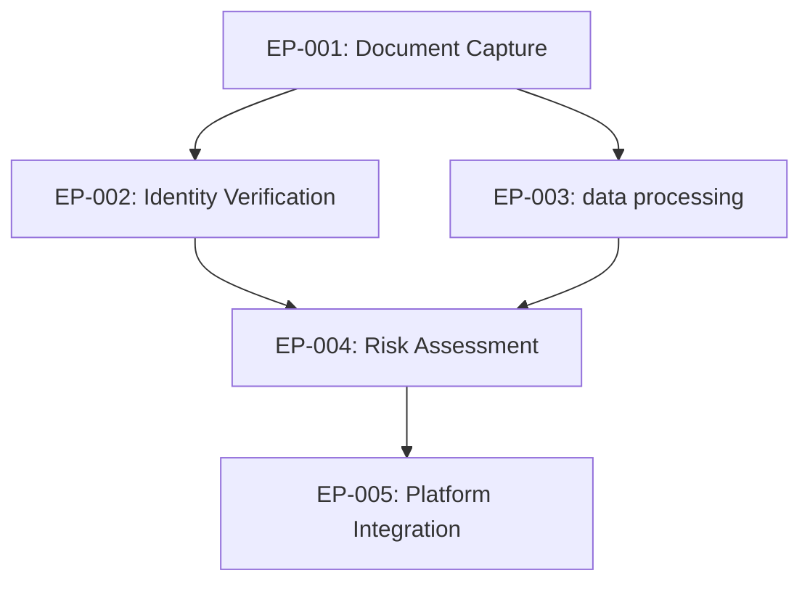

# Epic Breakdown Generator

> **⚡ CRITICAL TRANSITION SKILL**: Converts validated requirements into actionable sprint roadmap
>
> **Phase**: 3→4 boundary (Specification → Sprint Planning) | **Gate**: 2→3 | **Language**: Spanish
> **When to use**: ALWAYS after validate-requirements passes, BEFORE sprint planning starts
> **Blocks**: Gate 3 transition if epics are not properly decomposed

## Context: Two Epic Skills

| Skill                  | Phase                              | Purpose                                                        | Input            |
| ---------------------- | ---------------------------------- | -------------------------------------------------------------- | ---------------- |
| `tracking-integration` | Phase 1 (Origination)              | Creates **master project** from Business Case                  | BC + Kickoff     |
| `epic-breakdown`       | Phase 3→4 (Specification→Planning) | Decomposes master into **feature sub-epics** from requirements | RFs + NFRs + RTM |

This skill bridges the gap between validated requirements and Sprint Planning.

## ⚠️ Prerequisites (MUST be completed first)

| Artifact                | Source Skill            | Status                | Required           |
| ----------------------- | ----------------------- | --------------------- | ------------------ |
| Validated RTM           | `validate-requirements` | ✅ Must exist         | Blocks execution   |
| Implementation Clusters | `validate-requirements` | ✅ Must exist         | Blocks execution   |
| Master Project          | `tracking-integration`  | ✅ Must exist         | Blocks execution   |
| Dependency Map          | `generate-rf`           | ✅ Must exist         | Critical           |
| NFR Summary             | `generate-nfr`          | ⚠️ Highly recommended | Performance impact |

**⛔ Do NOT proceed without validated requirements. Garbage in = garbage out.**

## Domain Examples

**Typical Master Epics that need breakdown:**

1. **"User Onboarding Platform v2.0"** → Sub-epics: Document Capture, Data Processing, Input Validation, Identity Matching
2. **"Regulatory Compliance Integration"** → Sub-epics: Qualified Signatures, Cross-border Interoperability, Audit Trails
3. **"Mobile SDK Enhancement"** → Sub-epics: iOS Native, Android Native, React Native Bridge, Performance Optimization
4. **"Anti-Fraud Detection Engine"** → Sub-epics: Behavioral Analysis, Device Fingerprinting, Risk Scoring, Alert Management

## Workflow

1. Read master project (from `tracking-integration` output or manual input)
2. Read validated RTM (from `validate-requirements` output)
3. Read implementation clusters (from `validate-requirements` output)
4. Read dependency map (from `generate-rf` output)
5. Read NFR Summary Matrix (from `generate-nfr` output)
6. Group RFs into feature epics by cluster + business cohesion
7. Assign NFRs to epics (system-wide NFRs go to ALL epics)
8. Calculate dependencies between epics
9. Estimate sprint ranges per epic
10. Generate epic breakdown using template `templates/epics.md`
11. **Manual creation**: Generate sub-epics for manual creation in Jira
12. Output markdown/JSON for manual creation
13. **Validate**: Ensure 100% RF coverage and dependency resolution

## Input

| Input                                      | Required  | Source                         |
| ------------------------------------------ | --------- | ------------------------------ |
| Master Project (tracking tool or markdown) | ✅        | skill `tracking-integration/`  |
| Requirements Traceability Matrix           | ✅        | skill `validate-requirements/` |
| Implementation Clusters                    | ✅        | skill `validate-requirements/` |
| Dependency Map                             | ✅        | skill `generate-rf/`           |
| NFR Summary Matrix                         | ✅        | skill `generate-nfr/`          |
| Sprint capacity baseline                   | Desirable | skill `sprint-capacity/`       |

## Decomposition Rules

### Epic Sizing

| Rule                | Threshold                      | Action                                                  |
| ------------------- | ------------------------------ | ------------------------------------------------------- |
| Too large           | >8 RFs or >4 sprints estimated | Split into 2+ epics                                     |
| Too small           | <2 RFs or <0.5 sprints         | Merge with related epic                                 |
| Cross-cutting NFR   | NFR applies to ALL epics       | Mark as "cross-cutting constraint", not a separate epic |
| Infrastructure epic | Only NFRs, no RFs              | Valid — create as "Enabler Epic"                        |

### Grouping Criteria (priority order)

1. **Business cohesion**: RFs that deliver a complete user-facing feature together
   - _Example_: Document capture + data processing + validation → "Document Processing" epic
2. **Dependency chain**: RFs that must be implemented sequentially (critical path)
   - _Example_: Record enrollment → Record matching → Input validation (must be sequential)
3. **Technical affinity**: RFs that share the same system component/service
   - _Example_: All recognition RFs → "recognition SDK Engine" epic
4. **Team allocation**: RFs that map to the same team's domain
   - _Example_: Mobile SDK RFs → "Mobile Team" epic, Backend API RFs → "Platform Team" epic

### Generic Grouping Patterns

| Epic Pattern              | Common RFs                                                                     | Business Value                            |
| ------------------------- | ------------------------------------------------------------------------------ | ----------------------------------------- |
| **Document Processing**   | Data extraction, structured data reading, document validation, fraud detection | Complete document verification capability |
| **Core Algorithm Engine** | Data capture, record generation, matching, input validation                    | End-to-end data processing                |
| **Platform Integration**  | API design, authentication, rate limiting, monitoring                          | Scalable platform services                |
| **Compliance & Security** | Regulatory compliance, audit trails, data encryption, consent management       | Regulatory compliance                     |

### Dependency Types Between Epics

| Type            | Symbol | Meaning                                        |
| --------------- | ------ | ---------------------------------------------- |
| Hard dependency | →      | Must complete A before starting B              |
| Soft dependency | ⇢      | A's output improves B, but B can start without |
| Parallel        | ‖      | Can execute simultaneously                     |
| Milestone       | ⬡      | Both must complete before Gate N               |

## Output Template

Use `templates/epics.md` with these **mandatory additions**:

````markdown
# Epic Breakdown: {PROJECT}

## Master Epic

| Field                  | Value                                                          |
| ---------------------- | -------------------------------------------------------------- |
| **Jira ID**            | {PROJ-NNN}                                                     |
| **Name**               | {from tracking-integration}                                    |
| **Total Sub-Epics**    | {N}                                                            |
| **Total RFs**          | {N}                                                            |
| **Total NFRs**         | {N}                                                            |
| **Estimated Timeline** | Sprint {start} — Sprint {end}                                  |
| **Compliance Scope**   | data protection regulation, eIDAS Level {Low/Substantial/High} |

## Dependency Diagram


````

## Sub-Epic Details

### EP-001: Document Capture & Processing

**Example: Structured document data extraction pipeline**

| Field                 | Value                                                                                     |
| --------------------- | ----------------------------------------------------------------------------------------- |
| **Type**              | Feature                                                                                   |
| **Priority**          | Must Have                                                                                 |
| **RFs Included**      | RF-DOC-001 (Document capture), RF-DOC-002 (Data extraction), RF-DOC-003 (Fraud detection) |
| **NFRs Applicable**   | NFR-PERF-001 (< 3s processing), NFR-SEC-001 (Data encryption), ALL system-wide            |
| **Dependencies**      | None (foundational)                                                                       |
| **Estimated Sprints** | 2-3                                                                                       |
| **Team/Owner**        | Data Processing Team                                                                      |
| **Data Impact**       | Document records for downstream comparison                                                |

#### Business Value

Users can capture and verify documents with automatic data extraction and fraud detection, enabling secure digital onboarding across multiple document types and formats.

#### Key Deliverables

- Core processing library integration points
- Support for multiple document formats
- Real-time fraud detection algorithms
- Structured data extraction capability

#### Risk Assessment

| Risk                                       | Probability | Impact | Mitigation                                    |
| ------------------------------------------ | ----------- | ------ | --------------------------------------------- |
| Document quality varies in real conditions | High        | Medium | Implement adaptive image enhancement          |
| Fraud patterns evolve                      | Medium      | High   | ML model retraining pipeline                  |
| Regulatory changes                         | Medium      | High   | Compliance monitoring + flexible architecture |

---

### EP-002: Core Data Processing Engine

**Example: Pattern recognition and matching engine**

| Field                 | Value                                                                                                                       |
| --------------------- | --------------------------------------------------------------------------------------------------------------------------- |
| **Type**              | Feature                                                                                                                     |
| **Priority**          | Must Have                                                                                                                   |
| **RFs Included**      | RF-PROC-001 (Data capture), RF-PROC-002 (Record generation), RF-PROC-003 (Input validation), RF-PROC-004 (1:1 verification) |
| **NFRs Applicable**   | NFR-PERF-002 (< 2s verification), NFR-SEC-002 (Data encryption), NFR-PRIV-001 (GDPR compliance)                             |
| **Dependencies**      | EP-001 (document data for comparison)                                                                                       |
| **Estimated Sprints** | 3-4                                                                                                                         |
| **Team/Owner**        | Algorithms Team                                                                                                             |
| **Regulatory Note**   | Sensitive data subject to data protection regulations                                                                       |

#### Business Value

End-users can securely verify their identity through the core processing engine with advanced input validation, preventing fraud and ensuring secure access to services.

#### Key Deliverables

- Anti-fraud input validation
- High-accuracy matching (error rate < 0.01%)
- Cross-platform SDK support (iOS/Android)

---

## Sprint Allocation Suggestion

| Sprint   | Epic(s)                      | RFs                      | Focus                                         |
| -------- | ---------------------------- | ------------------------ | --------------------------------------------- |
| Sprint 1 | EP-001 (start)               | RF-DOC-001, RF-DOC-002   | Document capture + data processing foundation |
| Sprint 2 | EP-001 (end), EP-002 (start) | RF-DOC-003, RF-BIO-001   | Fraud detection + Face capture                |
| Sprint 3 | EP-002 (continue)            | RF-PROC-002, RF-PROC-003 | Record generation + Input validation          |
| Sprint 4 | EP-002 (end), EP-003 (start) | RF-PROC-004, RF-RISK-001 | Verification + Risk scoring                   |

## Sensitive Data Flow Validation

| Flow               | Input               | Process                           | Output                 | Compliance                 |
| ------------------ | ------------------- | --------------------------------- | ---------------------- | -------------------------- |
| Document → Record  | Source document     | Data extraction + record creation | Encrypted record       | Data protection consent    |
| Input → Validation | User input capture  | Analysis + validation check       | Validation result      | Regulatory standards       |
| Record → Match     | 2 encrypted records | Similarity algorithm              | Match score + decision | Local processing (privacy) |

## Validation Summary

| Check                                        | Result | Notes                                          |
| -------------------------------------------- | ------ | ---------------------------------------------- |
| All RFs assigned to an epic                  | ✅/❌  | Full requirement flow coverage verified        |
| All NFRs allocated (specific or system-wide) | ✅/❌  | Performance + security + privacy               |
| No orphan requirements                       | ✅/❌  | All processing steps covered                   |
| Critical path identified                     | ✅/❌  | Document → Processing → Decision dependency    |
| Each epic ≤4 sprints estimated               | ✅/❌  | Aligned with project complexity                |
| Dependencies documented                      | ✅/❌  | Data flow + API contracts defined              |
| GDPR compliance mapped                       | ✅/❌  | Consent, encryption, audit trails              |
| Anti-fraud measures included                 | ✅/❌  | Input validation + document fraud + behavioral |

````

## 🚨 Critical Rules (NON-NEGOTIABLE)

1. **100% RF Coverage**: Every RF must belong to exactly one epic (no orphans, no duplicates)
2. **NFR Allocation**: Every NFR must be allocated - either specific to an epic or system-wide
3. **Sensitive Data Flow**: Document → Processing → Decision pipeline must be complete and traceable
4. **Regulatory Compliance**: Data protection considerations must be explicit in every epic handling sensitive data
5. **Performance Thresholds**: Processing pipeline NFRs (< 3s total flow) must be distributed appropriately
6. **Epic Sizing**: 2-4 sprints maximum per epic (complexity requires focused scope)
7. **Demo Value**: Each epic must deliver demonstrable platform capability (not just infrastructure)
8. **Security First**: Every epic touching sensitive data requires security NFR allocation

## ⚠️ Platform-Specific Constraints

- **Input validation** considerations in every data processing epic
- **Cross-region** compatibility for regulatory compliance epics
- **Mobile-first** approach - every epic must consider mobile SDK impact
- **Audit trail** requirements for regulated industries (banking, government)
- **Record versioning** for algorithm updates without breaking existing data

## Manual Jira Creation Workflow

**Since no Jira MCP available, generate structured output for manual creation:**

### Step 1: Epic Creation Templates
```markdown
## Jira Epic Creation Checklist

For each epic, create with these fields:

**Epic Name**: {Epic name from breakdown}
**Epic Summary**: {Business value statement}
**Description**: {Use generated epic details}
**Epic Link**: {Master Epic ID}
**Components**: Core SDK, Processing Library, Platform, Mobile (as applicable)
**Labels**: data-processing, algorithm, document-verification, compliance
**Sprint**: {Suggested sprint range}
**Story Points**: {Estimated effort from RF count}
**Epic Owner**: {Team lead from breakdown}

**Custom Fields (platform-specific):**
- Processing Technology: [Core Algorithm, Document, Multi-factor, Behavioral]
- Compliance Scope: [GDPR, eIDAS, PSD2, AML]
- Mobile Platform: [iOS, Android, React Native, Flutter]
- Algorithm Version: [Current version of algorithms]
````

### Step 2: RF-to-Story Linking

```json
{
  "epic_to_stories_map": {
    "EP-001": {
      "epic_name": "Document Capture & Processing",
      "stories": [
        {
          "story_summary": "As a user I want to capture my document photo",
          "rf_reference": "RF-DOC-001",
          "acceptance_criteria": "Given/When/Then from RF",
          "story_points": 8,
          "sprint": 1
        }
      ]
    }
  }
}
```

### Step 3: Epic Dependency Setup

```markdown
## Manual Dependency Configuration

1. **Epic Links** (in Jira):
   - EP-001 "blocks" EP-002
   - EP-002 "is related to" EP-003

2. **Dependency Validation**:
   - Verify no circular dependencies
   - Confirm critical path makes business sense
   - Check resource allocation doesn't conflict

3. **Board Configuration**:
   - Create epic swimlanes
   - Set up epic progress tracking
   - Configure epic burndown charts
```

### Step 4: Sprint Board Setup

Export sprint allocation as CSV for import:

```csv
Epic,Sprint,Stories,Focus Area,Team
EP-001,Sprint 1,"RF-DOC-001,RF-DOC-002","Document Foundation",Computer Vision
EP-001,Sprint 2,"RF-DOC-003","Fraud Detection",Computer Vision
EP-002,Sprint 2,"RF-BIO-001","Face Capture",algorithms
```

**⚡ Action Required**: Manual creation in Jira with provided templates and data.

---

## 🎯 When to Execute This Skill (Triggers)

### Immediate Triggers (Execute NOW)

- ✅ `validate-requirements` completed successfully
- ✅ Gate 2 passed (requirements validated)
- ✅ Master epic exists in Jira
- 🔔 PO says: "We need to plan sprints"
- 🔔 SM asks: "What's our implementation roadmap?"
- 🔔 Dev Lead asks: "How do we split this work?"

### Conversation Triggers (Execute ASAP)

- "break down epic"
- "decompose epic"
- "create sub-epics"
- "epic structure"
- "sprint planning prep"
- "feature epics"
- "implementation roadmap"
- "how do we organize the sprints"
- "what epics do we need"

### Blocking Conditions (Do NOT execute)

- ❌ Requirements not validated (`validate-requirements` pending)
- ❌ Master project doesn't exist (`tracking-integration` not run)
- ❌ No implementation clusters defined
- ❌ Dependency map incomplete

### Success Criteria

✅ Every RF has an epic home
✅ Sprint roadmap is clear
✅ Dependencies mapped
✅ Teams know their scope
✅ Gate 3 ready for execution

**Remember**: This skill is ESSENTIAL for Phase 3→4 transition. Without it, sprint planning becomes chaotic and Gate 3 will fail. Always execute after requirements validation and before sprint planning begins.

## Quality Assurance

### Validation Script

This skill includes automated validation via `scripts/validate-examples.ts`:

```bash
# Validate skill examples and structure
npx tsx scripts/validate-examples.ts
```

**Validation includes:**

- Example completeness and correctness
- Epic decomposition compliance patterns
- Progressive disclosure adherence
- Resource organization standards

**When to use:**

- Before skill release/packaging
- In CI/CD pipeline (quality gates)
- After major example updates
- During skill maintenance cycles

**Integration with ecosystem:**

- Used by `/multi-agent-audit` for ecosystem validation
- Supports quality gates in SDLC workflow
- Provides consistent validation across all skills
