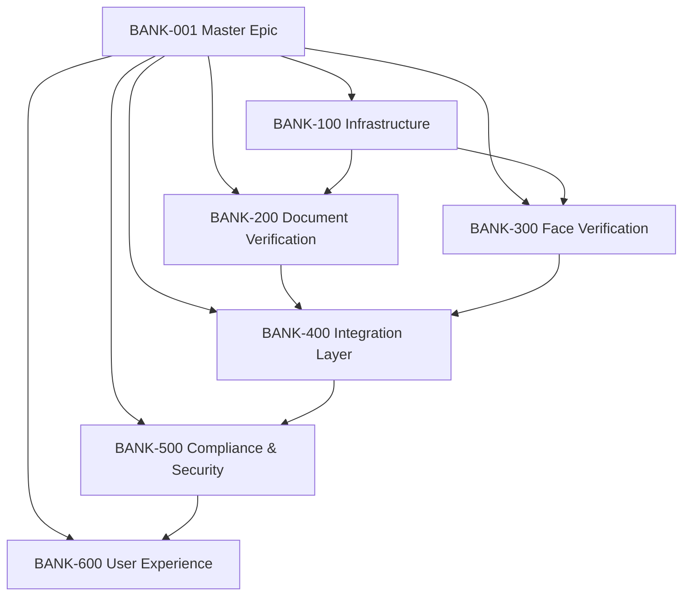

# Epic Breakdown: {{PRODUCT_NAME_1}}D Digital Onboarding Platform

**Master Epic**: BANK-001 "Digital Customer Onboarding with domain-specific Verification"
**Generated from**: RFs validados + NFRs definidos + Sprint capacity analysis
**Breakdown Date**: 2026-03-15
**Total Estimation**: 480 horas (24 sprints @ 20h/sprint)

---

## Epic Hierarchy & Dependencies

---

## Sub-Epic 1: BANK-100 Infrastructure Foundation

**Summary**: Establecer la infraestructura base para soportar verificación biométrica a escala bancaria

### Epic Details

- **Owner**: DevOps Lead + Platform Architect
- **Duration**: 6 sprints
- **Team**: Platform Engineering (2 devs + 1 DevOps)
- **Priority**: Highest (Blocking path)
- **Risk Level**: Medium (well-known technologies)

### Features Included

| Feature ID | Title                                         | Estimation | Sprint | Dependencies |
| ---------- | --------------------------------------------- | ---------- | ------ | ------------ |
| BANK-101   | Kubernetes Platform Setup                     | 40h        | S1-S2  | None         |
| BANK-102   | API Gateway Configuration                     | 32h        | S2-S3  | BANK-101     |
| BANK-103   | Database Architecture (PostgreSQL + Redis)    | 36h        | S3-S4  | BANK-101     |
| BANK-104   | HSM Integration for domain-specific Templates | 48h        | S4-S5  | BANK-103     |
| BANK-105   | Monitoring & Observability Stack              | 24h        | S5-S6  | All previous |

### Acceptance Criteria

- [ ] Kubernetes cluster running with 99.9% uptime
- [ ] API Gateway handling 1000 req/s with <100ms latency
- [ ] Database supporting 500 concurrent connections
- [ ] HSM storing/retrieving templates <200ms P95
- [ ] Complete observability for all components

### Key Risks

- **HSM vendor delays**: Mitigated by parallel development with mocks
- **Kubernetes complexity**: Mitigated by dedicated DevOps engineer
- **Performance targets**: Continuous load testing from Sprint 2

---

## Sub-Epic 2: BANK-200 Document Verification ({{PRODUCT_NAME_1}}D)

**Summary**: Implementar captura, OCR, y validación de documentos de identidad españoles

### Epic Details

- **Owner**: R&D Core Lead + Frontend Lead
- **Duration**: 4 sprints
- **Team**: Frontend (2), Backend (1), R&D (1)
- **Priority**: High (Critical path)
- **Risk Level**: Low (proven technology)

### Features Included

| Feature ID | Title                                      | Estimation | Sprint | Dependencies              |
| ---------- | ------------------------------------------ | ---------- | ------ | ------------------------- |
| BANK-201   | Document Capture UI (Mobile-first)         | 32h        | S3     | BANK-102                  |
| BANK-202   | {{PRODUCT_NAME_1}}D OCR Engine Integration | 40h        | S3-S4  | BANK-103, R&D model       |
| BANK-203   | Document Type Support (DNI/NIE/Passport)   | 28h        | S4     | BANK-202                  |
| BANK-204   | Quality Validation & Error Handling        | 24h        | S4-S5  | BANK-202                  |
| BANK-205   | Anti-fraud Document Detection              | 36h        | S5-S6  | BANK-202, Security review |

### User Stories Included (Selection)

- Document capture with real-time border detection
- Multi-format support (DNI, NIE, Spanish passport)
- Quality feedback and retry mechanisms
- Basic fraud detection (obvious fakes)

### Performance Targets

- **OCR Processing**: <800ms P95 for standard documents
- **UI Responsiveness**: <500ms feedback for document positioning
- **Fraud Detection**: >95% accuracy for obvious forgeries
- **Mobile Compatibility**: iOS 14+, Android 10+

---

## Sub-Epic 3: BANK-300 Face Verification ({{PRODUCT_NAME_1}})

**Summary**: Verificación facial con liveness detection y matching 1:1 contra documento

### Epic Details

- **Owner**: R&D Core Lead + Security Lead
- **Duration**: 4 sprints
- **Team**: R&D (2), Backend (1), Frontend (1)
- **Priority**: High (Critical path)
- **Risk Level**: Medium (domain-specific accuracy requirements)

### Features Included

| Feature ID | Title                                  | Estimation | Sprint | Dependencies        |
| ---------- | -------------------------------------- | ---------- | ------ | ------------------- |
| BANK-301   | Face Capture UI with Liveness Guidance | 28h        | S4     | BANK-201            |
| BANK-302   | {{PRODUCT_NAME_1}} Engine Integration  | 44h        | S4-S5  | BANK-104 (HSM)      |
| BANK-303   | 1:1 Matching Algorithm Implementation  | 32h        | S5     | BANK-302, BANK-202  |
| BANK-304   | Anti-spoofing (Photo/Video Detection)  | 40h        | S5-S6  | BANK-302            |
| BANK-305   | domain-specific Accuracy Tuning        | 16h        | S6-S7  | BANK-303, Real data |

### NFR Commitments

- **False Accept Rate**: <0.01% (1 in 10,000)
- **False Reject Rate**: <2% (98% legitimate users pass)
- **Liveness Detection**: >99% spoofing detection
- **Performance**: <400ms P95 for face verification

### GDPR Compliance Requirements

- [ ] Template encryption in HSM
- [ ] 30-day automatic deletion
- [ ] No storage of original images >5 minutes
- [ ] Granular consent management
- [ ] Audit trail for all domain-specific operations

---

## Sub-Epic 4: BANK-400 Integration Layer

**Summary**: Conexión con sistemas bancarios existentes y orquestación del flujo completo

### Epic Details

- **Owner**: Enterprise Architect + Backend Lead
- **Duration**: 5 sprints
- **Team**: Backend (2), Integration (1), QA (1)
- **Priority**: High (Business value delivery)
- **Risk Level**: High (external dependencies)

### Features Included

| Feature ID | Title                                        | Estimation | Sprint | Dependencies                |
| ---------- | -------------------------------------------- | ---------- | ------ | --------------------------- |
| BANK-401   | Core Banking Integration (Customer Creation) | 40h        | S5-S6  | BANK-103, Bank API access   |
| BANK-402   | Fraud Detection System Integration           | 32h        | S6     | BANK-301, Bank fraud API    |
| BANK-403   | Workflow Orchestration Engine                | 36h        | S6-S7  | BANK-202, BANK-303          |
| BANK-404   | Audit Trail & Compliance Reporting           | 28h        | S7     | All verification components |
| BANK-405   | Error Recovery & Circuit Breakers            | 24h        | S7-S8  | BANK-403                    |

### External Dependencies

| System               | API/Protocol | SLA    | Risk Mitigation                   |
| -------------------- | ------------ | ------ | --------------------------------- |
| Core Banking         | SOAP/XML     | <500ms | Mock service for development      |
| Fraud Detection      | REST/JSON    | <2s    | Circuit breaker + default scoring |
| AEAT (Tax Authority) | REST/JSON    | <5s    | Cache results + manual fallback   |

---

## Sub-Epic 5: BANK-500 Compliance & Security

**Summary**: Implementar todos los requisitos regulatorios (GDPR, PCI DSS, bancarios)

### Epic Details

- **Owner**: CISO + DPO + Legal
- **Duration**: 3 sprints (paralelo con otros)
- **Team**: Security (1), Backend (1), QA (1)
- **Priority**: Highest (Regulatory requirement)
- **Risk Level**: High (regulatory compliance)

### Features Included

| Feature ID | Title                                | Estimation | Sprint | Dependencies    |
| ---------- | ------------------------------------ | ---------- | ------ | --------------- |
| BANK-501   | GDPR Article 9 Implementation        | 32h        | S4-S5  | BANK-104        |
| BANK-502   | Data Retention & Deletion Automation | 24h        | S5-S6  | BANK-501        |
| BANK-503   | Security Monitoring & Alerting       | 28h        | S6-S7  | BANK-105        |
| BANK-504   | Compliance Audit Trail               | 20h        | S7     | All systems     |
| BANK-505   | Penetration Testing & Remediation    | 36h        | S8-S9  | Complete system |

### Regulatory Deliverables

- [ ] DPIA (Data Protection Impact Assessment) completed
- [ ] PCI DSS Level 1 compliance documentation
- [ ] Security architecture review by external auditor
- [ ] domain-specific data handling procedures documented
- [ ] Incident response playbook for domain-specific breaches

---

## Sub-Epic 6: BANK-600 User Experience & Optimization

**Summary**: Optimización de UX, performance, y onboarding guided experience

### Epic Details

- **Owner**: UX Lead + Frontend Lead
- **Duration**: 3 sprints
- **Team**: Frontend (2), UX/UI (1), QA (1)
- **Priority**: Medium (Quality & conversion)
- **Risk Level**: Low (iterative improvements)

### Features Included

| Feature ID | Title                                    | Estimation | Sprint | Dependencies            |
| ---------- | ---------------------------------------- | ---------- | ------ | ----------------------- |
| BANK-601   | Guided Onboarding Flow                   | 28h        | S6-S7  | BANK-201, BANK-301      |
| BANK-602   | Progressive Web App (PWA) Implementation | 32h        | S7-S8  | BANK-601                |
| BANK-603   | Performance Optimization                 | 24h        | S8     | All frontend components |
| BANK-604   | Accessibility (WCAG 2.1 AA)              | 20h        | S8-S9  | BANK-601                |
| BANK-605   | A/B Testing Framework                    | 16h        | S9     | BANK-602                |

### UX Targets

- **Completion Rate**: >85% (vs 33% baseline)
- **Time to Complete**: <3 minutes average
- **Mobile Experience**: First-class, not responsive afterthought
- **Accessibility**: WCAG 2.1 AA compliance
- **Error Recovery**: Clear guidance, max 3 attempts

---

## Sprint Planning Matrix

| Sprint | Sub-Epics Active             | Key Deliverables                            | Team Allocation                 |
| ------ | ---------------------------- | ------------------------------------------- | ------------------------------- |
| **S1** | BANK-100                     | K8s cluster + CI/CD pipeline                | Platform (100%)                 |
| **S2** | BANK-100                     | API Gateway + basic monitoring              | Platform (100%)                 |
| **S3** | BANK-100, BANK-200           | Database + Document capture UI              | Platform (50%) + Frontend (50%) |
| **S4** | BANK-200, BANK-300, BANK-500 | OCR integration + Face capture + GDPR       | Multi-team coordination         |
| **S5** | BANK-200, BANK-300, BANK-400 | Complete verification + banking integration | Peak complexity sprint          |
| **S6** | BANK-300, BANK-400, BANK-600 | Face matching + orchestration + UX          | Feature completion focus        |
| **S7** | BANK-400, BANK-500, BANK-600 | Integration testing + compliance + PWA      | Quality & compliance            |
| **S8** | BANK-500, BANK-600           | Security testing + performance optimization | Final hardening                 |
| **S9** | BANK-600                     | A/B testing + final UX polish               | Launch preparation              |

### Critical Path Analysis

**Longest path**: BANK-100 → BANK-200/300 → BANK-400 → BANK-500 (8 sprints)
**Parallel opportunities**: UX work (BANK-600) can start from Sprint 6
**Risk mitigation**: Buffer sprint planned for Sprint 10 if needed

---

## Resource Allocation

### Team Composition by Sprint

| Role                   | S1-S3 | S4-S6 | S7-S9 | Total FTE |
| ---------------------- | ----- | ----- | ----- | --------- |
| **Platform Engineer**  | 2     | 1     | 0.5   | 1.17      |
| **Backend Developer**  | 1     | 3     | 2     | 2.0       |
| **Frontend Developer** | 1     | 2     | 2     | 1.67      |
| **R&D Engineer**       | 0     | 2     | 1     | 1.0       |
| **QA Engineer**        | 0.5   | 1     | 1.5   | 1.0       |
| **DevOps**             | 1     | 0.5   | 0.5   | 0.67      |
| **Security**           | 0     | 1     | 1     | 0.67      |

### Budget Estimation

- **Development**: 480 hours × €75/hour = €36,000
- **R&D Integration**: Included in {{CLIENT_NAME}} platform license
- **Infrastructure**: AWS costs ~€2,000/month during development
- **Security/Compliance**: €8,000 external auditing
- **Total Budget**: ~€50,000 for 9-sprint development

---

## Success Metrics per Sub-Epic

### BANK-100 (Infrastructure)

- [ ] 99.9% uptime after Sprint 2
- [ ] <100ms API Gateway latency P95
- [ ] Successful load test: 1000 concurrent users

### BANK-200 (Document Verification)

- [ ] 95% document capture success rate
- [ ] <800ms OCR processing P95
- [ ] Support 3 document types (DNI/NIE/Passport)

### BANK-300 (Face Verification)

- [ ] FAR <0.01%, FRR <2%
- [ ] 99%+ liveness detection accuracy
- [ ] <400ms face verification P95

### BANK-400 (Integration)

- [ ] End-to-end onboarding <3 minutes
- [ ] 100% data consistency with core banking
- [ ] Circuit breakers prevent cascade failures

### BANK-500 (Compliance)

- [ ] GDPR Article 9 full compliance
- [ ] Zero critical security vulnerabilities
- [ ] Successful external compliance audit

### BANK-600 (UX)

- [ ] 85%+ completion rate (vs 33% baseline)
- [ ] WCAG 2.1 AA accessibility compliance
- [ ] PWA installable on mobile devices

---

**Gate Transition**: Este epic breakdown es input para **Gate 3** (Sprint Planning → Development)

**Next Steps**:

1. Sprint 1 planning with Platform team
2. R&D model integration timeline confirmation
3. External system access provisioning (Core Banking APIs)
4. Security review of domain-specific data flows
5. Final capacity planning with Scrum Master
