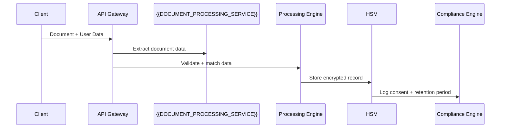

# Technical PRD Generator

Phase: 2 — Discovery | Gate: 1 (with PRD-F + cross-review) | Language: Spanish + English (technical)

## Workflow

1. **Read approved Business Case** (scope, constraints, objectives)
2. **Read tech discovery notes** (sessions with R&D, Architecture)
3. **Analyze current technical architecture** (AS-IS) from existing docs or codebase
   - Existing SDKs and libraries in use
   - Current API Gateway configuration
   - Database schemas and data models
   - Compliance implementation status
4. **Read tech stack rules** (`rules/tech-stack.md`) for approved technologies
5. **Generate PRD-T** using template below with domain-specific sections
6. **Identify PoC areas** (technology validation, performance testing, compliance validation)
7. **Document security architecture** for {{SENSITIVE_DATA_TYPE}} handling ({{COMPLIANCE_FRAMEWORK}} compliance)
8. **Ready for cross-review** with PRD-F (skill `review-cruzado/`)

## Input

| Input                        | Required  | Source                       |
| ---------------------------- | --------- | ---------------------------- |
| Approved Business Case       | ✅        | skill `business-case/`       |
| Tech discovery session notes | ✅        | R&D / Architecture workshops |
| Current architecture (AS-IS) | ✅        | Existing docs, codebase      |
| Tech stack rules             | ✅        | `rules/tech-stack.md`        |
| PRD Funcional draft          | Desirable | skill `prd-funcional/`       |

## Output Location

Generated documents should be saved to: **`docs/projects/{projectName}/prd-tecnico.md`**

Example: `docs/projects/identity-sdk-v3/prd-tecnico.md`

## Output Template

```markdown
---
id: {project-name}-prd-tecnico
version: "1.0.0"
last_updated: "YYYY-MM-DD"            # date of generation
updated_by: "TL: {Name}"              # Tech Lead/R&D generates technical PRDs
status: active
type: project
review_cycle: 60                      # days between reviews (project documentation)
next_review: "YYYY-MM-DD"             # calculated: last_updated + review_cycle
owner_role: "TL"                      # Tech Lead maintains technical PRDs
---

# PRD Técnico: [PROJECT NAME]

| Campo       | Valor                                             |
| ----------- | ------------------------------------------------- |
| **ID**      | PRD-T-[YYYY]-[NNN]                                |
| **Versión** | 1.0 — Borrador                                    |
| **Fecha**   | [YYYY-MM-DD]                                      |
| **Autor**   | [R&D Lead + IA]                                   |
| **Estado**  | Borrador / En Review / Cross-Review OK / Aprobado |

## 1. Resumen Técnico (executive overview for tech audience)

## 2. Arquitectura Actual (AS-IS)

### Diagrama C4 (Context + Container level)

### Componentes existentes relevantes

### Limitaciones del AS-IS que motivan el cambio

## 3. Arquitectura Propuesta (TO-BE)

### Diagrama C4 (Context + Container + Component)

### Capacidades técnicas (mapped to PRD-F functionalities)

### Nuevos componentes + cambios a existentes

### Decisiones técnicas (reference ADRs if exist)

## 4. Stack Tecnológico (from rules/tech-stack.md + new)

### Frontend / Backend / DB / Infrastructure / Third-party

## 5. Requisitos No Funcionales (NFRs)

### Performance

- **API response time**: <500ms P95 response time, 1000+ concurrent sessions
- **Data processing pipeline**: <200ms processing time
- **Document extraction**: <2s full extraction for standard documents
- **Multi-factor verification**: <1s comparison against stored record
- **Throughput**: 100+ requests/second per instance

### Security (Sensitive Data Protection)

- **Data encryption**: AES-256-GCM at rest and in transit
- **API security**: OAuth2 + mTLS for all sensitive data endpoints
- **Audit logging**: All sensitive data operations logged (no PII/raw data)
- **GDPR compliance**: Data minimization, consent management, right to deletion
- **Input validation**: Anti-fraud validation ≥95% accuracy

### Scalability

- **Current load**: 50K transactions/day, 500 concurrent users
- **Projected load**: 500K transactions/day, 5K concurrent users (12 months)
- **Auto-scaling**: Horizontal scaling based on CPU (70%) + queue depth (100)

### Availability

- **Enterprise tier**: 99.95% uptime SLA
- **Standard tier**: 99.9% uptime SLA
- **RTO**: <30 seconds failover
- **RPO**: <5 minutes data loss maximum

### Compliance

- **Data protection regulation**: Sensitive data subject to regulatory requirements
- **DPIA**: Data Protection Impact Assessment completed
- **Regulatory assurance**: Applicable compliance levels documented
- **Authentication standards**: Strong authentication compliance
- **Data residency**: EU data stays in EU, configurable by region

### Observability

- **Metrics**: Accuracy rates, latency percentiles, error rates
- **Alerts**: Data integrity issues, algorithm degradation, compliance violations
- **Dashboards**: Real-time platform operations monitoring

## 6. Integraciones

### Per integration: system, protocol, contract, auth, SLA, fallback

## 7. Modelo de Datos (high-level entities + relationships)

## 8. Riesgos Técnicos + PoC necesarios

### R-T-001: Algorithm Performance Degradation

- **Descripción**: New algorithm version may have different accuracy characteristics
- **Probabilidad**: Media — Algorithm updates are frequent
- **Impacto**: Alto — Could affect user experience and compliance thresholds
- **Mitigación**: A/B testing with controlled rollout, benchmark against current metrics
- **PoC requerido**: Algorithm validation with representative data samples

### R-T-002: GDPR Compliance Architecture

- **Descripción**: Current data storage may not meet data protection regulation requirements
- **Probabilidad**: Alta — Regulatory interpretation evolving
- **Impacto**: Crítico — Legal liability, potential fines, project blocking
- **Mitigación**: Legal review + technical audit, data pseudonymization
- **PoC requerido**: Data deletion workflow validation (48h max)

### R-T-003: Data Record Interoperability

- **Descripción**: Cross-vendor data format compatibility for regulatory compliance
- **Probabilidad**: Media — Standards still evolving
- **Impacto**: Alto — Could limit market reach, require dual enrollment
- **Mitigación**: Open standards compliance, documented format adoption
- **PoC requerido**: Data format conversion testing with reference test vectors

### R-T-004: Real-time Processing Performance

- **Descripción**: Processing pipeline may not achieve <200ms requirement under peak load
- **Probabilidad**: Baja — Current benchmarks show 150ms
- **Impacto**: Medio — Affects user experience, may need fallback strategy
- **Mitigación**: Hardware acceleration (GPU/NPU), algorithm optimization
- **PoC requerido**: Performance testing on production-equivalent hardware

### R-T-005: Cross-Border Data Transfer

- **Descripción**: Sensitive data transfer between regions may violate local laws
- **Probabilidad**: Alta — Different countries, different regulations
- **Impacto**: Crítico — Legal compliance, service availability
- **Mitigación**: Regional data residency, encryption in transit, legal review
- **PoC requerido**: Multi-region deployment with data isolation

## 9. Estimación de Alto Nivel (team × time × phases)

## 10. Supuestos Técnicos + Dependencias Externas

## 11. Historial de Versiones
```

## Key Rules

- **Architecture-first**: Describe the system architecture, not implementation details. Use C4 diagrams showing flow from client app → API Gateway → processing engines → secure storage.
- **NFRs are measurable**: "Fast processing" → "P95 API response <500ms, processing pipeline <200ms, 99.5% uptime SLA for enterprise clients"
- **Security explicit**: Sensitive data encrypted AES-256-GCM, no raw sensitive data in logs, data protection regulation compliance architecture documented
- **PoC areas explicit**: Algorithm accuracy testing, performance under load, data deletion workflow, cross-border compliance
- **Stack compliance**: All technologies verified against `rules/tech-stack.md`. Processing libraries, encryption methods, and storage solutions must be pre-approved
- **Integration contracts**: Each integration (fraud detection, compliance providers, external databases) needs protocol, auth, SLA, failover strategy
- **Cross-reference with PRD-F**: Every technical capability (data matching, document processing, multi-factor verification) maps to PRD-F user journeys and requirements
- **Compliance by design**: Regulatory requirements built into architecture, not added as afterthought

## Platform Project Example

### PRD-T Example: Core Platform v3.0 with Enhanced Document Processing

````markdown
# PRD Técnico: Core Platform v3.0 - Enhanced Document Verification

## 3. Arquitectura Propuesta (TO-BE)

### Nuevos componentes

- **Document Reader Service**: Integración con structured data extraction
- **{{DOCUMENT_PROCESSING_ENGINE}}**: ML mejorado para documentos multi-region
- **Data Encryption Service**: Hardware Security Module (HSM) integration
- **Compliance Engine**: Automated consent + deletion workflows

### Sensitive Data Flow


````

## 5. Requisitos No Funcionales específicos

- **Data matching accuracy**: Error rate ≤0.001% (enterprise), False rejection ≤1%
- **Document processing time**: <3 segundos para structured documents
- **Record generation**: <500ms para standard input
- **Data deletion**: <24 horas automated workflow

## 8. Riesgos específicos

- **R-T-DOC-001**: Compatibility with third-party document formats (PoC: 100 test documents)
- **R-T-GDPR-001**: Legal validation of data encryption approach (PoC: external audit)

````

## Quality Assurance

### Validation Script
This skill includes automated validation via `scripts/validate-examples.ts`:

```bash
# Validate skill examples and structure
npx tsx scripts/validate-examples.ts
````

**Validation includes:**

- Example completeness and correctness
- Technical documentation compliance patterns
- Progressive disclosure adherence
- Resource organization standards

**When to use:**

- Before skill release/packaging
- In CI/CD pipeline (quality gates)
- After major example updates
- During skill maintenance cycles

**Integration with ecosystem:**

- Used by `/multi-agent-audit` for ecosystem validation
- Supports quality gates in SDLC workflow
- Provides consistent validation across all skills

## System Design Section -- NEW

When generating a PRD-T that requires detailed system design documentation, use the template at `templates/system-design.md` to produce:

### Architecture Overview

Two paragraphs covering microservices decomposition rationale, database-per-service pattern, event-driven integration model, and identity layer configuration.

### Service Inventory

Markdown table with columns: Service, Responsibility, Database, Publishes Events. Derive one service per major domain boundary. Always include event-relay and notification-service.

### High-Level Architecture Diagram

Mermaid flowchart TB with layered architecture: External Actors, Edge Layer, Cloud Region (VPC with Container Cluster), and Managed Services. Apply standard classDef styles for consistent visualization.

**Output**: Integrated into `docs/projects/{projectName}/prd-tecnico.md` section 3 (Arquitectura Propuesta) or as standalone `docs/projects/{projectName}/system-design.md`

## Resources

- **Templates**: `templates/prd-tecnico.md`, `templates/system-design.md`
- **Platform architecture patterns**: `references/platform-architectures.md`
- **GDPR compliance checklists**: `references/gdpr-compliance.md`
- **Performance benchmarks**: `references/platform-performance-standards.md`
- **Integration templates**: `references/integration-contracts.md`
- **Related skills**: `design-doc/` (orchestrates system-design as part of full SDD)
