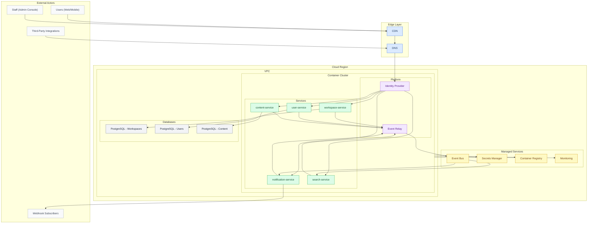

# SaaS Collaboration Platform -- System Design

## 1. Architecture Overview

The SaaS Collaboration Platform follows a microservices decomposition aligned with bounded contexts from domain-driven design. Each service owns its data exclusively through a database-per-service pattern, ensuring loose coupling and independent deployability. Inter-service communication uses an event-driven integration layer backed by a managed event bus, enabling asynchronous workflows such as notification dispatch, search indexing, and audit trail generation without introducing synchronous call chains between services.

The identity layer provides centralized authentication and authorization through an internal Identity Provider (IdP) that supports both OIDC and SAML federation. All inbound traffic passes through an API gateway responsible for TLS termination, rate limiting, and JWT validation before reaching service endpoints. This architecture allows each service team to develop, test, and deploy independently while maintaining strong consistency guarantees within service boundaries and eventual consistency across the broader system.

## 2. Service Inventory

| Service              | Responsibility                                                         | Database                    | Publishes Events                                                   |
| -------------------- | ---------------------------------------------------------------------- | --------------------------- | ------------------------------------------------------------------ |
| workspace-service    | Manages workspaces, memberships, permissions, and billing associations | PostgreSQL                  | workspace.created, workspace.updated, member.added, member.removed |
| user-service         | Handles user profiles, preferences, and account lifecycle management   | PostgreSQL                  | user.registered, user.updated, user.deactivated                    |
| content-service      | Stores and versions documents, files, and collaborative content        | PostgreSQL + Object Storage | content.created, content.updated, content.deleted, content.shared  |
| notification-service | Delivers notifications across channels (email, push, in-app, webhooks) | Redis + PostgreSQL          | notification.sent, notification.failed, notification.read          |
| event-relay          | Routes domain events between services via the managed event bus        | None (stateless)            | event.relayed, event.deadlettered                                  |
| search-service       | Provides full-text and faceted search across workspaces and content    | Elasticsearch               | index.updated, index.rebuilt                                       |

## 3. High-Level Architecture Diagram

## Changelog

| Version | Date       | Author                        | Changes         |
| ------- | ---------- | ----------------------------- | --------------- |
| 1.0.0   | 2026-03-26 | TL: System Design Integration | Initial version |
