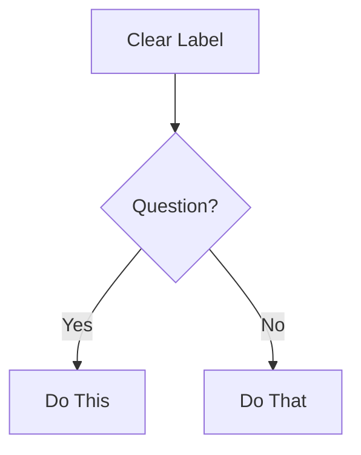

# Rule: Documentation Governance

> **Nivel**: Rule (contexto persistente — SIEMPRE cargado)
> **Carga**: SIEMPRE — la IA aplica esta rule al crear, leer, o modificar cualquier .md del ecosistema
> **Propósito**: Estándares de documentación del ecosistema — frontmatter obligatorio, versionado, tracking de cambios, staleness detection, y reglas de actualización.
> **La IA aplica esta rule SIEMPRE que crea o modifica un archivo .md**


## 1. Regla de Oro: Docs Travel With Code (DTC)

> **La documentación viaja con el código. El Dev que cambia código, actualiza la documentación afectada EN EL MISMO PR. No existe "lo actualizo después".**

### Cadena de responsabilidad (inquebrantable)

| Paso            | Quién                                         | Qué hace                                                                          | Cuándo                                    | Enforcement                 |
| --------------- | --------------------------------------------- | --------------------------------------------------------------------------------- | ----------------------------------------- | --------------------------- |
| **1. Autor**    | **Dev que hace el PR**                        | Actualiza TODOS los docs afectados por su cambio                                  | DURANTE la implementación, en el MISMO PR | DoD DD-20, DD-23            |
| **2. Reviewer** | **TL en code review**                         | Valida que docs están actualizados y son correctos                                | AL revisar el PR                          | DD-04 (TL review)           |
| **3. Hook**     | **dtc-write-guard (PreToolUse: Write\|Edit)** | Detecta archivos .md que DEBERÍAN haberse actualizado según matriz de impacto DTC | AL escribir/editar archivos               | Hook dtc-write-guard (WARN) |
| **4. Sync**     | **/sync-docs**                                | Catch-all: detecta drift post-merge y auto-corrige                                | DESPUÉS de merge a develop                | Command Tier 2              |
| **5. Gate**     | **Gate 4 (Dev→QA)**                           | Bloquea si DoD documentation criteria fallan                                      | AL avanzar de fase                        | /advance-gate 4             |

### Matriz de impacto: Cambio → Docs afectados

| Si cambias...                                    | DEBES actualizar...                                                            | Owner del doc |
| ------------------------------------------------ | ------------------------------------------------------------------------------ | ------------- |
| Schema de BD (tablas, columnas, relaciones)      | `docs/projects/{proyecto}/architecture.md`, ADR si es breaking                 | Dev + TL      |
| Endpoint API (nuevo, modificado, eliminado)      | `docs/projects/{proyecto}/specs/routes.md`, OpenAPI spec                       | Dev           |
| Componente UI exportado (nuevo, props cambiados) | `docs/projects/{proyecto}/specs/components.md`                                 | Dev           |
| Dependencia nueva en package.json                | `docs/projects/{proyecto}/architecture.md`                                     | Dev           |
| Pipeline CI/CD                                   | `docs/projects/{proyecto}/deployment.md`                                       | DevOps        |
| Rule, skill o command nuevo/modificado           | `CLAUDE.md`, HelpCenter, SitemapView, audit-catalog                            | TL            |
| Decisión arquitectónica nueva                    | `docs/projects/{proyecto}/adr/ADR-NNNN-*.md` con skill `adr`                   | TL            |
| Template skill (INMUTABLE)                       | **❌ PROHIBIDO** — templates en `.claude/skills/*/templates/` son inmutables   | NADIE         |
| Checklist skill (INMUTABLE)                      | **❌ PROHIBIDO** — checklists en `.claude/skills/*/checklists/` son inmutables | NADIE         |
| Proceso de equipo / roles                        | `rules/project.md`, `rules/org.md`                                             | PME           |
| Requisitos nuevos / modificados                  | `docs/projects/{proyecto}/requirements/`                                       | PO            |
| Sprint completado                                | `docs/projects/{proyecto}/progress.md`                                         | SM / PO       |

### ⚠️ CRITICAL: Templates Inmutables

**NUNCA modificar**:

- `.claude/skills/*/templates/*.md` → Son formatos estándar inmutables
- `.claude/skills/*/checklists/*.md` → Son criterios estándar inmutables

**SÍ modificar**:

- `docs/projects/{proyecto}/*.md` → Documentos específicos del proyecto generados desde templates

### Qué pasa si NO actualizas docs

```
1. Hook dtc-write-guard (PreToolUse: Write|Edit) → WARN al Dev (no bloquea, pero notifica al TL)
2. TL en code review → RECHAZA el PR con comentario "Docs no actualizados"
3. Si se escapa → /sync-docs lo detecta post-merge → genera ticket de deuda
4. Gate 4 → FAIL si DoD DD-20 no se cumple → bloquea paso a QA
5. /validate-project-docs → lo registra como gap en health report
```

### Excepciones (únicas aceptables)

| Excepción                     | Condición                            | Registro                                              |
| ----------------------------- | ------------------------------------ | ----------------------------------------------------- |
| Hotfix crítico                | Producción caída, fix urgente        | Ticket de follow-up OBLIGATORIO para docs, máximo 48h |
| Refactor sin cambio funcional | Solo renaming/reorganización interna | Solo actualizar si cambian paths o patterns           |
| Spike/PoC                     | Exploración sin merge a develop      | No requiere docs (el PoC Report lo cubre)             |


## 2. Template Strategy: SELF-CONTAINED ⭐

> **Migration Complete**: Templates (28→skills), Checklists (8→skills), Signoffs (2→skills)

### Principio de Inmutabilidad

```
✅ CORRECTO: skills/adr/templates/adr.md (template local inmutable)
❌ INCORRECTO: skills/adr/templates/adr.md (dependencia externa)
```

### Separación Clara: Template vs Documento

| Ubicación                      | Tipo                       | Propósito                   | ¿Modificable? |
| ------------------------------ | -------------------------- | --------------------------- | ------------- |
| `.claude/skills/*/templates/`  | **Template INMUTABLE**     | Formato estándar, esqueleto | ❌ NUNCA      |
| `.claude/skills/*/checklists/` | **Checklist INMUTABLE**    | Criterios estándar          | ❌ NUNCA      |
| `docs/projects/{proyecto}/`    | **Documento del proyecto** | Contenido real específico   | ✅ SÍ         |

### Portabilidad Garantizada

Al copiar `.claude/` folder → ecosistema completo funcional sin dependencias externas.

### DTC Rules para Self-Contained

1. **Templates inmutables**: NUNCA modificar `.claude/skills/*/templates/*.md`
2. **Output específico**: Skills generan docs en `docs/projects/{proyecto}/`
3. **No dependencias**: Cada skill tiene sus templates locales
4. **Escalabilidad**: Fácil distribución entre equipos/proyectos


## 3. Frontmatter Obligatorio

Todo documento `.md` del ecosistema (excepto CLAUDE.md que es índice) DEBE tener frontmatter YAML al inicio:

### Para Skills (SKILL.md)

```yaml
id: { skill-id } # ej: business-case, prd-tecnico
version: "1.0.0" # semver
last_updated: "YYYY-MM-DD" # fecha del último cambio significativo
updated_by: "{rol}: {nombre}" # quién actualizó
status: draft | active | deprecated
phase: 1-8 # fase del SDLC donde se usa
owner_role: "{rol principal}" # quién mantiene este skill
```

### Para Commands

```yaml
id: { command-name } # ej: implement-ticket, advance-gate
version: "1.0.0"
last_updated: "YYYY-MM-DD"
updated_by: "{rol}: {nombre}"
status: draft | active | deprecated
tier: 1 | 2 # tier 1: orchestrator, tier 2: tactical
authorized_roles: # roles que pueden ejecutar
  - Dev
  - Tech Lead
```

### Para Docs (templates, checklists, signoffs, standards)

```yaml
id: { doc-id } # ej: dor, qa-signoff, rf-format
version: "1.0.0"
last_updated: "YYYY-MM-DD"
updated_by: "{rol}: {nombre}"
status: draft | active | deprecated
type: checklist | signoff | template | standard | project
review_cycle: 30 | 60 | 90 # días entre revisiones obligatorias
next_review: "YYYY-MM-DD" # calculado: last_updated + review_cycle
owner_role: "{rol principal}"
```

### Para Rules

```yaml
id: { rule-id } # ej: org, tech-stack, documentation
version: "1.0.0"
last_updated: "YYYY-MM-DD"
updated_by: "{rol}: {nombre}"
status: active # rules siempre activas
scope: organization | project | documentation | workflow
references: # documentos que referencia via @
  - "docs/standards/org.md"
```


## 4. Enhanced Frontmatter (LIDR SDLC standard) ⭐

> **Methodology**: Sophisticated frontmatter tracking for workflow state, edit history, classification, and validation integration

### For Workflow Documents (PRD, RFs, NFRs, etc.)

```yaml
# Basic frontmatter (mantener)
id: document-id
version: "1.0.0"
last_updated: "YYYY-MM-DD"
updated_by: "Role: Name"
status: draft | active | deprecated

# LIDR SDLC enhanced tracking
stepsCompleted: ['step-01-init', 'step-02-discovery', 'step-03-requirements']
workflowType: 'prd' | 'requirements' | 'architecture' | 'complete-documentation'
inputDocuments: ['business-case.md', 'stakeholder-map.md']

# Project classification (auto-populated by project-classifier)
classification:
  projectType: 'Web Application' | 'Mobile Application' | 'Backend Service' | etc.
  subType: 'React SPA + Node.js API'
  domain: 'Biometric Identity Verification' | 'Fintech' | 'Healthcare' | etc.
  complexity: 'Low' | 'Medium' | 'High' | 'Very High'
  techStack: ['React', 'Node.js', 'PostgreSQL', 'Docker']
  confidence: 0.92

# Document tracking
documentCounts:
  existing: 3        # Documents found during discovery
  generated: 8       # Documents created in this workflow
  validated: 8       # Documents passed validation
  total_documents: 11

# Edit history (semantic changes)
editHistory:
  - date: '2026-03-15'
    step: 'project-classification'
    changes: 'Auto-detected biometric web application with high complexity'
  - date: '2026-03-15'
    step: 'requirements-generation'
    changes: 'Generated 45 functional requirements with biometric compliance patterns'
  - date: '2026-03-16'
    step: 'validation-improvements'
    changes: 'Applied validation feedback: improved measurability in RF-12, RF-34, RF-67'

# Validation integration (updated by validation engine)
validationResults:
  overall_score: 4.2
  overall_status: 'Good' | 'Excellent' | 'Satisfactory' | 'Needs Improvement'
  step_scores:
    prd_funcional: 4.1
    prd_tecnico: 4.3
    architecture_doc: 4.0
  validation_engine: '{{CLIENT_NAME}} SDLC Validation Engine v1.0'
  last_validation: '2026-03-15T16:30:00Z'
  issues: ['Missing traceability in RF-23', 'Improve measurability in NFR-05']

# Document relationships (dependency tracking)
relationships:
  dependsOn: ['business-case.md', 'stakeholder-map.md']
  generates: ['epic-breakdown.md', 'user-stories.md']
  feedsInto: ['sprint-planning.md', 'test-plan.md']

# Workflow state (for resuming interrupted workflows)
workflowState:
  currentStep: 8
  totalSteps: 18
  nextStep: 'architecture-documentation'
  estimatedTimeRemaining: '45 minutes'
  canResume: true
  lastActivity: '2026-03-15T16:45:00Z'
```

### For Project Documentation

```yaml
# Basic frontmatter
id: project-alpha-docs
version: "1.0.0"
status: active

# LIDR SDLC project tracking
projectInfo:
  name: "Project Alpha"
  type: "Biometric Identity Platform"
  phase: "Development"
  team_size: 12
  start_date: "2026-01-15"
  target_completion: "2026-06-30"

# Documentation health metrics
documentationHealth:
  total_documents: 23
  up_to_date: 18
  stale: 3
  missing: 2
  overall_score: 0.78
  last_audit: "2026-03-15"

# Compliance tracking
compliance:
  gdpr_art9: true
  psd2_compliant: true
  iso_30107: "in_progress"
  security_review: "scheduled"
  audit_trail: "complete"
```

### LIDR SDLC Documentation Standards ⭐

#### Critical Rules (LIDR SDLC Methodology Compliance)

1. **CommonMark Strict Compliance** (LIDR SDLC Rule 1)
   - ALL documentation MUST follow CommonMark specification exactly
   - ATX-style headers only: `#` `##` `###` (NOT Setext underlines)
   - Fenced code blocks with language identifier
   - Consistent list markers within list

2. **NO Time Estimates** (LIDR SDLC Rule 2)
   - NEVER document time estimates, durations, or completion times
   - Focus on workflow steps, dependencies, and outputs
   - Let users determine their own timelines

3. **Task-Oriented Writing** (LIDR SDLC Principle)
   - Write for user GOALS, not feature lists
   - Start with WHY, then HOW
   - Every doc answers: "What can I accomplish?"
   - Active voice: "Click the button" NOT "The button should be clicked"
   - Present tense: "The function returns" NOT "The function will return"

4. **Accessibility Standards** (LIDR SDLC Quality)
   - Descriptive link text: "See the API reference" NOT "Click here"
   - Alt text for diagrams: Describe what it shows
   - Semantic heading hierarchy (don't skip levels)
   - Tables have headers

#### Mermaid Diagrams (LIDR SDLC Standards)



**Critical Rules:**

- Always specify diagram type first line
- Use valid Mermaid v10+ syntax
- Keep focused: 5-10 nodes ideal, max 15
- Test syntax before outputting

#### Quality Checklist (LIDR SDLC standard 13 Items)

Before finalizing ANY documentation:

- [ ] CommonMark compliant (no violations)
- [ ] NO time estimates anywhere (Critical Rule 2)
- [ ] Headers in proper hierarchy
- [ ] All code blocks have language tags
- [ ] Links work and have descriptive text
- [ ] Mermaid diagrams render correctly
- [ ] Active voice, present tense
- [ ] Task-oriented (answers "how do I...")
- [ ] Examples are concrete and working
- [ ] Accessibility standards met
- [ ] Spelling/grammar checked
- [ ] Reads clearly at target skill level
- [ ] Validation passed (≥4.0/5.0 score)


## 5. Versionado

### Política de Versiones (Semver para Docs)

| Cambio                                                    | Bump              | Ejemplo       | Cuándo                                    |
| --------------------------------------------------------- | ----------------- | ------------- | ----------------------------------------- |
| Fix typo, mejorar redacción, formateo                     | **PATCH** (0.0.X) | 1.0.0 → 1.0.1 | Corrección menor sin impacto en contenido |
| Nueva sección, reorganización, actualización de criterios | **MINOR** (0.X.0) | 1.0.1 → 1.1.0 | Contenido nuevo o reestructurado          |
| Reescritura completa, cambio de estructura fundamental    | **MAJOR** (X.0.0) | 1.1.0 → 2.0.0 | Incompatible con versión anterior         |

### Changelog por Documento

Cada documento DEBE tener una sección `## Changelog` al final:

```markdown
## Changelog

| Versión | Fecha      | Autor      | Cambios                          |
| ------- | ---------- | ---------- | -------------------------------- |
| 1.1.0   | 2025-03-05 | TL: García | Añadida sección de anti-patrones |
| 1.0.1   | 2025-02-20 | QA: López  | Corregido criterio BDD #3        |
| 1.0.0   | 2025-02-01 | TL: García | Versión inicial                  |
```


## 6. Tracking de Cambios

### La IA DEBE al crear/modificar cualquier .md:

```
1. ACTUALIZAR frontmatter:
   - last_updated → fecha actual
   - updated_by → rol y nombre del humano
   - version → bump según política

2. AÑADIR entrada al Changelog del documento:
   - Versión nueva
   - Fecha
   - Quién (rol + nombre)
   - Qué cambió (1 línea)

3. VERIFICAR next_review (si aplica):
   - Si next_review < hoy → WARN: "Este documento necesita revisión.
     Última revisión: {last_updated}. Ciclo: {review_cycle} días."
```

### Cuando la IA lee un documento para referencia:

```
1. VERIFICAR staleness:
   - Si last_updated > 90 días → WARN: "Documento posiblemente desactualizado"
   - Si status == "deprecated" → WARN: "Documento deprecado. ¿Hay reemplazo?"

2. VERIFICAR consistencia:
   - Si version del frontmatter no coincide con último entry del changelog
     → WARN: "Inconsistencia de versión detectada"
```


## 7. Staleness Detection

### Ciclos de Revisión por Tipo

| Tipo de Documento   | Ciclo de Revisión | Quién Revisa        | Prioridad |
| ------------------- | ----------------- | ------------------- | --------- |
| Rules               | 90 días           | Tech Lead           | Alta      |
| Skills              | 60 días           | Owner del skill     | Media     |
| Commands            | 60 días           | Tech Lead           | Alta      |
| Checklists          | 30 días           | QA Lead + Tech Lead | Alta      |
| Signoffs            | 90 días           | QA Lead + Security  | Media     |
| Standards           | 90 días           | PME + Tech Lead     | Alta      |
| Templates (docs/)   | 60 días           | PO + Tech Lead      | Media     |
| Templates (project) | Por sprint        | PO                  | Media     |

### Indicadores de Staleness

```
🟢 FRESH:    last_updated < review_cycle/2
🟡 DUE SOON: last_updated entre review_cycle/2 y review_cycle
🔴 STALE:    last_updated > review_cycle
⚫ CRITICAL:  last_updated > review_cycle * 2
```

### Command `/sync-docs` detecta staleness automáticamente


## 8. Reglas de Actualización

### Cuándo se DEBE actualizar un documento

| Trigger                           | Documentos Afectados              | Acción                                 |
| --------------------------------- | --------------------------------- | -------------------------------------- |
| Nueva dependencia en package.json | architecture.md, specs/storage.md | Actualizar tech stack                  |
| Nueva tabla/migración de DB       | db-schema.md                      | Documentar tabla + relaciones          |
| Nuevo endpoint API                | specs/routes.md                   | Documentar endpoint                    |
| Nuevo componente UI exportado     | specs/components.md               | Documentar props + estados             |
| Cambio en CI/CD pipeline          | deployment.md                     | Actualizar pipeline stages             |
| Nueva rule/skill/command creado   | CLAUDE.md, SitemapView            | Actualizar inventario                  |
| Sprint completado                 | phases.md (proyecto)              | Actualizar progreso real vs plan       |
| Bug en producción                 | postmortem (si aplica)            | Documentar incidente                   |
| Decisión arquitectónica           | adr (nuevo ADR)                   | Crear ADR con contexto y consecuencias |
| Cambio en roles del equipo        | rules/project.md                  | Actualizar equipo                      |
| Post-retrospectiva                | Docs con action items             | Aplicar mejoras identificadas          |

### Cuándo NO actualizar (dejar como está)

| Situación                            | Por qué no tocar                                                   |
| ------------------------------------ | ------------------------------------------------------------------ |
| Corrección cosmética durante lectura | No bump version por typos al leer. Solo si se edita explícitamente |
| Cambio en feature no relacionada     | Solo actualizar docs directamente afectados                        |
| Refactor sin cambio funcional        | Solo si cambia estructura de directorios o patrones                |


## 9. Naming Conventions

### Archivos

| Tipo       | Pattern                                           | Ejemplo                                               |
| ---------- | ------------------------------------------------- | ----------------------------------------------------- |
| Skills     | `skills/{nombre}/SKILL.md`                        | `skills/business-case/SKILL.md`                       |
| Rules      | `rules/{scope}.md`                                | `rules/documentation.md`                              |
| Commands   | `commands/{verbo}-{sustantivo}.md`                | `commands/create-branch.md`                           |
| Checklists | `skills/{skill-name}/checklists/{nombre}.md`      | `skills/refinement-notes/checklists/dor.md`           |
| Signoffs   | `skills/{skill-name}/signoffs/{role}-signoff.md`  | `skills/test-execution-report/signoffs/qa-signoff.md` |
| Templates  | `skills/{skill-name}/templates/{nombre}.md`       | `_shared/lidr/templates/architecture/architecture.md` |
| Specs      | `skills/{skill-name}/templates/specs/{nombre}.md` | `skills/{skill-name}/templates/specs/routes.md`       |
| Standards  | `docs/standards/{nombre}.md`                      | `docs/standards/org.md`                               |
| Projects   | `docs/projects/{nombre}.md`                       | `docs/projects/sdlc-{{CLIENT_CODE}}.md`               |

### Dentro del documento

| Elemento             | Convención                       | Ejemplo                                     |
| -------------------- | -------------------------------- | ------------------------------------------- | --------- | -------- | --- |
| Títulos              | `# Título Principal` (solo 1 H1) | `# Template: Architecture Document`         |
| Secciones            | `## Sección`                     | `## Criterios de Completitud`               |
| Sub-secciones        | `### Sub-sección`                | `### Paso 1: Cargar Contexto`               |
| Tablas               | Headers en negrita, alineados    | `                                           | **Campo** | **Tipo** | `   |
| Código               | Fenced con lenguaje              | ``markdown ... ` `                          |
| Referencias cruzadas | `@ruta/al/doc.md`                | `skills/refinement-notes/checklists/dor.md` |
| TODOs                | `⚠️ TODO: {qué falta}`           | `⚠️ TODO: Completar sección de migraciones` |
| Estado por items     | ✅ ⚠️ ❌ 📝                      | `✅ Completado`, `⚠️ Parcial`               |


## 10. Referencias Cruzadas

### Formato de Referencias

Todos los documentos usan el formato `@ruta/desde/raíz` para referenciar otros docs:

```markdown
Referencia: skills/refinement-notes/checklists/dor.md
Skill: skills/business-case/SKILL.md
Rule: org.md
```

### La IA DEBE:

1. Verificar que las referencias `@` son válidas (el archivo existe)
2. Al crear un nuevo doc, añadir `@` references a docs relacionados
3. Al eliminar un doc, buscar y actualizar todas las `@` references a ese doc


## 11. Métricas de Documentación

### Que `/validate-project-docs` y `/sync-docs` reportan:

```markdown
## Documentation Health Report

### Overall Score: {X}% healthy

| Métrica              | Valor            | Target        | Estado |
| -------------------- | ---------------- | ------------- | ------ |
| Docs con frontmatter | {N}/{total}      | 100%          | ✅/❌  |
| Docs con changelog   | {N}/{total}      | 100%          | ✅/❌  |
| Docs fresh (🟢)      | {N}/{total}      | >80%          | ✅/❌  |
| Docs stale (🔴)      | {N}/{total}      | 0             | ✅/❌  |
| Referencias @válidas | {N}/{total refs} | 100%          | ✅/❌  |
| TODOs pendientes     | {N}              | Trending down | ⬆️/⬇️  |
```


## 12. Changelog

| Versión | Fecha      | Autor                                       | Cambios                                                                                     |
| ------- | ---------- | ------------------------------------------- | ------------------------------------------------------------------------------------------- |
| 2.1.0   | 2026-03-17 | TL: Self-Contained Architecture DTC Updates | Actualizada matriz DTC para patrón self-contained, agregadas reglas de templates inmutables |
| 2.0.0   | 2026-03-15 | TL: Lead Engineer                           | Enhanced frontmatter LIDR SDLC standard, documentation health metrics                       |


_Esta rule es contexto persistente. La IA la aplica SIEMPRE al crear, leer, o modificar cualquier .md del ecosistema._
