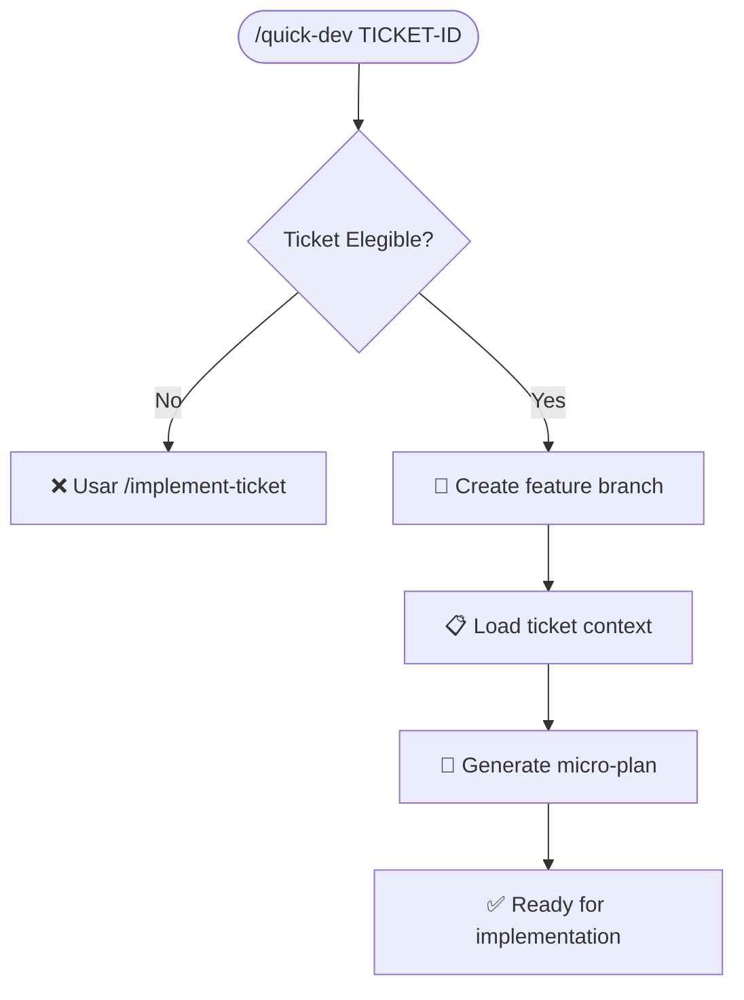
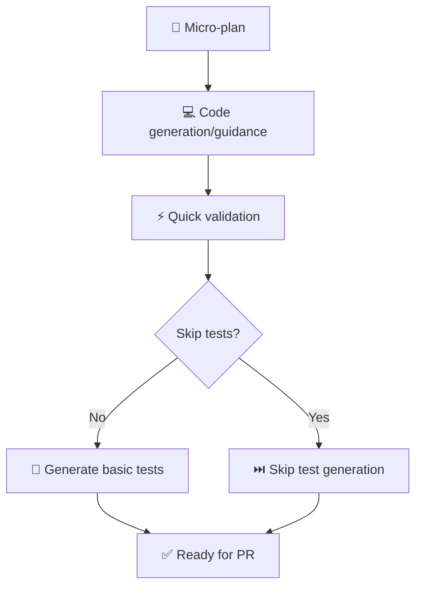
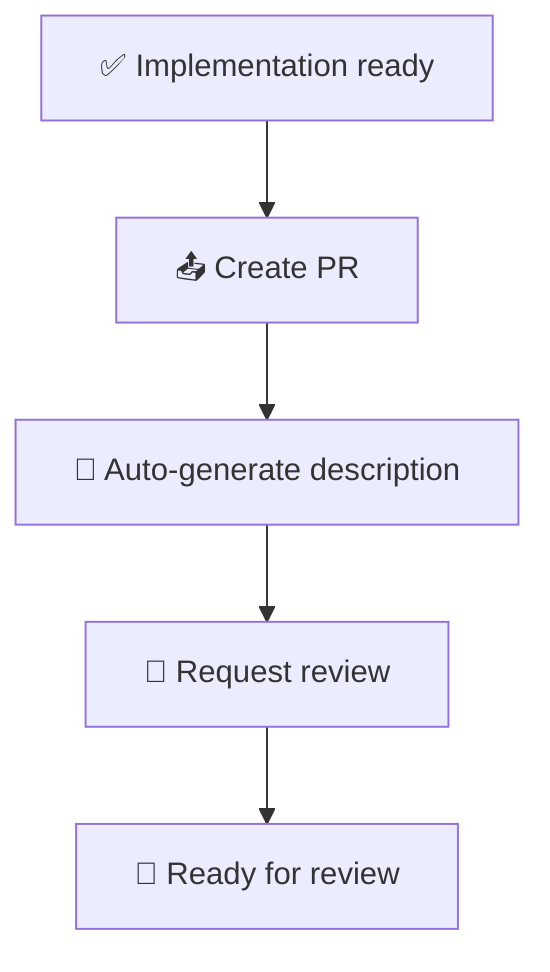

# Command: Quick Development

> **Relationship (de-duplication):** Actual code production is owned by **`bmad-quick-dev`** (implements any intent following the project's patterns). This command is the LIDR wrapper for **small tasks (<8h)**: eligibility check, branch, micro-plan, fast DoD, PR — and auto-escalates to `/lidr-implement-ticket` when scope grows. It is the lightweight sibling of `/lidr-implement-ticket` (same workflow, smaller envelope); delegate the coding to `bmad-quick-dev` instead of re-implementing it.

> **Propósito**: Flujo de desarrollo rápido para tareas pequeñas (< 8 horas). Bypass de procesos pesados para cambios menores, optimizado para velocidad.
> **Tier**: 2 (Tactical)
> **Roles**: Dev, Tech Lead
> **Inspiración**: LIDR SDLC quick-dev pattern para desarrollo ágil de micro-tareas


## Synopsis

```bash
/quick-dev [TICKET-ID] [--type TYPE] [--skip-tests]
```

Streamlines: branch creation → implementation → basic testing → PR creation para tareas pequeñas.


## Parámetros

| Parámetro      | Tipo     | Descripción                                                        | Default |
| -------------- | -------- | ------------------------------------------------------------------ | ------- |
| `TICKET-ID`    | Required | ID del ticket Jira (ej: SDLC-123)                                  | -       |
| `--type`       | Optional | Tipo de cambio: `fix`, `feat`, `docs`, `style`, `refactor`, `test` | `fix`   |
| `--skip-tests` | Flag     | Saltear generación de tests (solo para fixes menores)              | false   |


## Criterios de Elegibilidad

### ✅ Usa `/quick-dev` cuando

- **Estimación ≤ 8 horas**: Tareas pequeñas y bien definidas
- **Scope limitado**: 1-3 archivos afectados máximo
- **Bajo riesgo**: No impacta APIs públicas ni datos críticos
- **Tipos elegibles**:
  - 🐛 **Bug fixes**: Correcciones simples sin cambio de comportamiento
  - 📝 **Docs**: Actualización de documentación o comentarios
  - 🎨 **Style**: Formateo, linting, naming, refactor menor
  - ⚡ **Micro-features**: Funcionalidad menor, bien acotada
  - 🧪 **Test additions**: Añadir tests faltantes

### ❌ NO uses `/quick-dev` cuando

- **Estimación > 8 horas**: Usar `/implement-ticket` estándar
- **Cambios de API**: Usar proceso completo con PRD + RFs
- **Datos biométricos**: Requiere security review mandatory
- **Múltiples componentes**: Usar epic breakdown
- **Breaking changes**: Requiere ADR + revisión de arquitectura


## Flujo del Command

### Fase 1: Validación y Setup (2-3 min)



**Validaciones automáticas**:

- Ticket status = "Ready for Dev" o "In Progress"
- Estimación ≤ 8 horas (en description o comments)
- Story points ≤ 5 (si se usan)
- No labels: `epic`, `breaking-change`, `security-review`

**Branch naming**: `quick/{type}/{TICKET-ID}-{description}`

- Ejemplo: `quick/fix/SDLC-123-login-timeout`

### Fase 2: Implementation Assistant (15-45 min)



**Características del micro-plan**:

- **3-5 pasos máximo**: Breakdown simple y ejecutable
- **File targets**: Archivos específicos a modificar
- **Test strategy**: Si aplica, qué testear (happy path only)
- **Validation checklist**: 2-3 items críticos

**Code assistance**:

- Genera código siguiendo tech-stack.md
- Applica patterns del proyecto actual
- Sugiere imports y dependencies
- Valida contra DoD básico (sin proceso completo)

### Fase 3: Quick PR Creation (5-10 min)



**PR auto-description** incluye:

- **Type + scope**: `fix(auth): resolve login timeout`
- **Change summary**: 1-2 bullets de qué cambió
- **Testing**: Qué se validó (manual + tests si existen)
- **Quick checklist**: DoD simplificado (3-4 items)


## Diferencias vs `/implement-ticket`

| Aspecto             | `/quick-dev`           | `/implement-ticket`      |
| ------------------- | ---------------------- | ------------------------ |
| **Duración target** | 1-3 horas end-to-end   | 4-40 horas               |
| **Planning**        | Micro-plan (3-5 pasos) | Full breakdown + handoff |
| **Testing**         | Basic + optional skip  | Comprehensive test plan  |
| **Documentation**   | PR description only    | Full dev handoff         |
| **Review process**  | Peer review            | TL + peer review         |
| **DoD compliance**  | Simplified (5 items)   | Full DoD (20+ items)     |
| **Gate validation** | Pre-merge CI only      | Gate 4 formal            |


## Templates y Outputs

### Micro-plan Template

```markdown
## Quick Dev Plan: {TICKET-ID}

### Summary

**Type**: {fix|feat|docs|style|refactor|test}
**Estimated time**: {X} hours
**Files affected**: {list}

### Implementation Steps

1. **Step 1**: {action} → {expected outcome}
2. **Step 2**: {action} → {expected outcome}
3. **Step 3**: {action} → {expected outcome}

### Quick Validation

- [ ] {critical item 1}
- [ ] {critical item 2}
- [ ] {critical item 3}

### Test Strategy

{if not --skip-tests}

- **Happy path**: {what to test}
- **Error case**: {if applicable}
```

### PR Description Template

```markdown
## Quick {Type}: {Brief Description}

**Ticket**: {TICKET-ID}
**Type**: {type}
**Estimated effort**: {X}h

### Changes

- {bullet 1}
- {bullet 2}

### Testing

- [x] Manual verification: {what was tested}
- [x] Existing tests pass
      {if new tests}
- [x] New tests added: {what they cover}

### Quick Checklist

- [x] Code follows project conventions
- [x] No breaking changes
- [x] No security implications
- [x] Ready for peer review

**Quick Review**: This is a small, low-risk change ready for fast review.
```


## Command Implementation

### Orchestration Flow

```yaml
tools_sequence:
  validation:
    - jira_check_ticket_status
    - estimate_validation
    - scope_validation

  setup:
    - git_create_branch
    - load_ticket_context
    - generate_micro_plan

  implementation:
    - code_assistance # Interactive guidance
    - quick_validation # Basic DoD items
    - test_generation # If not skipped

  pr_creation:
    - git_add_changes
    - git_commit
    - git_push_branch
    - github_create_pr
    - request_reviewers # Peer only, not TL
```

### Error Handling

| Error                     | Action                                     |
| ------------------------- | ------------------------------------------ |
| Ticket no elegible        | Suggest `/implement-ticket` with reasoning |
| Estimación > 8h           | Force escalation to full process           |
| Security flags            | Block + require security review            |
| Breaking changes detected | Block + require ADR                        |
| CI failures               | Guide to fix + re-run                      |


## Metrics y Monitoring

### Success Metrics

- **Time to PR**: Target < 2 horas (setup → implementation → PR)
- **First-review pass rate**: Target > 80%
- **Merge rate**: Target > 90% (high confidence debido a scope limitado)
- **Rework cycles**: Target < 1.5 cycles promedio

### Usage Analytics

```markdown
## Quick Dev Analytics

**This Sprint**:

- Quick dev PRs: {N}
- Avg time to PR: {X} hours
- Pass rate: {Y}%

**Top Types**:

1. Bug fixes: {X}%
2. Docs: {Y}%
3. Style: {Z}%
```


## Integration con Ecosystem

### Con Commands existentes

- **Input**: Tickets de `/create-branch` si elegibles
- **Output**: PRs para code review estándar
- **Escalation**: A `/implement-ticket` si scope crece

### Con Skills

| Skill            | Cuándo se usa                            |
| ---------------- | ---------------------------------------- |
| `pr-description` | Auto-invoked para generar PR description |
| `bug-report`     | Si se detecta bug durante implementation |
| `tech-debt`      | Si se identifica debt técnico            |

### Con Hooks

- **dtc-write-guard**: Evaluation simplificada (subset de DoD)
- **context-loader**: Standard project context loading
- **notify-desktop**: Success notification al crear PR


## FAQ

### ¿Cuándo usar `/quick-dev` vs `/implement-ticket`?

**Regla de oro**: Si dudas, usa `/implement-ticket`. `/quick-dev` es solo para cambios que claramente cumplen criterios de elegibilidad.

**Examples**:

- ✅ Fix typo en UI: `/quick-dev`
- ✅ Add logging statement: `/quick-dev`
- ✅ Update doc: `/quick-dev`
- ❌ New API endpoint: `/implement-ticket`
- ❌ Change DB schema: `/implement-ticket`
- ❌ Algorithm modification: `/implement-ticket`

### ¿Puede saltar testing completamente?

**Solo con `--skip-tests` y criterios**:

- Bug fix sin lógica nueva
- Documentation change
- Style/formatting only
- **NUNCA** para features o cambios de comportamiento

### ¿Qué pasa si el scope crece durante implementation?

Command detecta automáticamente y sugiere:

1. **Continuar**: Si crecimiento menor (1-2 files más)
2. **Escalar**: A `/implement-ticket` si scope duplica
3. **Split**: Crear segundo ticket para scope adicional


## Changelog

| Versión | Fecha      | Autor                   | Cambios                                               |
| ------- | ---------- | ----------------------- | ----------------------------------------------------- |
| 1.0.0   | 2026-03-15 | AI Agent: Claude Sonnet | Versión inicial basada en LIDR SDLC quick-dev pattern |
