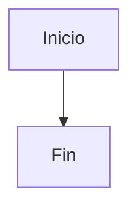

# Documentación LIDR

Documentación interna del equipo construida con [VitePress](https://vitepress.dev/).

## Desarrollo Local

### Requisitos
- Node.js 18+
- npm

### Comandos

```bash
# Instalar dependencias
npm install

# Iniciar servidor de desarrollo
npm run docs:dev

# Build para producción
npm run docs:build

# Preview del build de producción
npm run docs:preview
```

## Estructura

```
docs/
├── .vitepress/
│   ├── config.js          # Configuración de VitePress
│   ├── cache/            # Cache (ignorado en git)
│   └── dist/             # Build output (ignorado en git)
├── guides/               # Guías paso a paso
├── references/           # Referencias técnicas
├── guidelines/           # Estándares del equipo
├── notes/               # Investigaciones
└── index.md             # Página principal
```

## Agregar Contenido

### Nueva Página

1. Crea un archivo `.md` en la carpeta apropiada:
   ```bash
   touch docs/guides/nueva-guia.md
   ```

2. Agrega frontmatter si necesitas layout especial:
   ```markdown
   ---
   title: Mi Guía
   description: Descripción de la guía
   ---

   # Contenido aquí
   ```

3. Agrega al sidebar en `.vitepress/config.js`:
   ```js
   sidebar: {
     '/guides/': [
       {
         text: 'Guías',
         items: [
           { text: 'Nueva Guía', link: '/guides/nueva-guia' }
         ]
       }
     ]
   }
   ```

### Nueva Sección

1. Crea directorio:
   ```bash
   mkdir docs/nueva-seccion
   ```

2. Agrega `index.md`:
   ```bash
   touch docs/nueva-seccion/index.md
   ```

3. Agrega navegación en `.vitepress/config.js`

## Features

### Búsqueda
- Búsqueda local integrada
- Usa `Cmd/Ctrl + K` para buscar

### Mermaid
Soporte para diagramas Mermaid:

````markdown

````

### Code Blocks
Syntax highlighting automático:

````markdown
```bash
npm run docs:dev
```

```javascript
const config = { ... }
```
````

### Containers
Contenedores especiales:

```markdown
::: tip Consejo
Esto es un consejo útil
:::

::: warning Advertencia
Esto es una advertencia
:::

::: danger Peligro
Esto es peligroso
:::
```

## Deployment

El sitio puede ser deployado en:
- GitHub Pages
- Netlify
- Vercel
- Cloudflare Pages

### GitHub Pages

```bash
# Build
npm run docs:build

# Deploy
# (configurar GitHub Actions)
```

## Referencias

- [VitePress Docs](https://vitepress.dev/)
- [Markdown Extensions](https://vitepress.dev/guide/markdown)
- [Theme Config](https://vitepress.dev/reference/default-theme-config)
