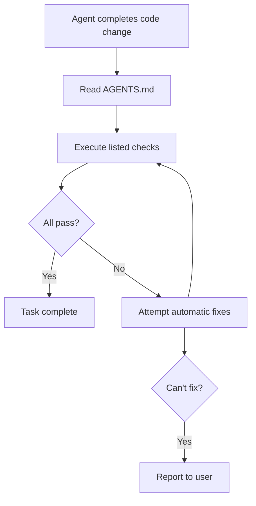

# AGENTS.md File Format

## Overview

**AGENTS.md** is a standardized Markdown file format designed to guide AI coding agents through project-specific context and instructions. It serves as "a **README for agents**: a dedicated, predictable place to provide the context and instructions to help AI coding agents work on your project."

**Official Site:** [agents.md](https://agents.md)
**Adoption:** Over 60,000 open-source projects
**Steward:** Agentic AI Foundation (Linux Foundation)

---

## Purpose

### The Problem

AI coding agents need project-specific context to work effectively:

- How to build the project
- Testing conventions
- Code style guidelines
- Deployment procedures
- Security considerations

### The Solution

AGENTS.md provides a **standardized location** for this information, separate from human-focused documentation.

### Key Benefit

**"Give agents a clear, predictable place for instructions"** that:

- Doesn't clutter README.md
- Is easy for agents to find
- Follows consistent format
- Works across different AI agents

---

## Design Philosophy

### Complementary to README.md

**Different audiences, different purposes:**

#### README.md (For Humans)

- Quick start guides
- Project description
- Installation steps
- Basic usage examples
- Contributing guidelines
- License information

#### AGENTS.md (For AI Agents)

- Detailed build steps
- Testing procedures
- Code style enforcement
- Security checks
- Commit message formats
- Deployment gotchas
- Development workflow

### Separation of Concerns

**Why separate files?**

1. **Clarity**: Each file serves distinct audience
2. **Maintainability**: Update agent instructions without changing README
3. **Readability**: README stays concise for humans
4. **Predictability**: Agents know where to look

---

## File Structure

### Location

```
project-root/
├── AGENTS.md          # Agent instructions
├── README.md          # Human documentation
├── package.json
└── src/
```

### Format

**Standard Markdown** with flexible headings:

- No required fields
- No strict schema
- Use headings for organization
- Agents parse provided text

---

## Common Content Sections

### 1. Project Overview

**Purpose:** High-level context about the project

**Example:**

```markdown
# Project Overview

This is a React-based e-commerce platform built with Next.js 14.
Uses App Router, Server Components, and TypeScript.

## Tech Stack

- Next.js 14 (App Router)
- React 18
- TypeScript 5
- Tailwind CSS
- PostgreSQL (via Prisma)
- tRPC for API
```

### 2. Setup Commands

**Purpose:** How to get the project running

**Example:**

```markdown
## Setup

\`\`\`bash

# Install dependencies

npm install

# Set up database

npm run db:setup

# Run development server

npm run dev
\`\`\`

## Environment Variables

Copy `.env.example` to `.env.local` and configure:

- `DATABASE_URL` - PostgreSQL connection string
- `NEXTAUTH_SECRET` - NextAuth.js secret
- `STRIPE_SECRET_KEY` - Stripe API key
```

### 3. Build Instructions

**Purpose:** Production build process

**Example:**

```markdown
## Build

\`\`\`bash

# Type check

npm run type-check

# Build production bundle

npm run build

# Preview production build

npm run start
\`\`\`

Build artifacts in `.next/` directory.
```

### 4. Testing Procedures

**Purpose:** How to run tests and what to test

**Example:**

```markdown
## Testing

\`\`\`bash

# Run all tests

npm test

# Run tests in watch mode

npm run test:watch

# Run E2E tests

npm run test:e2e

# Check test coverage

npm run test:coverage
\`\`\`

**Coverage Requirements:**

- Minimum 80% coverage for new code
- 100% coverage for utility functions
- E2E tests for critical user flows
```

### 5. Code Style Guidelines

**Purpose:** Coding standards and conventions

**Example:**

```markdown
## Code Style

### TypeScript

- Use explicit return types for functions
- Prefer `interface` over `type` for objects
- Enable strict mode in tsconfig.json

### React

- Use functional components with hooks
- Server Components by default, Client Components only when needed
- Props interfaces named `[Component]Props`

### File Naming

- Components: PascalCase (`UserProfile.tsx`)
- Utilities: camelCase (`formatDate.ts`)
- Constants: UPPER_SNAKE_CASE (`API_ENDPOINTS.ts`)

### Linting

Run before committing:
\`\`\`bash
npm run lint
npm run format
\`\`\`
```

### 6. Security Considerations

**Purpose:** Security requirements and checks

**Example:**

```markdown
## Security

### Required Checks

- [ ] No secrets in code (use environment variables)
- [ ] Input validation on all API endpoints
- [ ] SQL injection prevention (use parameterized queries)
- [ ] XSS prevention (sanitize user input)
- [ ] CSRF protection enabled

### Security Scanning

\`\`\`bash

# Check for known vulnerabilities

npm audit

# Run security linter

npm run lint:security
\`\`\`

### Authentication

- Use NextAuth.js for authentication
- JWT tokens expire after 24 hours
- Refresh tokens stored in HTTP-only cookies
```

### 7. Commit Message Format

**Purpose:** Standardized commit messages

**Example:**

```markdown
## Commit Messages

Follow Conventional Commits:

\`\`\`
<type>(<scope>): <description>

[optional body]

[optional footer]
\`\`\`

**Types:**

- `feat`: New feature
- `fix`: Bug fix
- `docs`: Documentation changes
- `style`: Code style (formatting, semicolons, etc.)
- `refactor`: Code refactoring
- `test`: Adding tests
- `chore`: Maintenance tasks

**Examples:**
\`\`\`
feat(auth): add OAuth login support
fix(cart): resolve checkout total calculation bug
docs(readme): update installation instructions
\`\`\`
```

### 8. Pull Request Format

**Purpose:** PR requirements and checklist

**Example:**

```markdown
## Pull Requests

### Before Opening PR

- [ ] All tests passing
- [ ] Code formatted and linted
- [ ] Type check passes
- [ ] Security scan clean
- [ ] Documentation updated

### PR Description Template

\`\`\`markdown

## What

[Brief description of changes]

## Why

[Reason for changes]

## How

[Technical implementation details]

## Testing

[How to test these changes]

## Screenshots

[If UI changes]
\`\`\`
```

### 9. Deployment Steps

**Purpose:** How to deploy to production

**Example:**

```markdown
## Deployment

### Staging

\`\`\`bash

# Deploy to staging

npm run deploy:staging

# Verify deployment

npm run verify:staging
\`\`\`

### Production

\`\`\`bash

# Create production build

npm run build

# Run production tests

npm run test:production

# Deploy to production

npm run deploy:production

# Monitor deployment

npm run monitor:production
\`\`\`

### Gotchas

- Database migrations run automatically on deployment
- Redis cache clears after deployment (warm up period ~5 min)
- CDN purge takes up to 10 minutes to propagate
```

### 10. Common Issues & Solutions

**Purpose:** Troubleshooting guide

**Example:**

```markdown
## Troubleshooting

### Build Fails with Memory Error

Increase Node.js memory:
\`\`\`bash
NODE_OPTIONS=--max-old-space-size=4096 npm run build
\`\`\`

### Database Connection Fails

Check:

1. PostgreSQL is running: `pg_isready`
2. Correct DATABASE_URL in `.env.local`
3. Database exists: `psql -l`

### Tests Fail Intermittently

Disable parallel execution:
\`\`\`bash
npm test -- --runInBand
\`\`\`
```

---

## Technical Characteristics

### No Required Fields

**Flexible format:**

- Use any headings you need
- Include what's relevant to your project
- Skip sections that don't apply
- No validation schema

**Example:**

```markdown
# My Simple Project

## Setup

npm install && npm run dev

## Testing

npm test

That's it!
```

### Standard Markdown

**Compatible with:**

- All markdown renderers
- Version control systems
- Documentation tools
- Text editors

**Features:**

- Code blocks with syntax highlighting
- Lists (ordered and unordered)
- Links and images
- Tables
- Blockquotes

### Hierarchical Resolution (Monorepos)

**Priority order:**

1. **Closest AGENTS.md wins** - File nearest to edited file takes precedence
2. **User prompts override** - Explicit user instructions override AGENTS.md

**Example Structure:**

```
monorepo/
├── AGENTS.md                    # Root level (lowest priority)
├── apps/
│   ├── web/
│   │   └── AGENTS.md           # Web app specific (higher priority)
│   └── mobile/
│       └── AGENTS.md           # Mobile app specific (higher priority)
└── packages/
    └── shared-ui/
        └── AGENTS.md           # Shared UI specific (higher priority)
```

**Resolution:**

- Editing `apps/web/src/components/Button.tsx` → Uses `apps/web/AGENTS.md`
- Editing `packages/shared-ui/Button.tsx` → Uses `packages/shared-ui/AGENTS.md`
- Editing `README.md` at root → Uses root `AGENTS.md`
- User says "ignore AGENTS.md and use tabs" → User instruction wins

---

## Automatic Execution

### Programmatic Checks

Agents attempt to execute listed commands and fix failures before completing tasks.

**Example:**

```markdown
## Quality Checks

Before committing, run:

\`\`\`bash
npm run type-check
npm run lint
npm run test
\`\`\`
```

**Agent Behavior:**

1. Read AGENTS.md
2. See quality checks section
3. Execute `npm run type-check`
4. If fails, attempt to fix type errors
5. Execute `npm run lint`
6. If fails, attempt to fix lint errors
7. Execute `npm run test`
8. If fails, attempt to fix failing tests
9. Complete task only if all checks pass

### Fix Before Complete

**Workflow:**



---

## Ecosystem Support

### Supported AI Agents (25+)

**Major Platforms:**

- **Claude Code** (Anthropic)
- **OpenAI Codex** (OpenAI)
- **Google Jules** (Google)
- **Cursor** (Anysphere)
- **GitHub Copilot** (GitHub/Microsoft)
- **VS Code Extensions**
- **Aider** (AI pair programming)

**Additional Tools:**

- Cline
- Continue
- Windsurf
- Supermaven
- Tabnine
- Codeium
- And many more...

### Universal Compatibility

**Benefits:**

- Write once, works with all agents
- Switch between agents seamlessly
- Team members can use different tools
- Future-proof documentation

---

## Best Practices

### 1. Keep It Focused

✅ **DO:** Include agent-specific context

```markdown
## Before Committing

Run these checks:
\`\`\`bash
npm run lint && npm test
\`\`\`
```

❌ **DON'T:** Duplicate README content

```markdown
## What is This Project?

[Long description better suited for README.md]
```

### 2. Be Specific

✅ **DO:** Provide exact commands

```markdown
## Testing

\`\`\`bash

# Unit tests

npm run test:unit

# Integration tests

npm run test:integration

# E2E tests

npm run test:e2e
\`\`\`
```

❌ **DON'T:** Be vague

```markdown
## Testing

Run the tests somehow.
```

### 3. Include Context

✅ **DO:** Explain why

```markdown
## Database Migrations

Always create reversible migrations.
Include both `up` and `down` functions.

Why: Enables safe rollbacks in production.
```

❌ **DON'T:** Just list commands

```markdown
## Migrations

\`\`\`bash
npm run migrate
\`\`\`
```

### 4. Update Regularly

✅ **DO:** Keep AGENTS.md in sync with project changes

**When to update:**

- New build steps added
- Testing procedures changed
- Code style guidelines updated
- Deployment process modified

❌ **DON'T:** Let it get stale

### 5. Use Code Blocks

✅ **DO:** Format commands properly

```markdown
\`\`\`bash
npm install
npm run dev
\`\`\`
```

❌ **DON'T:** Use plain text

```markdown
Run npm install then npm run dev
```

---

## Complete Example

**File:** `AGENTS.md`

```markdown
# E-commerce Platform - Agent Guide

## Project Overview

Next.js 14 e-commerce platform with App Router, Server Components, and tRPC.

Tech Stack:

- Next.js 14 (App Router)
- React 18 + TypeScript 5
- Tailwind CSS
- PostgreSQL (Prisma ORM)
- tRPC for API

## Setup

\`\`\`bash

# Install dependencies

npm install

# Set up database

cp .env.example .env.local

# Edit .env.local with your DATABASE_URL

npm run db:setup

# Run development server

npm run dev
\`\`\`

Visit http://localhost:3000

## Development Workflow

### Before Starting Work

\`\`\`bash

# Pull latest changes

git pull

# Install any new dependencies

npm install

# Run database migrations

npm run db:migrate
\`\`\`

### While Coding

\`\`\`bash

# Type check

npm run type-check

# Lint

npm run lint

# Format

npm run format
\`\`\`

## Code Style

### TypeScript

- Explicit return types on exported functions
- Prefer `interface` over `type` for objects
- Use `const` assertions for literal types

### React

- Server Components by default
- Client Components only for interactivity
- Async Server Components for data fetching
- Props interface: `[Component]Props`

### File Naming

- Components: PascalCase (`ProductCard.tsx`)
- Utilities: camelCase (`formatPrice.ts`)
- Server Actions: camelCase with `action` suffix (`updateCartAction.ts`)

## Testing

\`\`\`bash

# Run all tests

npm test

# Watch mode

npm run test:watch

# E2E tests

npm run test:e2e

# Coverage

npm run test:coverage
\`\`\`

**Coverage Requirements:**

- New code: 80% minimum
- Utilities: 100%
- Critical flows: E2E tests required

## Security

### Required Checks

- [ ] No hardcoded secrets
- [ ] Input validation on API routes
- [ ] SQL injection prevention (Prisma handles this)
- [ ] XSS prevention (React handles this mostly)
- [ ] Rate limiting on auth endpoints

### Security Commands

\`\`\`bash

# Vulnerability scan

npm audit

# Fix auto-fixable vulnerabilities

npm audit fix
\`\`\`

## Commit Messages

Use Conventional Commits:

\`\`\`
<type>(<scope>): <description>
\`\`\`

**Types:** feat, fix, docs, style, refactor, test, chore

**Examples:**

- `feat(cart): add quantity update functionality`
- `fix(checkout): resolve payment confirmation issue`
- `docs(api): update tRPC endpoint documentation`

## Pull Requests

### Before Opening PR

- [ ] All tests pass
- [ ] Linting clean
- [ ] Type check passes
- [ ] Coverage requirements met
- [ ] Security scan clean

### PR Template

\`\`\`markdown

## Changes

[What changed]

## Motivation

[Why this change]

## Testing

[How to test]

## Screenshots

[If UI changed]
\`\`\`

## Deployment

### Staging

\`\`\`bash
npm run build
npm run deploy:staging
\`\`\`

### Production

\`\`\`bash

# Full production deployment

npm run deploy:production

# Monitor

npm run monitor
\`\`\`

### Gotchas

- Migrations run automatically
- CDN cache takes 10min to clear
- Redis warms up in ~5min after deploy

## Troubleshooting

### Build Fails

Increase memory:
\`\`\`bash
NODE_OPTIONS=--max-old-space-size=4096 npm run build
\`\`\`

### Database Issues

\`\`\`bash

# Reset database (development only!)

npm run db:reset

# Check connection

npm run db:check
\`\`\`

### Type Errors

\`\`\`bash

# Regenerate Prisma client

npm run db:generate
\`\`\`
```

---

## Governance

### Stewardship

**Organization:** Agentic AI Foundation
**Parent:** Linux Foundation

**Purpose:**

- Maintain specification
- Ensure open standard
- Foster community adoption
- Prevent vendor lock-in

### Open Standard

**Benefits:**

- No single vendor control
- Community-driven evolution
- Long-term stability
- Broad ecosystem support

---

## Resources

- **Official Site:** [agents.md](https://agents.md)
- **Agentic AI Foundation:** [Linux Foundation Project](https://www.linuxfoundation.org)
- **Specification:** Available at agents.md
- **Examples:** 60,000+ open source projects using AGENTS.md

---

## Related References

**In This Repository:**

- `agent-development-claude-code.md` - Creating autonomous agents for Claude Code
- `docs/references/skills/` - Agent skills ecosystem
- `docs/references/commands/` - Command development
- `docs/references/mcp/` - Model Context Protocol

---

**Last Updated:** January 2026
**Category:** Agent Standards
**Status:** Open Standard
**Adoption:** 60,000+ projects
