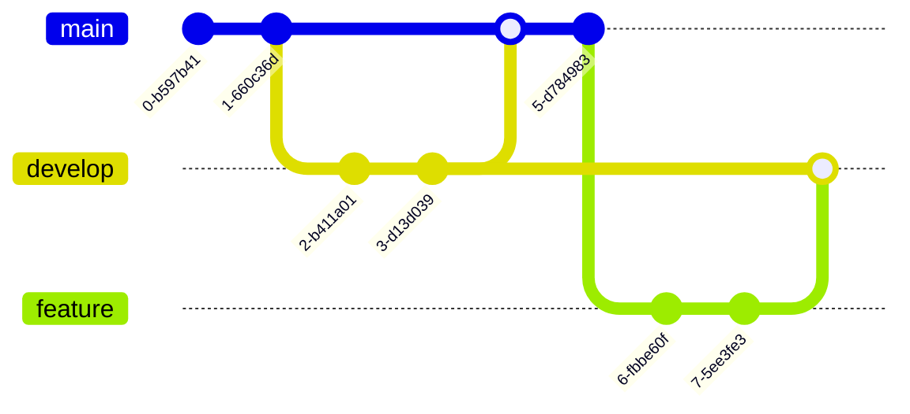

# Mermaid Diagrams Reference

## Overview

**Mermaid** is a text-based diagramming tool that renders diagrams from simple text definitions, making diagrams version-controllable, easy to update, and maintainable alongside code.

**Source:** [skills.sh/softaworks/agent-toolkit/mermaid-diagrams](https://skills.sh/softaworks/agent-toolkit/mermaid-diagrams)
**Official Site:** [mermaid.js.org](https://mermaid.js.org)

---

## What is Mermaid?

### Purpose

Mermaid allows you to create diagrams using text syntax instead of graphical tools, enabling:

- **Version control** - Diagrams stored in git alongside code
- **Easy updates** - Edit text instead of dragging boxes
- **Maintainability** - Keep diagrams in sync with code
- **Collaboration** - Review diagram changes in PRs
- **Automation** - Generate diagrams programmatically

### Key Benefits

✅ **Text-based** - No special software needed
✅ **Version controlled** - Track changes over time
✅ **Portable** - Works in markdown, docs, wikis
✅ **Readable** - Both as text and rendered
✅ **Maintainable** - Easy to update

---

## Core Syntax Structure

### Basic Pattern

All Mermaid diagrams follow this pattern:

```mermaid
[diagram-type]
    [diagram content]
```

### Example


### Comments

Use `%%` for comments:

```mermaid
graph TD
    %% This is a comment
    A[Start] --> B[Process]  %% Another comment
```

### Indentation

Indentation improves readability but isn't required:


---

## Available Diagram Types

### 1. Class Diagrams

**Purpose:** Domain modeling, OOP design, entity relationships

**Use Cases:**

- Object-oriented design
- Domain models
- System architecture
- Data structures

**Syntax:**


**Key Elements:**

- Class definitions with attributes and methods
- Relationships: `-->` (association), `--o` (aggregation), `--*` (composition), `--|>` (inheritance)
- Multiplicity: `"1"`, `"0..*"`, `"1..*"`
- Visibility: `+` (public), `-` (private), `#` (protected)

### 2. Sequence Diagrams

**Purpose:** Temporal interactions and message flows

**Use Cases:**

- API interactions
- Authentication flows
- Method call sequences
- System integrations

**Syntax:**


**Key Elements:**

- Participants: `participant`, `actor`
- Messages: `->>` (sync), `-->>` (response), `--)` (async)
- Activation: `activate`/`deactivate`
- Loops: `loop`, `alt`, `opt`, `par`
- Notes: `Note over`, `Note left of`, `Note right of`

### 3. Flowcharts

**Purpose:** Processes, algorithms, decision trees

**Use Cases:**

- Business processes
- Algorithm logic
- Decision flows
- Workflow documentation

**Syntax:**


**Key Elements:**

- Node shapes: `[]` (rectangle), `()` (rounded), `{}` (diamond), `[()]` (stadium), `[()])` (database)
- Arrows: `-->` (solid), `-.->` (dotted), `==>` (thick)
- Labels: `-->|text|`
- Subgraphs for grouping

### 4. Entity Relationship Diagrams (ERD)

**Purpose:** Database schemas and table relationships

**Use Cases:**

- Database design
- Data modeling
- Schema documentation
- Migration planning

**Syntax:**


**Key Elements:**

- Entities with attributes
- Relationships: `||--||` (one-to-one), `||--o{` (one-to-many), `}o--o{` (many-to-many)
- Keys: `PK` (primary key), `FK` (foreign key), `UK` (unique key)

### 5. C4 Diagrams

**Purpose:** Multi-level software architecture

**Use Cases:**

- System context
- Container diagrams
- Component diagrams
- Architecture documentation

See `c4-architecture.md` for complete reference.

### 6. State Diagrams

**Purpose:** State machines and lifecycle states

**Use Cases:**

- Object lifecycles
- Workflow states
- Game states
- Connection states

**Syntax:**


**Key Elements:**

- States: Simple names
- Transitions: `-->` with labels
- Start/end: `[*]`
- Composite states: `state Name { ... }`

### 7. Git Graphs

**Purpose:** Version control branching strategies

**Use Cases:**

- Git workflow documentation
- Branch strategy explanation
- Release planning
- Merge visualizations

**Syntax:**



**Key Elements:**

- `commit` - Create commit
- `branch` - Create branch
- `checkout` - Switch branch
- `merge` - Merge branches
- Tags and IDs

### 8. Gantt Charts

**Purpose:** Project timelines and scheduling

**Use Cases:**

- Project planning
- Sprint planning
- Release schedules
- Resource allocation

**Syntax:**


**Key Elements:**

- `dateFormat` - Date format specification
- Sections for grouping
- Tasks with IDs, start, duration
- Dependencies: `after taskId`
- Status: `done`, `active`, `crit`

### 9. Pie/Bar Charts

**Purpose:** Data visualization

**Use Cases:**

- Metrics display
- Distribution visualization
- Statistical reports
- Dashboards

**Pie Chart Syntax:**


---

## When to Use Each Diagram Type

### Choose Class Diagram When:

- Designing object-oriented systems
- Documenting domain models
- Showing inheritance hierarchies
- Modeling data structures

### Choose Sequence Diagram When:

- Documenting API flows
- Explaining authentication
- Showing temporal interactions
- Debugging distributed systems

### Choose Flowchart When:

- Documenting algorithms
- Showing decision logic
- Explaining business processes
- Creating user flows

### Choose ERD When:

- Designing databases
- Planning migrations
- Documenting schemas
- Showing data relationships

### Choose State Diagram When:

- Modeling object lifecycles
- Documenting workflows
- Designing state machines
- Showing status transitions

### Choose Git Graph When:

- Explaining branching strategy
- Documenting release process
- Planning merges
- Training team on git workflow

### Choose Gantt Chart When:

- Planning sprints
- Scheduling releases
- Showing timelines
- Resource planning

---

## Best Practices

### 1. Start Simple, Add Complexity

✅ **Good Approach:**

```mermaid
%% Version 1: Simple
graph TD
    A --> B
    B --> C

%% Version 2: Add details
graph TD
    A[Login] --> B[Validate]
    B --> C[Dashboard]

%% Version 3: Add branches
graph TD
    A[Login] --> B{Valid?}
    B -->|Yes| C[Dashboard]
    B -->|No| D[Error]
```

❌ **Avoid:** Starting with complex diagram on first iteration

### 2. Use Meaningful Names

✅ **Good:**


❌ **Bad:**


### 3. Add Comments for Context

✅ **Good:**


❌ **Bad:**


### 4. Keep Diagrams Focused

✅ **Good:** One diagram per concept

- `auth-flow.md` - Authentication
- `checkout-flow.md` - Checkout process
- `payment-flow.md` - Payment handling

❌ **Bad:** One massive diagram with everything

### 5. Store with Code

✅ **Good Structure:**

```
project/
├── docs/
│   ├── architecture/
│   │   ├── system-overview.md
│   │   └── api-flows.md
│   └── database/
│       └── schema.md
└── src/
```

### 6. Use Titles and Notes

✅ **Good:**


---

## Configuration & Theming

### Frontmatter Configuration

```yaml
---
config:
  theme: default
  themeVariables:
    primaryColor: "#ff0000"
---
```

### Available Themes

- `default` - Standard Mermaid theme
- `forest` - Green/nature theme
- `dark` - Dark background
- `neutral` - Grayscale
- `base` - Minimal styling

### Layout Options

- `dagre` (default) - Standard layout algorithm
- `elk` - Alternative layout engine

### Appearance Styles

- `classic` - Standard appearance
- `handDrawn` - Sketch-like style

### Example with Configuration

```yaml
---
config:
  theme: dark
  layout: elk
  look: handDrawn
---
```


---

## Common Pitfalls

### 1. Breaking Characters in Comments

❌ **Problem:**

```mermaid
graph TD
    A[Process] %% Uses {} for config
```

✅ **Solution:**

```mermaid
graph TD
    A[Process] %% Uses braces for config
```

### 2. Misspelled Syntax

❌ **Problem:** Silently fails

```mermaid
sequenceDiagarm  %% Typo: Diagarm
    User->>API: Request
```

✅ **Solution:** Double-check spelling

```mermaid
sequenceDiagram
    User->>API: Request
```

### 3. Overly Complex Diagrams

❌ **Problem:** 50+ nodes in one diagram

✅ **Solution:** Split into multiple focused diagrams

- `overview.md` - High-level
- `module-a.md` - Module A details
- `module-b.md` - Module B details

### 4. Undocumented Relationships

❌ **Problem:**

```mermaid
classDiagram
    A --> B
    B --> C
```

✅ **Solution:**

```mermaid
classDiagram
    Customer "1" --> "0..*" Order : places
    Order "1" --> "1..*" OrderItem : contains
```

---

## Complete Examples

### Example 1: Authentication Flow

**File:** `docs/flows/authentication.md`

```markdown
# Authentication Flow

## Overview

OAuth 2.0 authentication flow for the application.

## Diagram

\`\`\`mermaid
sequenceDiagram
actor User
participant App
participant AuthServer
participant API
participant Database

    %% Initial authentication request
    User->>App: Click "Login"
    App->>AuthServer: Authorization request

    %% User authentication
    AuthServer->>User: Show login form
    User->>AuthServer: Submit credentials

    %% Credential validation
    AuthServer->>Database: Verify credentials
    Database-->>AuthServer: User verified

    %% Token generation
    AuthServer->>AuthServer: Generate JWT
    AuthServer-->>App: Authorization code

    %% Token exchange
    App->>AuthServer: Exchange code for token
    AuthServer-->>App: Access token + Refresh token

    %% Authenticated request
    App->>API: Request with token
    API->>API: Validate token
    API->>Database: Fetch user data
    Database-->>API: User data
    API-->>App: Protected resource
    App-->>User: Show dashboard

\`\`\`

## Key Points

- OAuth 2.0 authorization code flow
- JWT tokens for API authentication
- Refresh tokens for session management
- Token validation on each API request
```

### Example 2: Database Schema

**File:** `docs/database/schema.md`

```markdown
# Database Schema

## Overview

E-commerce database schema with entities and relationships.

## Diagram

\`\`\`mermaid
erDiagram
CUSTOMER ||--o{ ORDER : places
CUSTOMER {
int id PK
string email UK
string name
datetime created_at
}

    ORDER ||--|{ ORDER_ITEM : contains
    ORDER {
        int id PK
        int customer_id FK
        decimal total
        string status
        datetime created_at
    }

    ORDER_ITEM }o--|| PRODUCT : references
    ORDER_ITEM {
        int id PK
        int order_id FK
        int product_id FK
        int quantity
        decimal price
    }

    PRODUCT ||--o{ PRODUCT_IMAGE : has
    PRODUCT {
        int id PK
        string sku UK
        string name
        text description
        decimal price
        int stock
    }

    PRODUCT_IMAGE {
        int id PK
        int product_id FK
        string url
        int sort_order
    }

    PRODUCT }o--o{ CATEGORY : belongs_to
    CATEGORY {
        int id PK
        string name UK
        string slug UK
        int parent_id FK
    }

\`\`\`

## Key Points

- Customers can place multiple orders
- Orders contain multiple items
- Products can have multiple images
- Products belong to multiple categories (many-to-many)
- All timestamps tracked for auditing
```

### Example 3: Deployment Process

**File:** `docs/processes/deployment.md`

```markdown
# Deployment Process

## Overview

CI/CD pipeline for application deployment.

## Diagram

\`\`\`mermaid
flowchart TD
Start([Developer Push]) --> PR[Create Pull Request]
PR --> Tests{Tests Pass?}

    Tests -->|No| Fix[Fix Issues]
    Fix --> PR

    Tests -->|Yes| Review[Code Review]
    Review --> Approved{Approved?}

    Approved -->|No| Changes[Request Changes]
    Changes --> PR

    Approved -->|Yes| Merge[Merge to Main]
    Merge --> Build[Build Docker Image]

    Build --> BuildSuccess{Build Success?}
    BuildSuccess -->|No| Notify[Notify Team]
    Notify --> End([End])

    BuildSuccess -->|Yes| Staging[Deploy to Staging]
    Staging --> SmokeTests[Run Smoke Tests]

    SmokeTests --> SmokePass{Tests Pass?}
    SmokePass -->|No| Rollback[Rollback Staging]
    Rollback --> Notify

    SmokePass -->|Yes| Manual{Manual Approval?}
    Manual -->|No| Schedule[Schedule Deployment]
    Schedule --> Manual

    Manual -->|Yes| Production[Deploy to Production]
    Production --> Monitor[Monitor Metrics]
    Monitor --> Healthy{Healthy?}

    Healthy -->|No| ProdRollback[Rollback Production]
    ProdRollback --> Incident[Create Incident]
    Incident --> End

    Healthy -->|Yes| Success[Deployment Success]
    Success --> End

    style Start fill:#90EE90
    style End fill:#FFB6C1
    style Production fill:#FFD700
    style ProdRollback fill:#FF6347

\`\`\`

## Key Points

- Automated testing before merge
- Docker image built on merge
- Staging deployment with smoke tests
- Manual approval for production
- Automatic rollback on health check failure
- Incident creation for production issues
```

### Example 4: Order State Machine

**File:** `docs/workflows/order-states.md`

```markdown
# Order State Machine

## Overview

Order lifecycle states and transitions.

## Diagram

\`\`\`mermaid
stateDiagram-v2
[*] --> Draft : Create order

    Draft --> PendingPayment : Submit
    Draft --> Cancelled : Cancel

    PendingPayment --> PaymentFailed : Payment rejected
    PendingPayment --> Confirmed : Payment successful

    PaymentFailed --> PendingPayment : Retry payment
    PaymentFailed --> Cancelled : Cancel order

    Confirmed --> Processing : Start fulfillment
    Confirmed --> Cancelled : Cancel before processing

    Processing --> Shipped : Ship items
    Processing --> Cancelled : Cancel (restocking)

    Shipped --> Delivered : Delivery confirmed
    Shipped --> InTransit : Tracking update

    InTransit --> Delivered : Delivery confirmed
    InTransit --> Returned : Return initiated

    Delivered --> Completed : After return window
    Delivered --> Returned : Customer returns

    Returned --> Refunded : Process refund

    Cancelled --> [*]
    Completed --> [*]
    Refunded --> [*]

    note right of Confirmed
        Order confirmed,
        payment received
    end note

    note right of Cancelled
        Inventory released,
        customer notified
    end note

\`\`\`

## Key States

- **Draft**: Order being created
- **PendingPayment**: Awaiting payment
- **Confirmed**: Payment received
- **Processing**: Being fulfilled
- **Shipped**: In delivery
- **Delivered**: Received by customer
- **Completed**: Final state (successful)
- **Cancelled**: Final state (cancelled)
- **Refunded**: Final state (refunded)

## Transitions

All transitions trigger appropriate notifications and inventory updates.
```

---

## File Storage Best Practices

### Recommended Structure

```
project/
├── docs/
│   ├── architecture/
│   │   ├── system-context.md      # C4 Level 1
│   │   ├── containers.md          # C4 Level 2
│   │   └── components-api.md      # C4 Level 3
│   ├── database/
│   │   ├── schema.md              # ERD
│   │   └── migrations.md          # Migration strategy
│   ├── flows/
│   │   ├── authentication.md      # Sequence diagram
│   │   ├── checkout.md            # Sequence diagram
│   │   └── payment.md             # Sequence diagram
│   ├── processes/
│   │   ├── deployment.md          # Flowchart
│   │   └── ci-cd.md               # Flowchart
│   └── models/
│       ├── domain-model.md        # Class diagram
│       └── order-states.md        # State diagram
└── README.md
```

### File Naming

- Use kebab-case: `user-authentication.md`
- Be descriptive: `oauth-login-flow.md` not `flow1.md`
- Include diagram type in path: `flows/`, `schemas/`, `processes/`

---

## Resources

- **Skill Source:** [skills.sh/softaworks/agent-toolkit/mermaid-diagrams](https://skills.sh/softaworks/agent-toolkit/mermaid-diagrams)
- **Mermaid Official:** [mermaid.js.org](https://mermaid.js.org)
- **Live Editor:** [mermaid.live](https://mermaid.live)
- **GitHub Repo:** [github.com/softaworks/agent-toolkit](https://github.com/softaworks/agent-toolkit)

---

**Last Updated:** January 2026
**Category:** Documentation & Diagrams
