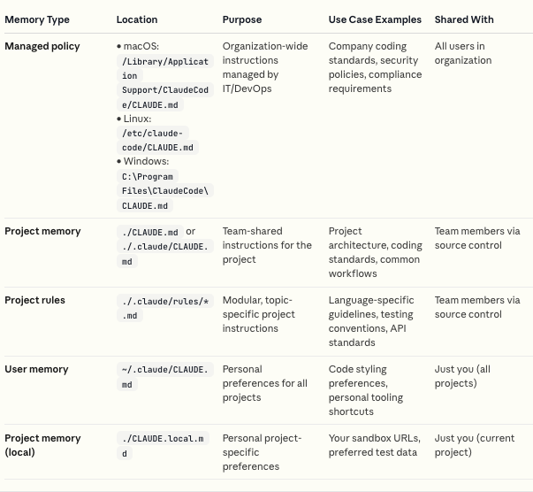

# Memory y Rules en Claude Code

Este documento explica cómo gestionar la memoria de Claude Code a través de sesiones usando archivos CLAUDE.md y el sistema de reglas modulares en `.claude/rules/`.

## Vista General

Claude Code puede recordar tus preferencias a través de sesiones, incluyendo guías de estilo, comandos comunes en tu flujo de trabajo, y convenciones específicas del proyecto. Esta capacidad se implementa mediante un sistema jerárquico de archivos de memoria.



## Tipos de Memoria

Claude Code ofrece cuatro ubicaciones de memoria en una estructura jerárquica, cada una con un propósito diferente:

| Tipo de Memoria            | Ubicación                                                                                                                                                       | Propósito                                         | Ejemplos de Uso                                                    | Compartido Con                |
| -------------------------- | --------------------------------------------------------------------------------------------------------------------------------------------------------------- | ------------------------------------------------- | ------------------------------------------------------------------ | ----------------------------- |
| **Managed policy**         | • macOS: `/Library/Application Support/ClaudeCode/CLAUDE.md`<br />• Linux: `/etc/claude-code/CLAUDE.md`<br />• Windows: `C:\Program Files\ClaudeCode\CLAUDE.md` | Instrucciones organizacionales gestionadas por IT | Estándares de código de la empresa, políticas de seguridad         | Todos los usuarios de la org  |
| **Project memory**         | `./CLAUDE.md` o `./.claude/CLAUDE.md`                                                                                                                           | Instrucciones compartidas del equipo              | Arquitectura del proyecto, estándares de código, flujos de trabajo | Miembros del equipo vía git   |
| **Project rules**          | `./.claude/rules/*.md`                                                                                                                                          | Instrucciones modulares por tema                  | Guías específicas de lenguaje, convenciones de testing             | Miembros del equipo vía git   |
| **User memory**            | `~/.claude/CLAUDE.md`                                                                                                                                           | Preferencias personales para todos los proyectos  | Preferencias de estilo, atajos de herramientas personales          | Solo tú (todos los proyectos) |
| **Project memory (local)** | `./CLAUDE.local.md`                                                                                                                                             | Preferencias personales específicas del proyecto  | URLs de sandbox, datos de prueba preferidos                        | Solo tú (proyecto actual)     |

### Características Clave

- **Jerarquía**: Los archivos más altos en la jerarquía toman precedencia y se cargan primero
- **Carga Automática**: Todos los archivos de memoria se cargan automáticamente en el contexto de Claude Code
- **CLAUDE.local.md**: Se agrega automáticamente a `.gitignore`, ideal para preferencias privadas que no deben estar en control de versiones

## Imports en CLAUDE.md

Los archivos CLAUDE.md pueden importar archivos adicionales usando la sintaxis `@path/to/import`:

```markdown
Ver @README para descripción del proyecto y @package.json para comandos npm disponibles.

# Instrucciones Adicionales

- flujo de trabajo git @docs/git-instructions.md
```

### Reglas de Imports

- Se permiten rutas **relativas y absolutas**
- Los imports son útiles para instrucciones individuales no versionadas:

  ```markdown
  # Preferencias Individuales

  - @~/.claude/my-project-instructions.md
  ```

- Los imports **no se evalúan** dentro de code spans y code blocks:
  ```markdown
  Este código no se tratará como import: `@anthropic-ai/claude-code`
  ```
- Profundidad máxima: **5 niveles** de recursión
- Usa `/memory` para ver qué archivos están cargados

## Cómo Claude Busca las Memorias

Claude Code lee memorias recursivamente:

1. **Desde el directorio actual hacia arriba**: Comienza en el cwd y sube hasta (pero sin incluir) la raíz `/`
2. **Lee CLAUDE.md y CLAUDE.local.md** en cada nivel
3. **Descubre CLAUDE.md en subdirectorios**: Solo se incluyen cuando Claude lee archivos en esos subdirectorios

### Cargar Memoria de Directorios Adicionales

Cuando usas `--add-dir` para acceso a directorios adicionales, puedes cargar sus archivos de memoria con:

```bash
CLAUDE_CODE_ADDITIONAL_DIRECTORIES_CLAUDE_MD=1 claude --add-dir ../shared-config
```

## Gestión de Memoria con `/memory`

Durante una sesión, usa el comando `/memory` para abrir cualquier archivo de memoria en tu editor del sistema para ediciones extensivas u organización.

```bash
> /memory
```

## Configurar Project Memory

Para inicializar un archivo CLAUDE.md en tu proyecto:

```bash
> /init
```

Esto crea una estructura base que puedes personalizar según las necesidades de tu proyecto.

### Ubicaciones Posibles

Puedes elegir entre:

- `./CLAUDE.md` - En la raíz del proyecto
- `./.claude/CLAUDE.md` - Dentro del directorio `.claude`

### Recomendaciones de Contenido

**Incluye:**

- ✅ Comandos frecuentemente usados (build, test, lint)
- ✅ Preferencias de estilo de código y convenciones de nombres
- ✅ Patrones arquitectónicos importantes específicos del proyecto
- ✅ Instrucciones compartidas del equipo
- ✅ Preferencias individuales

## Reglas Modulares con `.claude/rules/`

Para proyectos grandes, organiza instrucciones en múltiples archivos usando el directorio `.claude/rules/`. Esto permite mantener archivos de reglas enfocados y bien organizados en lugar de un CLAUDE.md grande.

### Estructura Básica

```
your-project/
├── .claude/
│   ├── CLAUDE.md           # Instrucciones principales
│   └── rules/
│       ├── code-style.md   # Guías de estilo
│       ├── testing.md      # Convenciones de testing
│       └── security.md     # Requisitos de seguridad
```

**Características:**

- Todos los archivos `.md` en `.claude/rules/` se cargan automáticamente como memoria del proyecto
- Misma prioridad que `.claude/CLAUDE.md`

### Reglas Específicas por Path

Las reglas pueden aplicarse solo a archivos específicos usando YAML frontmatter con el campo `paths`:

```markdown
---
paths:
  - "src/api/**/*.ts"
---

# Reglas de Desarrollo API

- Todos los endpoints deben incluir validación de entrada
- Usar formato estándar de respuesta de error
- Incluir comentarios de documentación OpenAPI
```

**Notas:**

- Reglas sin `paths` se cargan incondicionalmente y aplican a todos los archivos
- Solo se aplican cuando Claude trabaja con archivos que coinciden con los patrones

### Patrones Glob Soportados

| Patrón                 | Coincide Con                                   |
| ---------------------- | ---------------------------------------------- |
| `**/*.ts`              | Todos los archivos TypeScript en cualquier dir |
| `src/**/*`             | Todos los archivos bajo directorio `src/`      |
| `*.md`                 | Archivos Markdown en la raíz del proyecto      |
| `src/components/*.tsx` | Componentes React en directorio específico     |

**Múltiples patrones:**

```markdown
---
paths:
  - "src/**/*.ts"
  - "lib/**/*.ts"
  - "tests/**/*.test.ts"
---
```

**Brace expansion:**

```markdown
---
paths:
  - "src/**/*.{ts,tsx}"
  - "{src,lib}/**/*.ts"
---

# Reglas TypeScript/React
```

### Subdirectorios

Organiza reglas en subdirectorios para mejor estructura:

```
.claude/rules/
├── frontend/
│   ├── react.md
│   └── styles.md
├── backend/
│   ├── api.md
│   └── database.md
└── general.md
```

Todos los archivos `.md` se descubren recursivamente.

### Symlinks

El directorio `.claude/rules/` soporta symlinks para compartir reglas comunes entre proyectos:

```bash
# Symlink a directorio compartido de reglas
ln -s ~/shared-claude-rules .claude/rules/shared

# Symlink a archivos individuales
ln -s ~/company-standards/security.md .claude/rules/security.md
```

**Características:**

- Symlinks se resuelven y su contenido se carga normalmente
- Symlinks circulares se detectan y manejan correctamente

### Reglas a Nivel de Usuario

Crea reglas personales que aplican a todos tus proyectos en `~/.claude/rules/`:

```
~/.claude/rules/
├── preferences.md    # Preferencias personales de codificación
└── workflows.md      # Flujos de trabajo preferidos
```

**Precedencia:**

- Reglas de usuario se cargan **antes** que reglas del proyecto
- Las reglas del proyecto tienen **mayor prioridad**

## Gestión de Memoria Organizacional

Las organizaciones pueden desplegar archivos CLAUDE.md gestionados centralmente que aplican a todos los usuarios.

### Configuración

1. **Crear archivo de política gestionada** en la ubicación **Managed policy** (ver tabla de tipos de memoria)

2. **Desplegar vía sistema de gestión de configuración**:
   - MDM (Mobile Device Management)
   - Group Policy
   - Ansible
   - Otros sistemas de configuración

Esto asegura distribución consistente en todas las máquinas de desarrollo.

## Mejores Prácticas

### ✅ Ser Específico

**Bien:** "Usar indentación de 2 espacios"
**Mal:** "Formatear código apropiadamente"

### ✅ Usar Estructura para Organizar

- Formatear cada memoria individual como un bullet point
- Agrupar memorias relacionadas bajo encabezados markdown descriptivos

### ✅ Revisar Periódicamente

- Actualizar memorias conforme el proyecto evoluciona
- Asegurar que Claude use la información más actualizada

### ✅ Mantener Reglas Enfocadas

- Cada archivo debe cubrir un tema (ej: `testing.md`, `api-design.md`)
- Usar nombres de archivo descriptivos

### ✅ Usar Reglas Condicionales con Moderación

- Solo agregar frontmatter `paths` cuando las reglas realmente aplican a tipos de archivo específicos

### ✅ Organizar con Subdirectorios

- Agrupar reglas relacionadas (ej: `frontend/`, `backend/`)

## Ejemplos Prácticos

### Ejemplo 1: CLAUDE.md de Proyecto

````markdown
# Mi Proyecto Web

## Comandos Frecuentes

```bash
npm run dev      # Servidor de desarrollo
npm run build    # Build de producción
npm test         # Ejecutar tests
npm run lint     # Linter
```
````

## Estilo de Código

- Usar indentación de 2 espacios
- Preferir const sobre let
- Usar single quotes para strings
- Añadir trailing commas en objetos y arrays

## Arquitectura

- Componentes en `src/components/`
- Hooks personalizados en `src/hooks/`
- Utilidades en `src/utils/`
- Tests junto al código: `Component.test.tsx`

## Imports

- @docs/git-workflow.md
- @~/.claude/personal-preferences.md

````

### Ejemplo 2: Regla Condicional

**`.claude/rules/api/validation.md`**

```markdown
---
paths:
  - "src/api/**/*.ts"
  - "src/routes/**/*.ts"
---

# Reglas de Validación API

## Validación de Entrada

Todos los endpoints deben validar entrada usando Zod:

```typescript
import { z } from 'zod';

const CreateUserSchema = z.object({
  email: z.string().email(),
  name: z.string().min(2),
  age: z.number().positive().optional()
});

app.post('/users', async (req, res) => {
  const data = CreateUserSchema.parse(req.body);
  // ...
});
````

## Manejo de Errores

Usar formato estándar de respuesta de error:

```typescript
{
  "error": {
    "code": "VALIDATION_ERROR",
    "message": "Invalid input",
    "details": [...]
  }
}
```

```

### Ejemplo 3: Estructura Completa

```

mi-proyecto/
├── CLAUDE.md # Memoria principal del proyecto
├── CLAUDE.local.md # Mis preferencias locales (gitignored)
├── .claude/
│ ├── CLAUDE.md # Alternativa a raíz
│ └── rules/
│ ├── frontend/
│ │ ├── react.md # Reglas React
│ │ └── styling.md # Reglas CSS/Styling
│ ├── backend/
│ │ ├── api.md # Reglas API
│ │ └── database.md # Reglas DB
│ ├── testing.md # Convenciones de testing
│ └── security.md # Políticas de seguridad
└── docs/
├── git-workflow.md # Importado desde CLAUDE.md
└── deployment.md # Importado desde CLAUDE.md

```

## Comandos Útiles

| Comando     | Descripción                                       |
| ----------- | ------------------------------------------------- |
| `/init`     | Inicializar CLAUDE.md en el proyecto             |
| `/memory`   | Abrir archivo de memoria en editor del sistema   |

## Referencias

- [Documentación Oficial - Memory](https://code.claude.com/docs/en/memory)
- [Claude Code - Documentación General](https://code.claude.com/docs)
- [Model Context Protocol](https://modelcontextprotocol.io)

---

**Nota:** El sistema de memoria y reglas es fundamental para mantener consistencia en proyectos de equipo y personalización individual, permitiendo que Claude Code se adapte a las necesidades específicas de cada proyecto y desarrollador.
```
