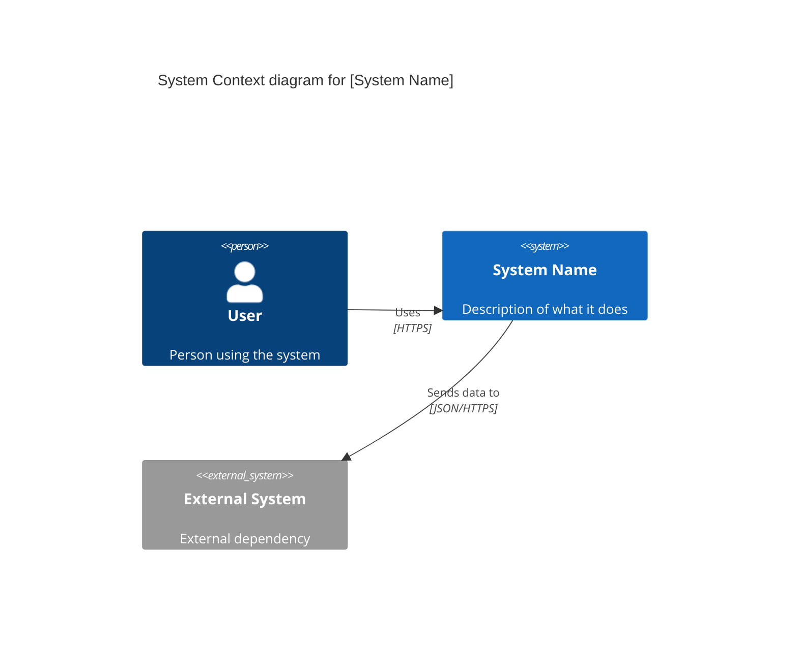

# C4 Architecture Documentation

## Overview

**C4** is a model for visualizing software architecture using hierarchical diagrams. It helps teams document systems at different abstraction levels using standardized notation, making architecture accessible to different audiences.

**Source:** [skills.sh/softaworks/agent-toolkit/c4-architecture](https://skills.sh/softaworks/agent-toolkit/c4-architecture)
**Official Site:** [c4model.com](https://c4model.com)

---

## What is C4?

C4 stands for **Context, Container, Component, Code** - four hierarchical levels for documenting software architecture.

### Purpose

- **Standardized notation** for architecture diagrams
- **Multiple abstraction levels** for different audiences
- **Hierarchical zoom** from system overview to code details
- **Clear communication** across technical and non-technical stakeholders

### Key Benefit

C4 provides a consistent way to think about and communicate software architecture, similar to how maps have different zoom levels for different purposes.

---

## The Four Levels

### Level 1: Context Diagram

**Purpose:** Show the system and its external dependencies

**Audience:** Everyone (technical and non-technical)

**Shows:**
- Your system (as a box)
- External actors (people and systems)
- Relationships between them

**Example Use Case:**
- Executive presentation
- Project kickoff
- System boundary definition

**What to Include:**
- System name and description
- Users/personas interacting with system
- External systems being integrated
- High-level relationships

**Elements:**
- `Person` - Users of the system
- `System` - Your system
- `System_Ext` - External systems
- `Enterprise_Boundary` - Organization boundary

### Level 2: Container Diagram

**Purpose:** Show the major deployable units and their interactions

**Audience:** Technical teams (developers, architects, operations)

**Shows:**
- Applications
- Databases
- Microservices
- File systems
- Message queues

**Example Use Case:**
- Deployment planning
- Technology stack overview
- Integration architecture

**What to Include:**
- Web applications
- Mobile apps
- Databases
- APIs/services
- Message brokers
- Technology choices

**Elements:**
- `Container` - Deployable unit
- `ContainerDb` - Database
- `ContainerQueue` - Message queue
- `Container_Boundary` - Grouping boundary

### Level 3: Component Diagram

**Purpose:** Show internal structure of a container

**Audience:** Developers working on the specific container

**Shows:**
- Internal components
- Component responsibilities
- Component interactions
- Key abstractions

**Example Use Case:**
- Detailed design documentation
- Onboarding new developers
- Refactoring planning

**What to Include:**
- Controllers
- Services
- Repositories
- Utilities
- Internal boundaries

**Elements:**
- `Component` - Logical grouping of code
- `ComponentDb` - Data component
- `Component_Boundary` - Module boundary

**Important Note:** "Context + Container diagrams are sufficient for most software development teams." Only create Component diagrams when they genuinely add value.

### Level 4: Code/Deployment Diagram

**Purpose:** Show infrastructure and deployment topology

**Audience:** DevOps, operations teams

**Shows:**
- Infrastructure nodes
- Network topology
- Deployment units
- Hardware/VM configuration

**Example Use Case:**
- Infrastructure provisioning
- Deployment automation
- Disaster recovery planning

**What to Include:**
- Servers/VMs
- Load balancers
- Firewalls
- CDNs
- Availability zones

**Elements:**
- `Deployment_Node` - Infrastructure node
- `Container` - Deployed instances
- Network boundaries

### Dynamic Diagrams

**Purpose:** Show request flows and interactions over time

**Audience:** Developers understanding complex workflows

**Shows:**
- Numbered sequence of interactions
- Request/response flows
- Multi-step processes
- Event chains

**Example Use Case:**
- API workflow documentation
- Event-driven architecture
- Complex business processes

---

## Creating C4 Diagrams

### Using Mermaid Syntax

C4 diagrams are written using **Mermaid** syntax for easy versioning and rendering.

### Basic Structure



### Elements

#### Person
```mermaid
Person(alias, "Name", "Description")
```

**Example:**
```mermaid
Person(customer, "Customer", "A customer of the system")
Person(admin, "Administrator", "System administrator")
```

#### System
```mermaid
System(alias, "Name", "Description")
System_Ext(alias, "Name", "Description")  # External system
```

**Example:**
```mermaid
System(webapp, "Web Application", "Main customer-facing app")
System_Ext(payment, "Payment Gateway", "Stripe payment processor")
```

#### Container
```mermaid
Container(alias, "Name", "Technology", "Description")
ContainerDb(alias, "Name", "Technology", "Description")
ContainerQueue(alias, "Name", "Technology", "Description")
```

**Example:**
```mermaid
Container(api, "API Application", "Node.js", "REST API")
ContainerDb(db, "Database", "PostgreSQL", "Stores user data")
ContainerQueue(queue, "Message Queue", "RabbitMQ", "Async processing")
```

#### Component
```mermaid
Component(alias, "Name", "Technology", "Description")
ComponentDb(alias, "Name", "Technology", "Description")
```

**Example:**
```mermaid
Component(controller, "User Controller", "Express", "Handles user requests")
Component(service, "User Service", "TypeScript", "Business logic")
ComponentDb(repo, "User Repository", "TypeORM", "Data access")
```

### Boundaries

#### Enterprise Boundary
```mermaid
Enterprise_Boundary(alias, "Name") {
    # Elements inside boundary
}
```

#### System Boundary
```mermaid
System_Boundary(alias, "Name") {
    # Elements inside boundary
}
```

#### Container Boundary
```mermaid
Container_Boundary(alias, "Name") {
    # Elements inside boundary
}
```

**Example:**
```mermaid
Enterprise_Boundary(company, "Company Systems") {
    System_Boundary(ecommerce, "E-commerce Platform") {
        Container(web, "Web App", "React", "Customer UI")
        Container(api, "API", "Node.js", "Backend API")
    }
}
```

### Relationships

```mermaid
Rel(from, to, "Label", "Technology")
```

**Parameters:**
- `from` - Source element alias
- `to` - Target element alias
- `Label` - What happens (action verb)
- `Technology` - How it happens (protocol/format)

**Examples:**
```mermaid
Rel(user, webapp, "Uses", "HTTPS")
Rel(webapp, api, "Makes API calls to", "JSON/HTTPS")
Rel(api, db, "Reads from and writes to", "JDBC")
Rel(service, queue, "Publishes messages to", "AMQP")
```

---

## Best Practices

### Rule 1: Complete Element Information

Every element MUST have:
- **Name**: What it's called
- **Type**: Person/System/Container/Component
- **Technology**: How it's built (for technical elements)
- **Description**: What it does

✅ **Good:**
```mermaid
Container(api, "API Application", "Node.js/Express", "Provides REST API for mobile and web clients")
```

❌ **Bad:**
```mermaid
Container(api, "API", "", "API")
```

### Rule 2: Unidirectional Arrows

Use unidirectional arrows to avoid ambiguity.

✅ **Good:**
```mermaid
Rel(webapp, api, "Sends requests to", "JSON/HTTPS")
Rel(api, webapp, "Returns responses to", "JSON/HTTPS")
```

❌ **Bad:**
```mermaid
BiRel(webapp, api, "Communicates with", "HTTPS")
```

### Rule 3: Action Verb Labels

Label arrows with **action verbs** describing what happens.

✅ **Good:**
```mermaid
Rel(user, webapp, "Uses", "HTTPS")
Rel(webapp, api, "Sends requests to", "JSON/HTTPS")
Rel(api, db, "Reads from and writes to", "JDBC")
Rel(service, email, "Sends email using", "SMTP")
```

❌ **Bad:**
```mermaid
Rel(user, webapp, "uses", "")
Rel(webapp, api, "connects", "")
```

### Rule 4: Include Technology Specifications

Always specify the technology/protocol used.

✅ **Good:**
```mermaid
Rel(mobile, api, "Makes API calls to", "JSON/HTTPS")
Rel(api, cache, "Reads from and writes to", "Redis Protocol")
Rel(worker, queue, "Consumes messages from", "AMQP")
```

❌ **Bad:**
```mermaid
Rel(mobile, api, "Calls")
Rel(api, cache, "Uses")
```

### Rule 5: Limit Diagram Complexity

**Maximum elements per diagram: ~20**

If exceeding 20 elements:
- Split into multiple diagrams
- Focus on specific subsystems
- Create separate views for different concerns

**Example:**
Instead of one massive Container diagram:
- `c4-containers-overview.md` - High-level
- `c4-containers-frontend.md` - Frontend containers
- `c4-containers-backend.md` - Backend containers
- `c4-containers-infrastructure.md` - Infrastructure

### Rule 6: Consistent Naming

Use consistent naming across all diagrams:

```mermaid
# Level 1: Context
System(webapp, "E-commerce Platform", "Online shopping system")

# Level 2: Container
System_Boundary(webapp, "E-commerce Platform") {
    Container(web, "Web Application", "React", "Customer UI")
    Container(api, "API", "Node.js", "Backend")
}

# Level 3: Component (inside API container)
Container_Boundary(api, "API") {
    Component(controller, "Product Controller", "Express", "")
    Component(service, "Product Service", "TypeScript", "")
}
```

---

## Output Format

### File Organization

```
docs/architecture/
├── c4-context.md           # Level 1: System context
├── c4-containers.md        # Level 2: Container overview
├── c4-components-auth.md   # Level 3: Auth components
├── c4-components-payment.md # Level 3: Payment components
├── c4-deployment.md        # Level 4: Infrastructure
└── c4-dynamic-checkout.md  # Dynamic: Checkout flow
```

### Naming Convention

- `c4-context.md` - System context diagram
- `c4-containers.md` - Container diagram
- `c4-components-{feature}.md` - Component diagram for specific feature
- `c4-deployment.md` - Deployment/infrastructure diagram
- `c4-dynamic-{workflow}.md` - Dynamic diagram for specific workflow

### File Template

```markdown
# [Diagram Title]

## Purpose

[What this diagram shows and why it's useful]

## Audience

[Who should read this diagram]

## Diagram

\`\`\`mermaid
C4[Context/Container/Component]
    title [Diagram Title]

    [Elements and relationships]
\`\`\`

## Key Points

- [Important point 1]
- [Important point 2]
- [Important point 3]

## Related Diagrams

- [Link to parent diagram]
- [Link to child diagrams]
- [Link to related diagrams]
```

---

## Complete Examples

### Example 1: Context Diagram

**File:** `docs/architecture/c4-context.md`

```markdown
# E-commerce Platform - System Context

## Purpose

Shows the E-commerce Platform and its external dependencies.

## Audience

All stakeholders (technical and non-technical)

## Diagram

\`\`\`mermaid
C4Context
    title System Context diagram for E-commerce Platform

    Person(customer, "Customer", "A customer shopping online")
    Person(admin, "Administrator", "Manages products and orders")

    System(ecommerce, "E-commerce Platform", "Online shopping system")

    System_Ext(payment, "Payment Gateway", "Stripe payment processor")
    System_Ext(email, "Email Service", "SendGrid email delivery")
    System_Ext(shipping, "Shipping API", "FedEx shipping integration")

    Rel(customer, ecommerce, "Browses and purchases products", "HTTPS")
    Rel(admin, ecommerce, "Manages catalog and orders", "HTTPS")

    Rel(ecommerce, payment, "Processes payments via", "JSON/HTTPS")
    Rel(ecommerce, email, "Sends notifications using", "SMTP")
    Rel(ecommerce, shipping, "Creates shipments via", "JSON/HTTPS")
\`\`\`

## Key Points

- Customers interact via web browser
- Admins have separate management interface
- Payment processing handled by Stripe
- Email notifications via SendGrid
- Shipping integration with FedEx API
```

### Example 2: Container Diagram

**File:** `docs/architecture/c4-containers.md`

```markdown
# E-commerce Platform - Containers

## Purpose

Shows the major deployable units of the E-commerce Platform.

## Audience

Technical teams (developers, architects, operations)

## Diagram

\`\`\`mermaid
C4Container
    title Container diagram for E-commerce Platform

    Person(customer, "Customer", "Shopping online")

    System_Boundary(ecommerce, "E-commerce Platform") {
        Container(web, "Web Application", "React", "Customer-facing UI")
        Container(admin, "Admin Portal", "React", "Product/order management")
        Container(api, "API Application", "Node.js/Express", "REST API")
        ContainerDb(db, "Database", "PostgreSQL", "Stores products, orders, users")
        ContainerQueue(queue, "Message Queue", "RabbitMQ", "Async processing")
        Container(worker, "Background Worker", "Node.js", "Processes async tasks")
    }

    System_Ext(payment, "Payment Gateway", "Stripe")
    System_Ext(email, "Email Service", "SendGrid")

    Rel(customer, web, "Uses", "HTTPS")
    Rel(web, api, "Makes API calls to", "JSON/HTTPS")
    Rel(admin, api, "Makes API calls to", "JSON/HTTPS")

    Rel(api, db, "Reads from and writes to", "JDBC")
    Rel(api, queue, "Publishes messages to", "AMQP")
    Rel(worker, queue, "Consumes messages from", "AMQP")

    Rel(api, payment, "Processes payments via", "JSON/HTTPS")
    Rel(worker, email, "Sends emails via", "SMTP")
\`\`\`

## Key Points

- React frontends for customers and admins
- Single Node.js API serving both frontends
- PostgreSQL for data persistence
- RabbitMQ for async processing
- Background worker for email and notifications
- Stripe for payment processing
```

### Example 3: Component Diagram

**File:** `docs/architecture/c4-components-api.md`

```markdown
# API Application - Components

## Purpose

Shows internal components of the API Application container.

## Audience

Developers working on the API

## Diagram

\`\`\`mermaid
C4Component
    title Component diagram for API Application

    Container(web, "Web Application", "React", "Customer UI")
    ContainerDb(db, "Database", "PostgreSQL", "Data store")

    Container_Boundary(api, "API Application") {
        Component(router, "API Router", "Express", "Routes HTTP requests")

        Component(productCtrl, "Product Controller", "Express", "Product endpoints")
        Component(orderCtrl, "Order Controller", "Express", "Order endpoints")
        Component(userCtrl, "User Controller", "Express", "User endpoints")

        Component(productSvc, "Product Service", "TypeScript", "Product business logic")
        Component(orderSvc, "Order Service", "TypeScript", "Order business logic")
        Component(userSvc, "User Service", "TypeScript", "User business logic")

        ComponentDb(productRepo, "Product Repository", "TypeORM", "Product data access")
        ComponentDb(orderRepo, "Order Repository", "TypeORM", "Order data access")
        ComponentDb(userRepo, "User Repository", "TypeORM", "User data access")
    }

    Rel(web, router, "Makes requests to", "JSON/HTTPS")

    Rel(router, productCtrl, "Routes to", "")
    Rel(router, orderCtrl, "Routes to", "")
    Rel(router, userCtrl, "Routes to", "")

    Rel(productCtrl, productSvc, "Uses", "")
    Rel(orderCtrl, orderSvc, "Uses", "")
    Rel(userCtrl, userSvc, "Uses", "")

    Rel(productSvc, productRepo, "Uses", "")
    Rel(orderSvc, orderRepo, "Uses", "")
    Rel(userSvc, userRepo, "Uses", "")

    Rel(productRepo, db, "Reads/writes", "JDBC")
    Rel(orderRepo, db, "Reads/writes", "JDBC")
    Rel(userRepo, db, "Reads/writes", "JDBC")
\`\`\`

## Key Points

- Three-layer architecture: Controller → Service → Repository
- Separate components for products, orders, users
- TypeORM for database access
- Express routing layer
```

### Example 4: Dynamic Diagram

**File:** `docs/architecture/c4-dynamic-checkout.md`

```markdown
# Checkout Process - Dynamic Flow

## Purpose

Shows the sequence of interactions during checkout.

## Audience

Developers implementing checkout flow

## Diagram

\`\`\`mermaid
C4Dynamic
    title Dynamic diagram for Checkout Process

    Person(customer, "Customer", "")
    Container(web, "Web App", "React", "")
    Container(api, "API", "Node.js", "")
    ContainerDb(db, "Database", "PostgreSQL", "")
    System_Ext(payment, "Payment Gateway", "Stripe")
    ContainerQueue(queue, "Queue", "RabbitMQ", "")

    Rel(customer, web, "1. Clicks checkout", "")
    Rel(web, api, "2. POST /orders", "JSON/HTTPS")
    Rel(api, db, "3. Creates order (pending)", "JDBC")
    Rel(api, payment, "4. Charge payment", "JSON/HTTPS")
    Rel(payment, api, "5. Payment confirmed", "JSON/HTTPS")
    Rel(api, db, "6. Updates order (confirmed)", "JDBC")
    Rel(api, queue, "7. Publish order.confirmed", "AMQP")
    Rel(api, web, "8. Return success", "JSON/HTTPS")
    Rel(web, customer, "9. Show confirmation", "")
\`\`\`

## Key Points

- Order created in pending state before payment
- Payment processed synchronously via Stripe
- Order updated to confirmed after payment
- Background processing triggered via queue
- Customer receives immediate confirmation
```

---

## When to Use Each Level

### Always Create

**Level 1: Context**
- Required for every project
- First diagram to create
- Keep updated as external dependencies change

**Level 2: Container**
- Required for every project
- Second diagram to create
- Update when deployment architecture changes

### Conditionally Create

**Level 3: Component**
- Only when genuinely valuable
- For complex containers with many responsibilities
- When onboarding developers to specific areas
- Skip if container is simple/straightforward

**Level 4: Code/Deployment**
- For complex infrastructure
- When multiple deployment environments exist
- For DevOps/SRE documentation

**Dynamic Diagrams**
- For complex workflows
- When sequence matters
- For API documentation
- For troubleshooting flows

---

## Installation

### Using npx skills

```bash
npx skills add https://github.com/softaworks/agent-toolkit --skill c4-architecture
```

### Manual Installation

1. Create `docs/architecture/` directory
2. Use Mermaid in markdown files
3. Follow C4 naming conventions
4. Apply best practices

---

## Resources

- **Skill Source:** [skills.sh/softaworks/agent-toolkit/c4-architecture](https://skills.sh/softaworks/agent-toolkit/c4-architecture)
- **C4 Model Official:** [c4model.com](https://c4model.com)
- **Mermaid Documentation:** [mermaid.js.org](https://mermaid.js.org)
- **GitHub Repo:** [github.com/softaworks/agent-toolkit](https://github.com/softaworks/agent-toolkit)

---

**Last Updated:** January 2026
**Category:** Architecture Documentation
